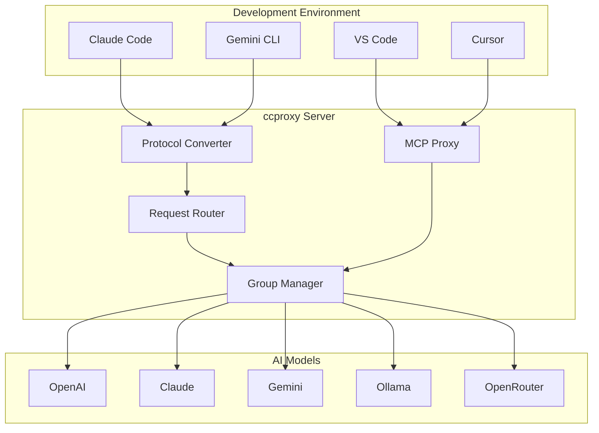

# ccproxy Module

The **ccproxy** module is the heart of Chatspeed's AI proxy system. It enables seamless integration of any AI model into any development environment through protocol conversion and intelligent routing.

## What is ccproxy?

ccproxy is a lightweight, high-performance proxy server that:

1. **Converts AI Protocols**: Translates between OpenAI, Claude, Gemini, and Ollama APIs
2. **Routes Requests**: Intelligently routes requests to different AI models based on endpoints
3. **Manages Groups**: Organizes AI models into logical groups for easy switching
4. **Handles MCP**: Provides unified MCP (Model Context Protocol) proxy services

## Architecture Overview



## Key Features

### 🔄 Protocol Conversion

ccproxy automatically converts between different AI API formats:

- **Input**: Any supported protocol (OpenAI, Claude, Gemini, Ollama)
- **Output**: Target protocol required by your chosen AI model
- **Transparent**: Your IDE doesn't need to know about the conversion

### 🎯 Smart Routing

Route requests to different models using simple endpoints:

```bash
# Use Kimi model
curl http://localhost:11434/kimi/v1/chat/completions

# Use Qwen model
curl http://localhost:11434/qwen/v1/chat/completions

# Use Claude model
curl http://localhost:11434/claude/v1/chat/completions
```

### 🎛️ Group Management

Organize your AI models into logical groups:

```yaml
groups:
  kimi:
    model: "kimi-k2"
    provider: "openrouter"
    temperature: 0.7

  qwen:
    model: "qwen3-code"
    provider: "ollama"
    temperature: 0.3

  claude:
    model: "claude-3-sonnet"
    provider: "anthropic"
    temperature: 0.5
```

### 🔗 MCP Integration

Unified MCP proxy for all your development tools:

- **Single Configuration**: Configure MCP tools once
- **Multi-IDE Support**: Use the same tools across VS Code, Cursor, Claude Code
- **Automatic Sync**: Changes propagate to all connected IDEs

## Use Cases

### 1. Cost Optimization

Replace expensive models with cost-effective alternatives:

```bash
# Before: Expensive Claude API calls
# After: Use free OpenRouter models via ccproxy
export CLAUDE_API_BASE="http://localhost:11434/openrouter"
```

### 2. Model Experimentation

Quickly test different models without changing your code:

```bash
# Test with different models by changing the endpoint
curl http://localhost:11434/gpt4/v1/chat/completions
curl http://localhost:11434/claude/v1/chat/completions
curl http://localhost:11434/gemini/v1/chat/completions
```

### 3. IDE Tool Unification

Configure MCP tools once, use everywhere:

```json
{
  "mcpServers": {
    "filesystem": {
      "command": "http://localhost:11434/mcp/filesystem"
    }
  }
}
```

## Getting Started

1. **[Installation](./installation.md)** - Install and set up ccproxy
2. **[Configuration](./configuration.md)** - Configure your AI models and groups
3. **[Protocol Conversion](./protocol-conversion.md)** - Understanding protocol conversion
4. **[Group Management](./group-management.md)** - Managing model groups
5. **[Examples](./examples.md)** - Real-world usage examples

## Integration Guides

- **[Claude Code Integration](./claude-code.md)** - Using ccproxy with Claude Code
- **[Gemini CLI Integration](./gemini-cli.md)** - Using ccproxy with Gemini CLI
- **[OpenRouter Setup](./openrouter.md)** - Connecting to OpenRouter for free models

## Advanced Topics

- **[Custom Protocols](./custom-protocols.md)** - Adding support for new AI APIs
- **[Load Balancing](./load-balancing.md)** - Distributing requests across multiple models
- **[Monitoring](./monitoring.md)** - Monitoring proxy performance and usage
- **[Security](./security.md)** - Securing your proxy deployment

## Troubleshooting

Having issues? Check our **[Troubleshooting Guide](./troubleshooting.md)** for common problems and solutions.