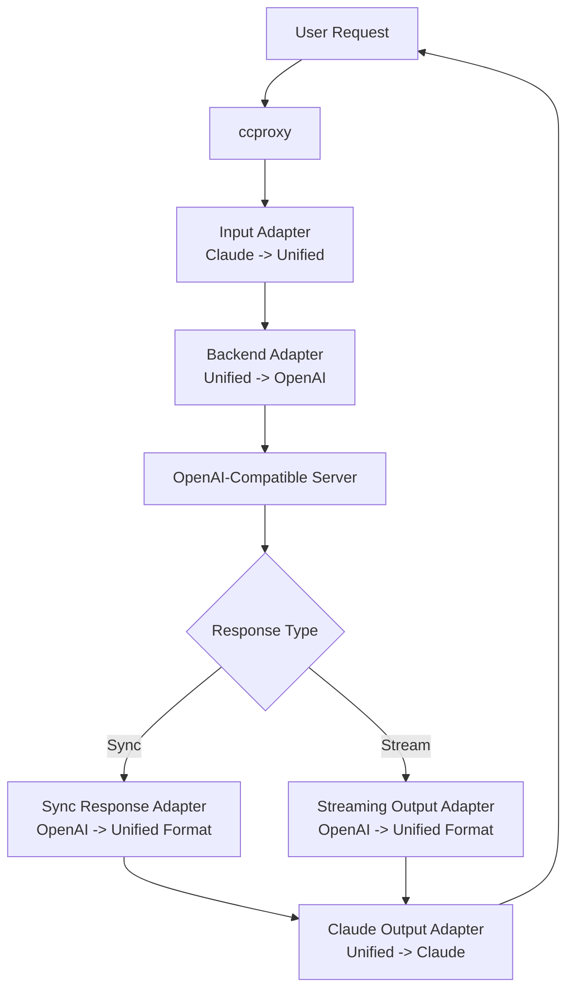

# ccproxy - Universal AI Model Proxy

> ccproxy is a protocol adapter that enables arbitrary protocol conversion between mainstream AI protocols like OpenAI-compatible, Claude, Gemini, and Ollama, and provides MCP proxy functionality.

## 🎯 What is ccproxy?

ccproxy is the core module of Chatspeed, providing **universal AI model proxy capabilities**. It acts as a bridge between different AI model protocols, allowing you to use any protocol to access AI models that use other protocols in any development environment.

## 🔄 Protocol Conversion

ccproxy supports seamless conversion between mainstream dialogue protocols:

- **OpenAI-Compatible Format**
- **Claude API**
- **Gemini API**
- **Ollama Local Models**

## ⚙️ How It Works

ccproxy uses the adapter pattern to achieve seamless conversion between different AI model protocols. When a user sends a request, the system automatically converts the request from one protocol format to the format required by the target server, and converts the final output back to the requester's protocol.

The following is a data flow example for a Claude protocol input being proxied to an OpenAI-compatible server:



Workflow Explanation:

1.  A user sends a Claude protocol request, and the router dispatches it to the appropriate handler.
2.  The input adapter converts the Claude format data into an internal unified format.
3.  The backend adapter converts the unified format into the format required by the target server (OpenAI-compatible protocol).
4.  The converted data is sent to the OpenAI-compatible server.
5.  The processing method is selected based on the data return type:
    - Sync return: The response adapter converts the OpenAI format to the unified format.
    - Streaming return: The streaming adapter converts OpenAI format chunks to unified format chunks one by one.
6.  The output adapter converts the unified format back to the user's requested Claude protocol format and returns it to the client.

## 💡 Use Cases

### 💰 Cost Optimization

- Integrate free models from various platforms to replace expensive services like Claude Code, effectively using it for free.
- Define different proxy groups for various use cases.
- Utilize cost-effective models to **reduce development costs by over 80%**.

### 🚀 Development Efficiency

- Quickly switch models for different tasks.
- Use a unified interface across all IDEs.
- No need to reconfigure tools repeatedly.

### 🔬 Learning and Research

- ccproxy allows logging the input and output of various models via a toggle, making it convenient to study the prompt systems of different IDEs.

### 🛡️ Privacy and Control

- Use Ollama to keep sensitive code localized.
- Utilize ccproxy to isolate real model configuration information (like API keys), enhancing security.
- No vendor lock-in.

## 🔧 ccproxy Configuration

Before starting this section, please install **Chatspeed** according to the [Installation Guide](../guide/installation.md).

### 🧩 Proxy Groups

Proxy groups allow users to isolate different model access capabilities based on use cases. They can also be used to quickly switch models for Claude Code.

#### Group Management

1.  Click the drop-down menu in the top-right corner of the Chatspeed main window and select "Proxy" in the numbered order.

    

2.  After entering the proxy settings page, click "Proxy Groups" to switch to group management, then click "+" to add a group.

    

3.  This example uses a `qwen` group. Fill in the details as shown in the image and save.

    

    **Details**:
    - **Prompt Injection**: Select **Enhance**.
    - **Prompt Text**: You can enter your own required prompt enhancements (an example is provided below).
    - **Tool Filtering**: Enter `WebFetch` and `WebSearch`, one per line. Since we are using external models, Claude Code's internal tools `WebFetch` and `WebSearch` cannot be used and need to be filtered out. These tools can be replaced by installing search-related MCP tools.
    - **Temperature Ratio**: Set the ratio based on the optimal temperature for different models. Claude uses a temperature of `1.0` for code generation, while the optimal temperature for `qwen3-code` is `0.7`, so the ratio is `0.7`.

**Claude Code** Prompt Enhancement:

```md
# Task Execution and Tool Usage

You are a world-class programming expert, responsible for executing code modifications, bug fixes, and writing code based on the user's requirements. Unless you need to confirm details with the user or the task has been completed, you should continue using the appropriate tools in each interaction to gradually push the task forward.

# Error Handling and Troubleshooting

When you need to use a tool, follow the user's provided tool and use standard output, aiming to avoid invalid tool calls. If an error occurs while executing a tool, first check the error message and attempt different solutions. If the same tool encounters errors more than 3 times in a row, consider the following steps:

1. Check if the tool configuration or usage is correct.
2. Consider switching to another tool or alternative solution to ensure the task continues progressing.
3. If the issue cannot be resolved, inform the user promptly and propose feasible alternative solutions.

# Maintaining Task Continuity

Throughout the task execution process, always monitor progress and strive to minimize interruptions. Ensure that each operation step is clear, and that every tool used is appropriate, so as to avoid wasting unnecessary resources and time. If multiple tool calls are required within a task, arrange them logically and execute them sequentially to ensure each step receives effective feedback.

# Language Consistency

You should always maintain the user's question in the language they are using, unless the user explicitly requests otherwise.
```

#### Group Switching

You can add a Kimi proxy group, a Gemini group, etc., according to your needs. Access models in different groups using the `/{group_name}/` prefix. For specific access rules, please refer to the [API Documentation](../api/).

### 🔀 Proxy Management

After managing groups, we can now add different proxies to the corresponding groups as needed. This example demonstrates adding a proxy model for the `Claude Code` use case.

> Before starting this section, you must first add some models. You can refer to the **Add Model** section in the [Quick Start](../guide/quickStart.md).

#### Proxy Settings

1.  Click the drop-down menu in the top-right corner of the Chatspeed main window and select "Proxy" in the numbered order.

    

2.  On the proxy management page, click **Proxy Service**, then **+** in the numbered order.

    

3.  Fill in the details as indicated by the annotations and save:
    - **Group**: This example configures qwen3-code as the model for `Claude Code`, so select qwen.
    - **Proxy Alias**: `Claude Code` currently uses `claude-sonnet-4-20250514` as its main programming model, so enter `claude-sonnet-4-20250514` here.
    - **Model**: Search for qwen, then select all qwen3-coder or related models.

      > Note: `Nvidia`'s `qwen3-235b-a22b` in the image is not actually a code model and is just used as an example.

    

4.  Please follow step 3 again to add a `claude-3-5-haiku-20241022` proxy. This is the model currently used by `Claude Code` to generate conversation titles.

    

5.  At this point, we have the basic conditions for a `Claude Code` proxy.

    

### 🔑 Key Management

Proxy keys are used to access proxy models. They are independent of the keys provided by AI vendors and can effectively protect your data security. You can configure multiple keys for different scenarios.

#### Key Management

1.  Click the drop-down menu in the top-right corner of the Chatspeed main window and select "Proxy" in the numbered order.

    

2.  Switch to key management, click "+", enter `ClaudeCode` in the **Key Name**, and then save. The key name can be any string you like.

    

3.  You can add multiple keys for your different use cases. For example, I have added keys for `Claude Code`, `Cline`, `Roo Code`, `Zed`, and development testing (`dev`). Some keys in the documentation are actually the `dev` key, which can usually be safely used in a test environment.

    

### ✍️ Prompt Engineering

Currently, `Qwen Code` offers 2000 free calls per day, and `Gemini CLI` has a generous free quota (testing shows `gemini-2.5-pro` has about 50 free calls per day, after which it automatically switches to `gemini-2.5-flash`). Therefore, with a limited budget, they can meet most programming needs. If you want to experience `Claude Code` on a limited budget, creating a proxy pool with free models from various channels is an excellent choice. However, free models have limitations, including call limits, frequency limits, and adaptation issues. Call and frequency limits can be addressed with multiple accounts and keys. This article mainly discusses the adaptation issue.

It is certain that the `Claude` model used in `Claude Code` is specially adapted and performs excellently, especially with a low error rate in tool calls and a very smooth workflow.

To use an external, non-specially trained model for `Claude Code`, the model must at least have good tool-calling capabilities and instruction-following ability. On this basis, we can use prompt enhancement to optimize its performance in `Claude Code`.

The following prompt enhancement is appended to the `Claude Code` system prompt. It attempts to guide the model better in its tasks through examples and guidance. As the prompt is quite long, you can refer to it here: [Prompt Enhancement](../../prompt.md).

### 🎛️ Parameter Tuning

Based on the information sent from `Claude Code`, only the temperature is currently set; parameters like `top_k` and `top_p` are not. Therefore, parameter tuning in proxy groups is mainly done through temperature. It is recommended to refer to the official documentation of each **AI model** for the optimal temperature. As far as I know, the optimal temperature for `qwen3-coder` is 0.7, and for `kimi-k2` it is 0.6. For others, please refer to the official documentation of the model you are using.

## 💻 Usage Examples

### 🤖 Claude Code

If you have followed the **ccproxy Configuration** section above and set everything up, you are now ready to work in Claude Code.

To facilitate group switching, we will provide two scripts, one for the `zsh` environment and one for the `bash` environment. With them, you can quickly switch proxy groups. Depending on your shell environment, you can copy them directly into `~/.zshrc` or `~/.bashrc`.

> **Important**: Be sure to change `$DEV_KEY` in the script to the key from your **Proxy Key** settings, and change `$KIMI_KEY` to your actual key. Also, the `prod` environment in the script uses Kimi's official k2 interface. If you are using the official `Claude Code` model, please change the `URL` accordingly.


#### Proxy Group Switching Helper

1.  `zsh` environment script for switching proxy groups

```zsh
# Format: [environment_name]="BASE_URL AUTH_TOKEN"
declare -A CLAUDE_ENV_MAP=(
  [dev]="http://127.0.0.1:11434 $DEV_KEY"
  [prod]="https://api.moonshot.cn/anthropic $KIMI_KEY"
)

# Function to set Claude Code environment variables
# Usage examples:
# source ~/.zshrc
# set_claude_env qwen      # Uses qwen configuration, URL becomes http://127.0.0.1:11434/qwen
# set_claude_env prod     # Uses prod configuration
set_claude_env() {
  local group_name="$1"     # Original environment name provided by the user
  local lookup_key="$1"   # Key used to look up configuration in the map
  local local_compat_mode="$2"

  # Check if argument is empty
  if [[ -z "$group_name" ]]; then
    echo "❌ Error: Missing argument. Usage: set_claude_env <environment_name>"
    # `${(k)VAR}` is Zsh syntax to get all keys of an associative array
    echo "Supported environment names: ${(k)CLAUDE_ENV_MAP}"
    return 1
  fi

  # If the input environment is not 'prod', force the 'dev' configuration
  if [[ "$lookup_key" != "prod" ]]; then
    lookup_key="dev"
  fi

  # Check if 'lookup_key' exists in the configuration map to prevent errors
  if [[ -z "${CLAUDE_ENV_MAP[$lookup_key]}" ]]; then
      echo "❌ Error: Configuration for environment '$lookup_key' not found."
      return 1
  fi

  # Get the corresponding values and set environment variables
  # `${(z)VAR}` is Zsh syntax to split a string into an array by whitespace
  local env_values=("${(z)CLAUDE_ENV_MAP[$lookup_key]}")
  export ANTHROPIC_BASE_URL="${env_values[1]}"
  export ANTHROPIC_AUTH_TOKEN="${env_values[2]}"

  # If 'dev' configuration is ultimately used, append '/<group_name>' to the URL
  if [[ "$lookup_key" == "dev" ]]; then
    if [[ "$local_compat_mode" == "compat" ]]; then
      export ANTHROPIC_BASE_URL="$ANTHROPIC_BASE_URL/$group_name/compat_mode"
    else
      export ANTHROPIC_BASE_URL="$ANTHROPIC_BASE_URL/$group_name"
    fi
  fi

  # Success message, explicitly stating the configuration used
  echo "✅ Successfully switched to environment: $group_name (using '$lookup_key' configuration)"
  echo "   ANTHROPIC_BASE_URL = $ANTHROPIC_BASE_URL"
  echo "   ANTHROPIC_AUTH_TOKEN = $ANTHROPIC_AUTH_TOKEN"
}
```

2.  `bash`environment下的代理分组切换脚本

```sh
# Format: [environment_name]="BASE_URL AUTH_TOKEN"
declare -A CLAUDE_ENV_MAP=(
  [dev]="http://127.0.0.1:11434 $DEV_KEY"
  [prod]="https://api.moonshot.cn/anthropic $KIMI_KEY"
)

# Function to set Claude Code environment variables
# Usage examples:
# source ~/.bashrc
# set_claude_env qwen      # Uses qwen configuration, URL becomes http://127.0.0.1:11434/qwen
# set_claude_env prod     # Uses prod configuration
set_claude_env() {
  local group_name="$1"     # Original environment name provided by the user
  local lookup_key="$1"   # Key used to look up configuration in the map
  local local_compat_mode="$2"

  # Check if argument is empty
  if [[ -z "$group_name" ]]; then
    echo "❌ Error: Missing argument. Usage: set_claude_env <environment_name>"
    # ${!VAR[@]} is Bash syntax to get all keys of an associative array
    echo "Supported environment names: ${!CLAUDE_ENV_MAP[@]}"
    return 1
  fi

  # If the input environment is not 'prod', force the 'dev' configuration
  if [[ "$lookup_key" != "prod" ]]; then
    lookup_key="dev"
  fi

  # Check if 'lookup_key' exists in the configuration map to prevent errors
  if [[ -z "${CLAUDE_ENV_MAP[$lookup_key]}" ]]; then
      echo "❌ Error: Configuration for environment '$lookup_key' not found."
      return 1
  fi

  # Get the corresponding values and set environment variables
  # Using read -ra to split the string into an array by whitespace
  local -a env_values # Declare as indexed array
  read -r -a env_values <<< "${CLAUDE_ENV_MAP[$lookup_key]}"

  # Bash array indexing starts at 0
  export ANTHROPIC_BASE_URL="${env_values[0]}"
  export ANTHROPIC_AUTH_TOKEN="${env_values[1]}"

  # If 'dev' configuration is ultimately used, append '/<group_name>' to the URL
  if [[ "$lookup_key" == "dev" ]]; then
    if [[ "$local_compat_mode" == "compat" ]]; then
      export ANTHROPIC_BASE_URL="$ANTHROPIC_BASE_URL/$group_name/compat_mode"
    else
      export ANTHROPIC_BASE_URL="$ANTHROPIC_BASE_URL/$group_name"
    fi
  fi

  # Success message, explicitly stating the configuration used
  echo "✅ Successfully switched to environment: $group_name (using '$lookup_key' configuration)"
  echo "   ANTHROPIC_BASE_URL = $ANTHROPIC_BASE_URL"
  echo "   ANTHROPIC_AUTH_TOKEN = $ANTHROPIC_AUTH_TOKEN"
}
```

#### Switching Proxy Groups

For `zsh`, copy the script above into your `~/.zshrc` and then run `source ~/.zshrc` to apply it.

Now you can start using `Claude Code`:

1.  Run `source ~/.zshrc`
2.  Run `set_claude_env qwen`
3.  Run `claude` to enter `Claude Code`

Here is my example output:

```zsh
> claude
╭───────────────────────────────────────────────────╮
│ ✻ Welcome to Claude Code!                         │
│                                                   │
│   /help for help, /status for your current setup  │
│                                                   │
│   cwd: /Volumes/dev/personal/dev/ai/chatspeed     │
│                                                   │
│   ─────────────────────────────────────────────── │
│                                                   │
│   Overrides (via env):                            │
│                                                   │
│   • API Base URL: http://127.0.0.1:11434/qwen     │
╰───────────────────────────────────────────────────╯

> Could you analyze @src-tauri/src/ccproxy/ for me?
  ⎿  Listed directory src-tauri/src/ccproxy/

⏺ I'll analyze the src-tauri/src/ccproxy/ directory structure for you.

  This appears to be a Rust-based proxy implementation with support for multiple AI backends. Here's what I can see:

  The main components are:
  1. Adapter module - Contains backend implementations for different AI providers:
    - Claude, Gemini, Ollama, OpenAI backends
    - Input/output handling for each provider
    - Traits for standardizing adapter behavior
  2. Handler module - Manages different types of requests:
    - Chat handling
    - Direct requests
    - Model listing
    - Ollama-specific extra handlers
  3. Helper module - Utility functions:
    - Proxy rotation
    - SSE (Server-Sent Events) handling
    - Stream processing
  4. Types module - Data structures for each provider's API formats
  5. Core files:
    - auth.rs - Authentication handling
    - errors.rs - Error definitions
    - router.rs - Request routing

  This structure suggests a proxy service that can route requests to different AI backends while providing a unified interface. Each backend has its own adapter with
  specific input/output handling.

  Would you like me to examine any specific part of this implementation in more detail?
```

Now you can enjoy using `Claude Code` for free!

### 💎 Gemini CLI

[To be added]

### 🛠️ Zed

Zed is a next-generation code editor designed for high-performance collaboration with humans and AI. It has advantages in resource consumption, offers good AI support, and its debugging features are maturing.

This section explains how to use models configured in ccproxy with Zed.

1.  Open settings from the menu `Zed` -> `Settings` -> `Open Settings` (macOS shortcut: `Command + ,`).
2.  Add the following configuration to the file:

```json
{
  "language_models": {
    "openai_compatible": {
      "Chatspeed": {
        "api_url": "http://localhost:11434/v1",
        "available_models": [
          {
            "name": "gemini2.5-pro",
            "display_name": "gemini2.5-pro",
            "max_tokens": 200000,
            "max_output_tokens": 32000,
            "max_completion_tokens": 200000
          },
          {
            "name": "gemini2.5-flash",
            "display_name": null,
            "max_tokens": 200000,
            "max_output_tokens": 32000,
            "max_completion_tokens": 200000
          },
          {
            "name": "gemini2.0-flash",
            "display_name": null,
            "max_tokens": 200000,
            "max_output_tokens": 32000,
            "max_completion_tokens": 200000
          },
          {
            "name": "deepseek-v3",
            "display_name": null,
            "max_tokens": 200000,
            "max_output_tokens": 32000,
            "max_completion_tokens": 200000
          },
          {
            "name": "qwen3-coder",
            "display_name": null,
            "max_tokens": 200000,
            "max_output_tokens": 32000,
            "max_completion_tokens": 200000
          },
          {
            "name": "k2",
            "display_name": "kimi-k2",
            "max_tokens": 200000,
            "max_output_tokens": 32000,
            "max_completion_tokens": 200000
          }
        ]
      }
    }
  }
}
```

> **Note**: All models must be added in Chatspeed beforehand. Copy the model names from the location indicated in the image below.


2.  Copy the proxy key in the order indicated by the numbers in the image below.

    

3.  Open the settings in Zed as indicated by the numbers, and paste the **proxy key** into the **Chatspeed** API Key field.

    

    

4.  After completing the steps above, you can now enjoy using the proxy models in the Zed editor.

    

### 🛠️ Roo Code

[Roo Code](https://github.com/RooCodeInc/Roo-Code) is a fork of [Cline](https://github.com/cline/cline) and an excellent `vscode` **AI plugin**. I often use it for tedious tasks, like supplementing missing `i18n` language items for `Chatspeed` and installing necessary MCP tools to help with information verification. The following explains how to configure `ccproxy`'s proxy models in `Roo Code`. This example uses `gemini2.5-pro`.

1.  Open Roo Code's model settings in the numbered order, enter `gemini2.5-pro`, and then click `Create Profile` to save.

    

2.  Click in the numbered order, enter the relevant information, and then click the `Save` button at position **number 6** to save the information:
    - **API Provider**: Select `OpenAI Compatible`.
    - **Base URL**: Enter `http://127.0.0.1:11434/v1`.
    - **API Key**: Copy the proxy key from the ccproxy settings interface and paste it here.
    - **Model**: Select `gemini2.5-pro`.
    - `gemini2.5-pro` should support image input and tool calls, so you can check the corresponding options or ignore them.

    

3.  Roo Code supports creating multiple models. You just need to repeat the first and second steps to add other models. Finally, return to the `Roo Code` plugin's main interface to start using it.

    

### 🛠️ Cline

[Cline](https://github.com/cline/cline) is an excellent vscode plugin. Its `Plan -> Execute` mode is different from `Roo Code`'s, but it is still a popular AI programming plugin. This article explains how to configure `ccproxy`'s proxy models in `Cline`.

1.  Open Cline's model settings in the numbered order. First, set `Cline`'s **Execution Model**:
    - **API Provider**: Select `OpenAI Compatible`.
    - **Base URL**: Enter `http://127.0.0.1:11434/v1`.
    - **API Key**: Copy the proxy key from the ccproxy settings interface and paste it here.
    - **Model ID**: Enter `gemini2.5-flash`.
    - `gemini2.5-flash` should support image input and tool calls, so you can check the corresponding options or ignore them.

    

2.  Switch to `Plan Mode`, modify the relevant information in the numbered order, and then click the `Done` button at position **number 3** to save:
    - **Model ID**: Select `deepseek-r1-0528`.
    - `deepseek-r1-0528` is a reasoning model, so as shown by **number 2**, uncheck `Supports Images` and `Supports browser use`.

    

3.  Return to the `Cline` plugin's main interface to start using it.

    

## 📚 Next Steps

- [MCP Proxy Integration](../mcp/)
- [API Reference](../api/)
