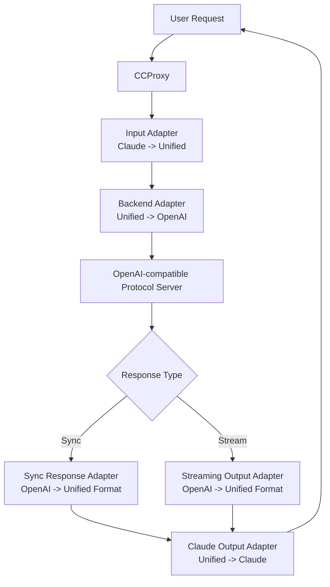

# Introduction to CCProxy

> CCProxy (Chat Completion Proxy) is a protocol adapter that enables arbitrary conversion between OpenAI-compatible, Claude, Gemini, and Ollama protocols.

## 🎯 What is CCProxy?

CCProxy is a core module of Chatspeed that provides **universal AI model proxy capabilities**. It acts as an adapter bridge between different AI model protocols, allowing you to connect most AI models on the market to various popular AI IDEs or plugins. For example, you can connect Gemini, locally deployed Ollama models, or other models that support the OpenAI-compatible protocol format to platforms like Claude Code.

CCProxy also has AI model enhancement features. Its **tool compatibility mode** enables models that do not natively support function calling to gain this capability. For example, many models deployed via Ollama do not originally support tool calling, but with CCProxy, they can "acquire" this ability and connect to platforms like Claude Code or Gemini CLI.

## 🔄 What Protocol Conversions Does CCProxy Support?

CCProxy supports seamless conversion between major AI chat protocols:

- **OpenAI-compatible format**
- **Claude API**
- **Gemini API**
- **Ollama local models**

## ⚙️ How CCProxy Works

CCProxy uses the adapter pattern to achieve seamless conversion between different AI model protocols. When a user sends a request, the system automatically converts the request from one protocol format to the format required by the target server, and then converts the final output back to the requester's protocol format.

The following is a data flow example of a request in `Claude` protocol being proxied to a server with an `OpenAI-compatible protocol`:

Workflow Description:

1. A user sends a Claude protocol request, and the router dispatches it to the appropriate handler.
2. The input adapter converts the Claude format data into an internal unified format.
3. The backend adapter converts the unified format into the format required by the target server (OpenAI-compatible).
4. The converted data is sent to the AI (OpenAI-compatible) server.
5. The response is processed based on the return method:
    - Synchronous return: The response adapter converts the OpenAI format to the unified format.
    - Streaming return: The streaming adapter converts OpenAI format data chunks into unified format chunks.
6. The output adapter converts the unified format back to the user's requested Claude protocol format and returns it to the client.

## 🚀 Core Value of CCProxy

### 🔄 Global Key Rotation

CCProxy provides multiple load-balancing capabilities:

- Supports adding multiple access keys for each provider.
- Each proxy model can be routed to multiple identical or different provider models.
- Client requests are automatically rotated among all providers and keys.
- Multiple free channels can be combined into a proxy pool to increase call limits and frequency.

### 💰 Cost Optimization

- Replace expensive services like Claude Code at a low or even zero cost by integrating free models from various platforms.
- Define separate proxy groups for different usage scenarios.
- **Reduce development costs by over 80%** by utilizing cost-effective models.

### 🚀 Development Efficiency

- Quickly switch models for different tasks.
- Use a unified interface across all IDEs.
- No need to reconfigure tools repeatedly.

### 🔬 Learning and Research

- CCProxy allows logging the input and output of each model, making it easier to study the prompt systems of various **workflows**.

### 🛡️ Privacy and Control

- Isolate real model configuration information (like keys) with CCProxy to enhance security.
- Avoid vendor lock-in and easily switch model services.

## 📚 Detailed Documentation

- [Configuration Guide](./configuration.md)
- [Using with Claude Code](./claude-code.md)
- [Using with Gemini CLI](./gemini-cli.md)
- [Zed Configuration](./zed.md)
- [Roo Code Configuration](./roo-code.md)
- [Cline Configuration](./cline.md)

## 📚 Next Steps

- [MCP Proxy Integration](../mcp/)
- [API Reference](../api/)
