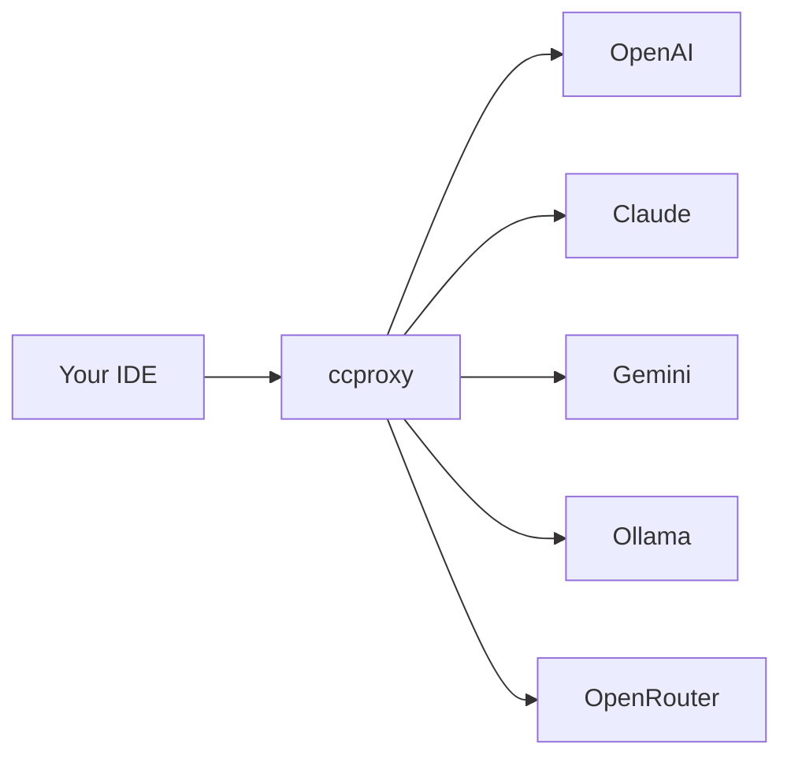

# Getting Started

Welcome to Chatspeed! This guide will help you get up and running with the most powerful AI proxy and MCP management platform.

## What is Chatspeed?

Chatspeed is a revolutionary platform that solves the fundamental problem of AI model integration across different development environments. With our **ccproxy** module, you can:

- Connect any AI model to any development environment
- Reduce AI development costs by over 80%
- Manage MCP tools across multiple IDEs from a single configuration
- Switch between models seamlessly without changing your workflow

## Quick Overview

### The Problem We Solve

As a developer, you've probably faced these challenges:

1. **High AI Development Costs**: Premium models like GPT-4 and Claude are expensive for daily development
2. **IDE Tool Fragmentation**: Setting up MCP tools separately in VS Code, Cursor, Claude Code, etc.
3. **Model Lock-in**: Being stuck with one model/provider for your entire workflow
4. **Protocol Incompatibility**: Different AI services use different APIs and protocols

### The Chatspeed Solution

Chatspeed's **ccproxy** module acts as a universal translator and proxy:

## Core Concepts

### 1. Protocol Conversion
ccproxy can convert between different AI protocols:
- OpenAI-compatible APIs
- Claude Messages API
- Google Gemini API
- Ollama API

### 2. Model Groups
Organize your AI models into logical groups:
- `kimi` group: Cost-effective models for general tasks
- `qwen` group: Specialized coding models
- `claude` group: Premium models for complex reasoning

### 3. Unified MCP Proxy
All your MCP (Model Context Protocol) tools in one place:
- Configure once, use everywhere
- Automatic tool synchronization across IDEs
- Centralized tool management

## Next Steps

1. **[Installation](./installation.md)** - Install Chatspeed and ccproxy
2. **[Quick Start](./quickStart.md)** - Get your first proxy running in 5 minutes
3. **[Configuration](./configuration.md)** - Detailed configuration options
4. **[ccproxy Module](../ccproxy/)** - Deep dive into the proxy system

## Need Help?

- 📚 Check our [FAQ](./faq.md)
- 🐛 [Report issues](https://github.com/aidyou/chatspeed/issues)
- 💬 [Join discussions](https://github.com/aidyou/chatspeed/discussions)
- 📧 [Contact support](mailto:support@chatspeed.ai)