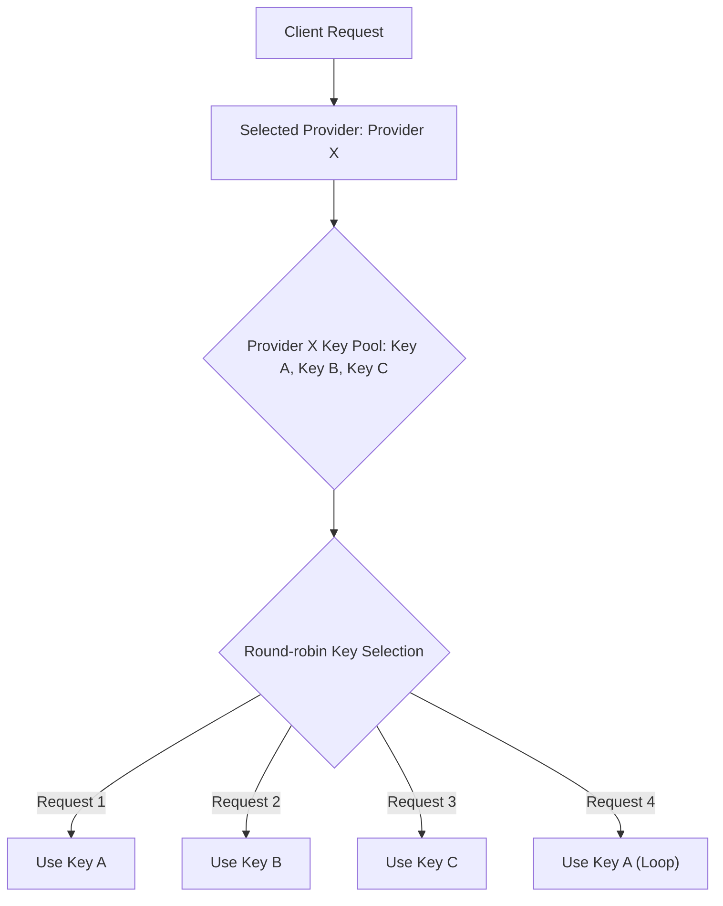
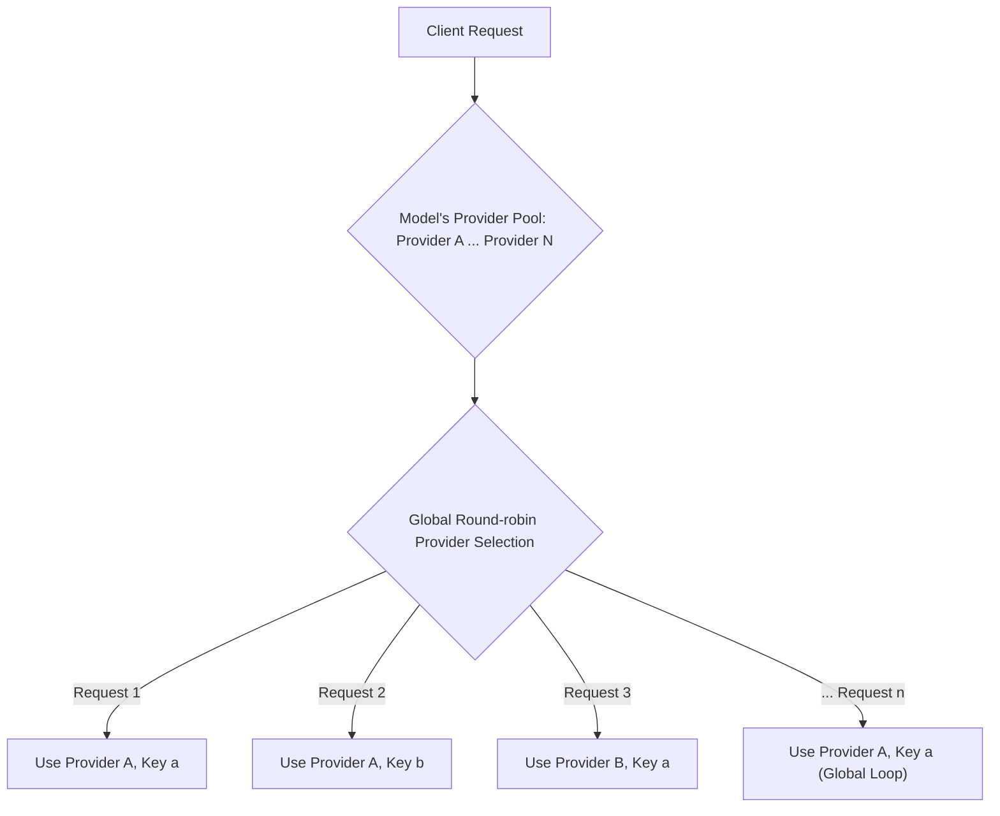

# Features Overview

Chatspeed is a feature-rich AI assistant application designed to help you better interact with AI. In addition to its basic chat functionalities, Chatspeed integrates the powerful `ccproxy` module, which provides AI proxy and MCP proxy capabilities. This allows you to flexibly connect various AI models to environments like Claude Code or Gemini CLI and centrally manage all your MCP tools.

## 🤖 Core Features

### 1. AI Assistant

As your AI assistant, Chatspeed offers the following core features:

- **Multi-Model Chat**: Engage in conversations with a variety of supported AI models.
- **Smart Translation**: Automatically detects the input language and translates it as needed.
- **Rich Text Support**: Supports formats like code blocks, mind maps, flowcharts, tables, and formulas.
- **Skill Management**: Visually create and manage custom skills.
- **Smart Notes**: Save and manage important AI conversation content.

### 2. AI Proxy Management

Chatspeed provides a unified platform to manage various AI chat proxies and multimodal content proxies:

- **Centralized Management**: Manage scattered AI services from one place.
- **Protocol Conversion**: Freely convert between Claude, Gemini, OpenAI-compatible, and Ollama protocols.
- **Group Support**: Configure proxy groups for different needs, making it easy to switch between models for Claude Code or Gemini CLI.

### 3. Multi-Model Support

Connect to mainstream AI platforms and use a wide range of large models via the OpenAI-compatible protocol:

- **Broad Compatibility**: Supports OpenAI, Gemini, Ollama, and Claude.
- **Key Management**: Configure multiple API keys for a single model, with automatic rotation during conversations.
- **Streaming Output**: Supports streaming responses for a real-time output experience.
- **Inference Display**: Supports displaying the thought process for Deepseek and inference outputs for OpenAI.
- **Parameter Configuration**: Full support for configuring parameters like temperature, top_p, and max_tokens.
- **Proxy Support**: Supports HTTP network proxy settings.

## 🌐 ccproxy - The Core Proxy Module

`ccproxy` is the core module of Chatspeed, providing powerful AI model proxy capabilities.

### Protocol Conversion Capability

`ccproxy` supports conversion between mainstream dialogue protocols:

- **OpenAI-Compatible Format**
- **Claude API**
- **Gemini API**
- **Ollama Local Models**

Through protocol conversion, `ccproxy` achieves "Any Claude Code"—connecting any AI model to the Claude Code environment—and "Any Gemini CLI"—connecting any AI model to the Gemini CLI environment.

### Group Management

Create different proxy groups for various scenarios. You can place frequently used models for IDEs or plugins like Cline, Roo Code, and Zed into a default group, while creating separate proxy groups for Claude Code to allow for quick switching.

### Load Balancing

Chatspeed supports setting multiple keys for the same provider, which are automatically rotated with each call. For the `ccproxy` module's proxies, a single model can be configured with multiple different providers, and the rotation rule is global.

**Chatspeed Key Rotation (Single Provider)**

 

---

**ccproxy Global Rotation (Single Model)**

## 🔧 Unified MCP Proxy Management

Aggregate all available MCP (Model Context Protocol) tools in the Chatspeed system into a unified proxy entry point, solving the problem of repeatedly configuring tools across different IDEs.

### Why is an MCP Proxy needed?

In similar use cases, the same MCP tools are often installed. For example, in a programming context, tools like context7 and search MCPs are typically installed in various IDEs or plugins. The more IDEs you use, the more cumbersome management and upgrades become.

### Advantages of Using an MCP Proxy

- **Unified Configuration**: Simply install all necessary MCP tools on Chatspeed.
- **Unified Access**: The `ccproxy` module provides all aggregated MCP tools via `http://localhost:11434/sse`.
- **Simplified Setup**: Configuring MCPs in any IDE or plugin becomes straightforward.
- **Centralized Management**: Adding, removing, or modifying tools can all be done centrally in the Chatspeed client.

## 💬 Advanced Chat Interface

Enjoy a superior chat experience:

- **Clean Interface**: Supports light and dark theme modes.
- **Multi-Language Support**: The interface is available in multiple languages.
- **Convenient Operations**: Supports message quoting and resending.
- **Rich Text Parsing**: Supports code blocks, mind maps, flowcharts, tables, formulas, and more.

## 🤖 AI Assistant

Enhanced AI assistant features:

- **Instant Response**: Quick answers to your questions.
- **Smart Translation**: Automatically recognizes input language and translates it.
- **Reasoning Capabilities**: Achieves reasoning abilities similar to Deepseek R1 through general-purpose skills.
- **Visual Generation**: AI-assisted generation of mind maps and flowcharts.
- **Custom Skills**: Supports the creation of custom skills.

## 🛠️ Skill Management

Visual creation and management of skills:

- **Visual Builder**: Provides an intuitive interface for creating skills.
- **Quick Access**: Supports quick skill invocation via hotkey bindings.
- **Icon Support**: Supports a built-in icon library and custom uploads.

## 📝 Smart Notes Feature

AI-powered knowledge management:

- **Smart Save**: Easily save valuable answers from conversations to your knowledge base.
- **Tag Management**: Supports organizing entries with tags.
- **Rich Media Display**: Supports parsing of reasoning processes, code blocks, mind maps, flowcharts, tables, and formulas.

## 🔐 Data Security

Protecting your data's security:

- **Local Encrypted Storage**: All data is stored locally with encryption.
- **History Archiving**: Manage your conversation history with archiving.
- **Backup and Recovery**: Database backup and recovery functionality.

## 💡 Use Cases

### Cost Optimization

- Use free or cost-effective models in Claude Code as alternatives to the expensive default Claude model.
- Aggregate free models from different providers to leverage their free quotas and reduce development costs.

### Development Efficiency

- Quickly switch models for different tasks.
- Use a unified interface across all IDEs.
- Reduce the need for reconfiguring tools.

### Privacy and Control

- Keep sensitive code localized by using Ollama.
- Maintain full control over model selection.
- Avoid vendor lock-in.

## Next Steps

Now that you have an overview of Chatspeed's features, you can:

1. **[Quick Start](../../guide/quickStart.md)** - Learn how to get started with Chatspeed quickly.
2. **[ccproxy Module](../../ccproxy/)** - Explore the core proxy functionalities.
3. **[MCP Proxy](../../mcp/)** - Learn about MCP proxy integration.
