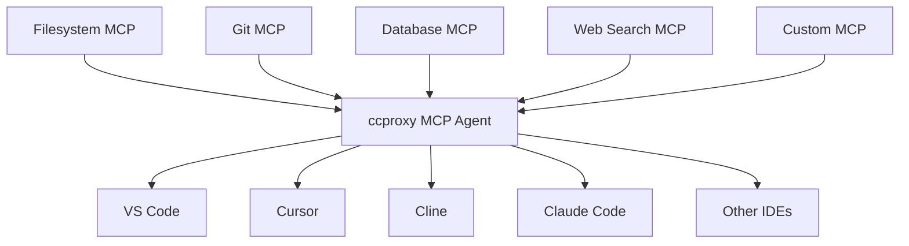

# MCP Agent

> Aggregates all available MCP (Large Model Context Protocol) tools in the Chatspeed system into a unified agent entry point, completely solving the pain point of repeatedly configuring tools across different IDEs.

The **MCP Agent**, provided by Chatspeed's ccproxy module, is the solution for the fragmented MCP management mentioned above. It converts all MCP tools installed on Chatspeed into a flattened structure and provides a unified access entry point via the SSE protocol. This means you only need to install the MCP tools in Chatspeed, disable the ones you don't need, and then you can access all your MCP tools via `http://localhost:11434/sse`.

## 🔧 Why You Need an MCP Agent

Developers often use multiple AI IDEs or plugins, and each typically requires the installation of common MCPs to extend the AI's capabilities. Certain MCPs, like context7 or search MCPs, are installed in almost every IDE. Reinstalling these necessary MCPs every time you switch IDEs becomes tedious.

### Before Using the ccproxy Module's MCP Agent

- Individually install MCP tools in VS Code ❌
- Repeatedly configure the same tools in Cursor ❌
- Duplicate setup for Claude Code ❌
- Duplicate setup for Gemini CLI ❌
- Repeatedly install the same MCP tools for Trae, Cline, Roo Code, etc. ❌

### After Using the ccproxy Module's MCP Agent

- Simply install all necessary MCP tools on Chatspeed ✅
- The ccproxy module provides all aggregated MCP tools via `http://localhost:11434/sse` ✅
- Configuring MCPs in any IDE or plugin is simple: just select the SSE protocol and set the URL to `http://localhost:11434/sse` ✅
- Adding, removing, or modifying tools is managed centrally in the Chatspeed client ✅

## 🌐 Chatspeed's MCP Agent Architecture



## 🛠️ Server-side Installation and Configuration

### Installation

Please download and install the latest version of Chatspeed from the [official Chatspeed website](https://github.com/aidyou/chatspeed/releases).

### MCP Agent Configuration

1.  Open the MCP configuration options from the "MCP" menu in the top-right corner of the Chatspeed main interface. Click in the numerical order indicated in the image:

    

2.  In the MCP configuration interface, add the necessary MCP tools, such as context7, tavily-mcp, etc. You can remove any tools you don't need (as indicated by the number 2 in the image below).

    

After the configuration above, you will have the following MCP tools:

    

## ⚙️ MCP Client Configuration

### General Configuration

The configuration format for different MCP clients may vary slightly, but it generally looks like this:

```json
{
  "mcpServers": {
    "ccproxy": {
      "type": "sse",
      "url": "http://localhost:11434/sse"
    }
  }
}
```

### Claude Code

The following command installs it at the user scope, making it available for all projects:

```bash
claude mcp add -t sse -s user ccproxy http://localhost:11434/sse
```

After installation, you can see the following configuration information:

```bash
> claude mcp get ccproxy
ccproxy:
  Scope: User config (available in all your projects)
  Status: ✓ Connected
  Type: sse
  URL: http://localhost:11434/sse
```

If you only want to install it for the current project, use the following command:

```bash
claude mcp add -t sse ccproxy http://localhost:11434/sse
```

### Gemini CLI

`Gemini CLI` uses the `mcpServers` configuration in the `settings.json` file to locate and connect to MCP servers. This configuration supports multiple servers with different transport mechanisms.

You can configure MCP servers in the global `~/.gemini/settings.json` file or at the root of your project by creating or opening a `.gemini/settings.json` file. In that file, add the `mcpServers` configuration block.

```json
{
  "mcpServers": {
    "ccproxy": {
      "url": "http://localhost:11434/sse"
    }
  }
}
```

Once configured, enter the `Gemini CLI` and execute `/mcp list` to see the list of available tools. Here is an example:

```bash
╭───────────────╮
│  > /mcp list  │
╰───────────────╯


ℹ Configured MCP servers:

  🟢 ccproxy - Ready (5 tools)
    Tools:
    - get_current_time
    - get-library-docs
    - resolve-library-id
    - tavily-extract
    - tavily-search
```

For more configuration information, you can follow this [guide](https://github.com/google-gemini/gemini-cli/blob/main/docs/tools/mcp-server.md#configure-the-mcp-server-in-settingsjson).

### VS Code

You can follow the MCP installation [guide](https://code.visualstudio.com/docs/copilot/chat/mcp-servers#_add-an-mcp-server) using the standard configuration above. Alternatively, you can use the VS Code CLI to install the ccproxy MCP tool:

```sh
code --add-mcp '{"name":"ccproxy","url":"http://localhost:11434/sse"}'
```

### Cursor

Go to `Cursor Settings` -> Tools & Integrations -> MCP Tools -> Add new MCP Server. Add the following information to the configuration file:

```json
{
  "mcpServers": {
    "ccproxy": {
      "url": "http://localhost:11434/sse"
    }
  }
}
```

### Trae CN

Go to `Trae CN`'s AI Function Management -> MCP -> Add -> Add Manually. Add the following information to the configuration file and save:

```json
{
  "mcpServers": {
    "ccproxy": {
      "url": "http://localhost:11434/sse"
    }
  }
}
```

### Windsurf

`Windsurf`'s MCP server configuration file is located at `~/.codeium/windsurf/mcp_config.json`. This is a JSON file that contains a list of servers `Cascade` can connect to. The JSON should follow the same pattern as the `Claude Desktop` configuration file.

You can open `~/.codeium/windsurf/mcp_config.json` and add the following content:

```json
{
  "mcpServers": {
    "ccproxy": {
      "serverUrl": "http://localhost:11434/sse"
    }
  }
}
```

> Note, if you have multiple MCP tools, just add the `ccproxy` section, like so:

```json
    "ccproxy":{
      "url": "http://localhost:11434/sse"
    }
```