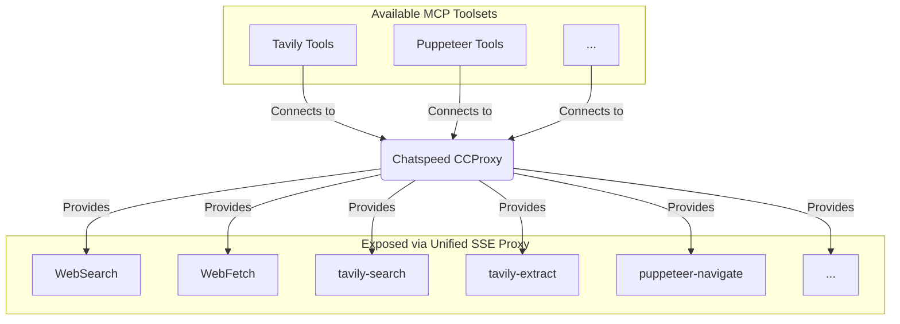

# MCP Proxy

> Aggregates all available MCP (Model Context Protocol) tools in the Chatspeed system into a unified proxy entry point, completely solving the pain point of repeatedly configuring tools across different IDEs.

Chatspeed's [CCProxy](../ccproxy/) module provides the **MCP Proxy** as a solution to the aforementioned fragmented MCP management. It aggregates all MCP tools installed in Chatspeed into a flattened structure and provides unified access entry points via multiple protocols. This means you only need to install your MCP tools in Chatspeed once, disable the ones you don't need, and then you can access all your MCP tools via any of the following protocols:

- Streamable HTTP Protocol: `http://localhost:11434/mcp/http` (Recommended)
- SSE Protocol: `http://localhost:11434/mcp/sse`

> Please note that the port `11434` used in the MCP URLs in this chapter is the default port of the [CCProxy](../ccproxy/) module. If you have modified the default port, please update the port configuration in your configuration files accordingly.

## 🔧 Why You Need an MCP Proxy

Developers often use multiple AI IDEs or AI plugins, and each AI IDE or AI plugin typically requires the installation of some common MCPs to extend the AI's capabilities. Some common MCPs are installed in almost every IDE, such as context7, tavily-mcp, etc. Reinstalling the same MCP tools every time you switch IDEs becomes tedious.

### Before Using the CCProxy Module's MCP Proxy

- Individually install MCP tools in `VS Code` ❌
- Repeatedly configure the same tools in `Cursor` ❌
- Duplicate setup for `Claude Code` ❌
- Duplicate setup for `Gemini CLI` ❌
- Repeatedly install the same MCP tools for `Trae`, `Cline`, `Roo Code`, etc. ❌

### After Using the CCProxy Module's MCP Proxy

- Simply install all necessary MCP tools on `Chatspeed` ✅
- The CCProxy module provides all aggregated MCP tools via SSE protocol (`http://localhost:11434/mcp/sse`) ✅ or `Streamable HTTP` protocol (`http://localhost:11434/mcp/http`) ✅
- Configuring MCPs in all IDEs or plugins becomes very simple: just select the appropriate protocol, and configure it to the corresponding URL ✅
- Adding, removing, and modifying tools can all be completed centrally in the `Chatspeed` client ✅

## 🌐 Chatspeed's MCP Proxy Architecture



## 🛠️ Server-side Installation and Configuration

### Installation

Please download and install the latest version of Chatspeed from the [official Chatspeed website](https://github.com/aidyou/chatspeed/releases). For details, you can refer to the [User Guide](../guide/installation.md).

### MCP Proxy Configuration

1. Open the MCP configuration options by clicking "MCP" in the top-right corner of the main interface in Chatspeed, and click in the numerical order indicated in the image below:


2. In the MCP configuration interface, add the necessary MCP tools, such as context7, tavily-mcp, etc. For tools you don't need, you can disable them (as indicated by number 2 in the image below).


After the above configuration, you will have the following MCP tools:


## ⚙️ MCP Client Configuration

### General Configuration

Usually, the configuration formats of different MCP clients vary slightly, but generally look like this:

**Streamable HTTP Protocol Configuration (Recommended):**

```json
{
  "mcpServers": {
    "ccproxy": {
      "type": "http",
      "url": "http://localhost:11434/mcp/http"
    }
  }
}
```

**SSE Protocol Configuration:**

```json
{
  "mcpServers": {
    "ccproxy": {
      "type": "sse",
      "url": "http://localhost:11434/mcp/sse"
    }
  }
}
```

> **Note:** Chatspeed's MCP Proxy implementation of the `Streamable HTTP` protocol provides better connection stability and remains available after network disconnections or computer sleep (suspend), and is recommended for priority use in supported clients.

### Claude Code

1. The following will install to the user scope, making it available in all projects:

```bash
claude mcp add -t http -s user ccproxy http://localhost:11434/mcp/http
```

2. If you only want to install for the current project, enter the project directory, then use the following command to install:

```bash
claude mcp add -t http ccproxy http://localhost:11434/mcp/http
```

3. After installation, verify using `claude mcp get ccproxy`. If the output is as follows, the installation was successful:

```bash
> claude mcp get ccproxy
ccproxy:
  Scope: User config (available in all your projects)
  Status: ✓ Connected
  Type: http
  URL: http://localhost:11434/mcp/http
```

### Gemini CLI

The MCP configuration for `Gemini CLI` is exactly the same as the `Claude Code` commands, just change `claude` to `gemini`.

1. Global installation

```bash
gemini mcp add -t http -s user ccproxy http://localhost:11434/mcp/http
```

2. Project installation, please enter the project directory first and then execute the following command:

```bash
gemini mcp add -t http ccproxy http://localhost:11434/mcp/http
```

3. After configuration, verify using `gemini mcp list`. Output similar to the following information indicates successful installation:

```bash
> gemini mcp list
Configured MCP servers:

✓ ccproxy: http://localhost:11434/mcp/http (http) - Connected
```

For more configuration information, please refer to this [guide](https://github.com/google-gemini/gemini-cli/blob/main/docs/tools/mcp-server.md#configure-the-mcp-server-in-settingsjson).

### Qwen Code

`Qwen Code` is a fork of `Gemini CLI`, so the installation commands are exactly the same as `Gemini CLI`.

1. Global installation

```bash
qwen mcp add -t http -s user ccproxy http://localhost:11434/mcp/http
```

2. Project installation, please enter the project directory first and then execute the following command:

```bash
qwen mcp add -t http ccproxy http://localhost:11434/mcp/http
```

3. After configuration, verify using `qwen mcp list`. Output similar to the following information indicates successful installation:

```bash
> qwen mcp list
Configured MCP servers:

✓ ccproxy: http://localhost:11434/mcp/http (http) - Connected
```

### VS Code

You can follow the MCP [installation guide](https://code.visualstudio.com/docs/copilot/chat/mcp-servers#_add-an-mcp-server) using the standard configuration above. Alternatively, you can use the `VS Code CLI` to install the CCProxy MCP tool:

#### Steps for GUI Installation

1. Click the configuration button in the image below


2. Click the MCP configuration button in the image below


3. Select "HTTP(HTTP or Server-Sent Events) Connect to a remote HTTP server that implements the MCP protocol"


4. Enter `http://localhost:11434/mcp/http` and press Enter


5. Enter the MCP server name `ccproxy` and press Enter


6. Select global or current workspace, global configuration is recommended


#### Command Line Installation

```sh
code --add-mcp '{"name":"ccproxy","type":"http","url":"http://localhost:11434/mcp/http"}'
```

### Cursor

Go to `Cursor Settings` -> Tools & Integrations -> MCP Tools -> Add new MCP Server. Add the following information to the configuration:

```json
{
  "mcpServers": {
    "ccproxy": {
      "url": "http://localhost:11434/mcp/http"
    }
  }
}
```

### Trae CN

Go to `Trae CN`'s AI Function Management -> MCP -> Add -> Manual Add. Add the following information to the configuration and save:

```json
{
  "mcpServers": {
    "ccproxy": {
      "url": "http://localhost:11434/mcp/http"
    }
  }
}
```

### Windsurf

`Windsurf`'s MCP server configuration file is located at `~/.codeium/windsurf/mcp_config.json`. This is a JSON file that contains a list of servers that `Cascade` can connect to. The JSON should follow the same pattern as the `Claude Desktop` configuration file.

You can open `~/.codeium/windsurf/mcp_config.json` and add the following content:

```json
{
  "mcpServers": {
    "ccproxy": {
      "serverUrl": "http://localhost:11434/mcp/http"
    }
  }
}
```

> Note, if you have multiple MCP tools, just add the `ccproxy` section, like:

```json
    "ccproxy":{
      "serverUrl": "http://localhost:11434/mcp/http"
    }
```

### Cline

1. Please click the button labeled **number 1** to enter the MCP setting interface, then click the button labeled **number 2** to switch to the "Installed" interface, and finally click the button labeled **number 3** to enter the MCP code configuration interface. Copy the following code into the code editor and save:

```json
{
  "mcpServers": {
    "ccproxy": {
      "type": "streamableHttp",
      "url": "http://127.0.0.1:11434/mcp/http"
    }
  }
}
```


2. After saving the code, you can see that `Cline`'s MCP server list already has `ccproxy`'s MCP tools.


### Roo Code

1. Click the button labeled **number 1**


2. Select "MCP Servers" from the dropdown menu


3. You can click the button labeled **number 1** to add a global MCP or click the button labeled **number 2** to add a project MCP


4. Add the following content to the opened code editor and save:

```json
{
  "mcpServers": {
    "ccproxy": {
      "type": "streamable-http",
      "url": "http://localhost:11434/mcp/http"
    }
  }
}
```

5. Now you can see `ccproxy`'s MCP tools in the `Roo Code` MCP server list.


### Crush

`Crush`'s configuration file name can be `.crush.json` or `crush.json`. On linux/macOS, the configuration file path is `$HOME/.config/crush/crush.json`, and on windows, the configuration file path is `%USERPROFILE%\AppData\Local\crush\crush.json`.

This article takes `macos` as an example, please edit `$HOME/.config/crush/crush.json`, create one if the file does not exist, put the following code into the mcp configuration block:

```json
{
  "ccproxy": {
    "type": "http",
    "url": "http://localhost:11434/mcp/http"
  }
}
```

A complete configuration example is as follows:

```json
{
  "$schema": "https://charm.land/crush.json",
  "mcp": {
    "ccproxy": {
      "type": "http",
      "url": "http://localhost:11434/mcp/http"
    }
  },
  "providers": {
    "Chatspeed": {
      "name": "Chatspeed",
      "base_url": "http://localhost:11434/compat_mode/v1",
      "type": "openai",
      "api_key": "your_api_key",
      "models": [
        {
          "name": "gemini2.5-pro",
          "id": "gemini2.5-pro",
          "context_window": 1000000,
          "default_max_tokens": 8192
        }
      ]
    }
  }
}
```
