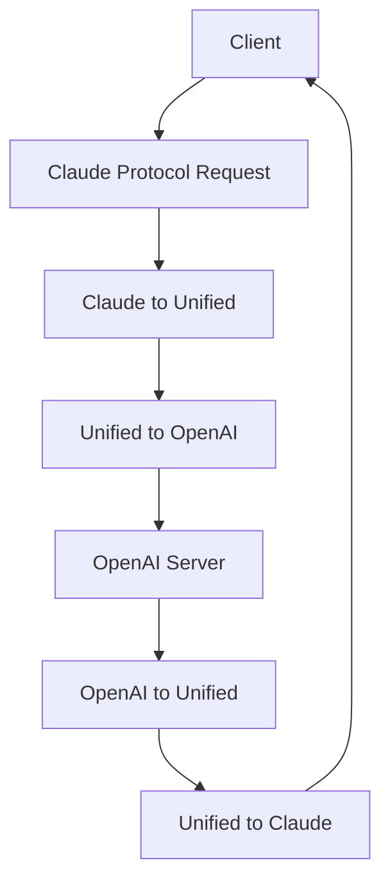

# CCProxy Tool Compatibility Mode: Empowering Any AI Model with Tool Calling Capabilities

In AI development, we often encounter a common challenge: the varying levels of tool calling support across models from different AI providers. Some models offer native tool calling, while others provide none at all. To complicate matters further, even models that do support tool calling often exhibit differences in parameter formats.

What's even more perplexing is that even a single model with native tool calling capabilities might behave differently across various platform interfaces. For instance, the DeepSeek V3.1 model inherently supports native tool calling, but its interface provided by the MoTa community does not, whereas the interface provided by NVIDIA fully supports it. Such platform-specific discrepancies further escalate development complexity.

To address these challenges, we developed CCProxy's Tool Compatibility Mode.

## How It Works

CCProxy is an AI chat proxy module that can convert between different protocols such as OpenAI-compatible, Gemini, Claude, and Ollama. Its core workflow is as follows:

### Standard Protocol Conversion Process

Taking an input via Claude protocol and requesting an OpenAI-compatible server as an example:



The entire data flow can be represented as:
```
client -> claude protocol -> unified format -> openai format -> server -> unified format -> claude format -> client
```

### Tool Compatibility Mode Principle

For models that do not natively support tool calling, CCProxy employs an innovative Tool Compatibility Mode:

1. **Tool Description Conversion**: Converts tool calls into an XML-formatted description, which is passed to the AI as part of the prompt.
2. **Format Requirement**: Requires the AI to return a specific XML format when it needs to call a tool.
3. **Response Parsing**: Parses the XML-formatted data returned by the AI, converting the tool call information within it into a standard tool call format.

## Core Advantages

### 1. Solving Cross-Protocol Parameter Compatibility Issues

Different AI providers have varying requirements for tool parameters, and these discrepancies can lead to tool call failures. Let's illustrate this with a specific example:

**Problem Scenario**: The Grep tool defined in Claude Code includes parameters like `-A`, `-B`, and `-C`, but Gemini does not allow parameter names to start with `-`.

```json
{
  "name": "Grep",
  "description": "A powerful search tool built on ripgrep\n\n  Usage:\n  - ALWAYS use Grep for search tasks. NEVER invoke `grep` or `rg` as a Bash command. The Grep tool has been optimized for correct permissions and access.\n  - Supports full regex syntax (e.g., \"log.*Error\", \"function\\s+\\w+\")\n  - Filter files with glob parameter (e.g., \"*.js\", \"**/*.tsx\") or type parameter (e.g., \"js\", \"py\", \"rust\")\n  - Output modes: \"content\" shows matching lines, \"files_with_matches\" shows only file paths (default), \"count\" shows match counts\n  - Use Task tool for open-ended searches requiring multiple rounds\n  - Pattern syntax: Uses ripgrep (not grep) - literal braces need escaping (use `interface\\{\\}\\` to find `interface{}` in Go code)\n  - Multiline matching: By default patterns match within single lines only. For cross-line patterns like `struct \\{[\\s\\S]*?field`, use `multiline: true`\n",
  "input_schema": {
    "type": "object",
    "properties": {
      "pattern": {
        "type": "string",
        "description": "The regular expression pattern to search for in file contents"
      },
      "path": {
        "type": "string",
        "description": "File or directory to search in (rg PATH). Defaults to current working directory."
      },
      "glob": {
        "type": "string",
        "description": "Glob pattern to filter files (e.g. \"*.js\", \"*.{ts,tsx}\") - maps to rg --glob"
      },
      "output_mode": {
        "type": "string",
        "enum": ["content", "files_with_matches", "count"],
        "description": "Output mode: \"content\" shows matching lines (supports -A/-B/-C context, -n line numbers, head_limit), \"files_with_matches\" shows file paths (supports head_limit), \"count\" shows match counts (supports head_limit). Defaults to \"files_with_matches\"."
      },
      "-B": {
        "type": "number",
        "description": "Number of lines to show before each match (rg -B). Requires output_mode: \"content\", ignored otherwise."
      },
      "-A": {
        "type": "number",
        "description": "Number of lines to show after each match (rg -A). Requires output_mode: \"content\", ignored otherwise."
      },
      "-C": {
        "type": "number",
        "description": "Number of lines to show before and after each match (rg -C). Requires output_mode: \"content\", ignored otherwise."
      },
      "-n": {
        "type": "boolean",
        "description": "Show line numbers in output (rg -n). Requires output_mode: \"content\", ignored otherwise."
      },
      "-i": {
        "type": "boolean",
        "description": "Case insensitive search (rg -i)"
      },
      "type": {
        "type": "string",
        "description": "File type to search (rg --type). Common types: js, py, rust, go, java, etc. More efficient than include for standard file types."
      },
      "head_limit": {
        "type": "number",
        "description": "Limit output to first N lines/entries, equivalent to \"| head -N\". Works across all output modes: content (limits output lines), files_with_matches (limits file paths), count (limits count entries). When unspecified, shows all results from ripgrep."
      },
      "multiline": {
        "type": "boolean",
        "description": "Enable multiline mode where . matches newlines and patterns can span lines (rg -U --multiline-dotall). Default: false."
      }
    },
    "required": ["pattern"],
    "additionalProperties": false,
    "$schema": "http://json-schema.org/draft-07/schema#"
  }
}
```

**Compatibility Issue**: When this tool definition is directly passed to Gemini, the call fails because parameter names like `-A`, `-B`, `-C`, and `-i` do not conform to Gemini's naming conventions, as shown in the error example below:

```json
{
  "candidates": [
    {
      "finishReason": "MALFORMED_FUNCTION_CALL",
      "index": 0
    }
  ],
  "usageMetadata": {
    "promptTokenCount": 47265,
    "totalTokenCount": 47265,
    "promptTokensDetails": [
      {
        "modality": "TEXT",
        "tokenCount": 47265
      }
    ]
  },
  "modelVersion": "gemini-2.5-flash",
  "responseId": "tWHGaMzaJLi5mtkPiPGkiA8"
}

```

CCProxy's Tool Compatibility Mode not only eliminates the need for models to natively support tool calling but also perfectly circumvents parameter format issues.

### 2. Empowering Any Model with Tool Calling Capabilities

This is one of CCProxy's most fundamental features. Even if an AI provider's model does not natively support tool calling, our Tool Compatibility Mode enables them to acquire this capability. This significantly expands the range of usable models, especially for free or open-source models.

### 3. Reducing User Cognitive Load

For the average user, understanding whether each model supports tool calling is a significant cognitive burden. CCProxy frees users from needing to concern themselves with the underlying technical details of models; from the user's perspective, all models possess the same tool calling capabilities. This transparent approach greatly enhances the user experience.

### 4. Empowering Complex AI Workflows

Tool Compatibility Mode, by converting tool definitions into text (XML) that models can easily understand and combining this with CCProxy's prompt enhancement system, can guide models to more reliably execute complex multi-step tasks. The AI is able to:
- More accurately determine when to use a tool during a conversation.
- Reliably output tool call instructions in the preset XML format.
- Chain multiple tools together to complete more complex workflows.
This approach combines the model's language understanding capabilities with the deterministic functions of tools, truly transforming the AI assistant into a powerful tool capable of solving real-world problems.

## Practical Case: Gemini Integration with Claude Code

Let's look at CCProxy's practical effect through a specific case. Before starting, please refer to this blog post to configure the proxy model: [Free Use of Claude Code: Integrating MoTa Qwen3-Code](../claude-code-free/post-1.md)

### Challenge

When integrating the Gemini model with the `Claude Code` toolset, we encountered a core compatibility barrier. While CCProxy's standard proxy mode can already handle most parameter **type** mismatches (e.g., converting `uint` to `integer`), a more challenging issue lies in parameter **naming** conventions:

**The Gemini API does not allow tool parameter names to start with a hyphen (`-`).**

However, the `Grep` tool in `Claude Code` defines parameters such as `-A`, `-B`, and `-C`. If these tool definitions are sent directly to Gemini via standard mode, the API immediately returns a `MALFORMED_FUNCTION_CALL` error, causing the tool call to fail completely. This is precisely the perfect scenario that Tool Compatibility Mode aims to solve.

### Solution

By integrating the `Gemini` model with `Claude Code` through CCProxy's Tool Compatibility Mode, you can perfectly bypass **parameter type restrictions**. Enabling Tool Compatibility Mode is simple: just add `/compat_mode` to the URL address. A complete proxy address would look like `http://localhost:11435/gemini/compat_mode`, where `gemini` is the group name (which you can modify as needed), and `compat_mode` indicates that Tool Compatibility Mode is enabled.

The image below is a screenshot of `gemini-flash-2.5` integrated with `Claude Code` in Tool Compatibility Mode, used to fix a bug in the Chatspeed AI module:


## Summary

CCProxy's Tool Compatibility Mode is not just a technical solution; it's a significant contribution to the standardization of the AI ecosystem. It enables developers to:
- Use any preferred AI model without worrying about tool calling support issues.
- Focus on business logic development rather than protocol adaptation.
- Provide users with a consistent experience, regardless of the underlying model.
As AI technology rapidly evolves, the differentiation between models will continue to grow. Intermediate solutions like CCProxy provide crucial infrastructure support for building a more open and compatible AI ecosystem.
