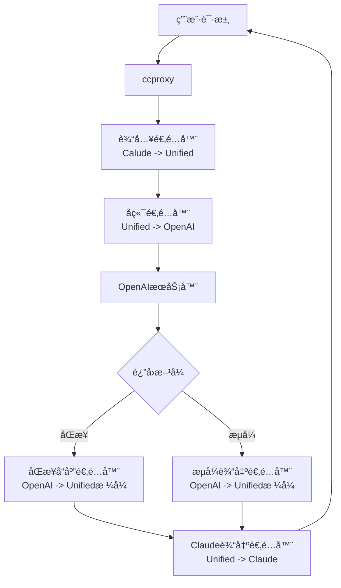

# ccproxy - 通用 AI 模å‹ä»£ç†

> ccproxyçš„å议适é…器，å®ç°äº†OpenAI兼容åè®®ã€Claudeã€Geminiã€Ollama 之间任æ„å议转æ¢ï¼Œå¹¶æ供了MCP代ç†ã€‚

## 🯠什么是 ccproxy？

ccproxy 是 Chatspeed 的核心模å—，æä¾›**通用 AI 模å‹ä»£ç†èƒ½åŠ›**。它充当ä¸åŒ AI 模å‹å议之间的桥æ¢ï¼Œè®©æ‚¨å¯ä»¥åœ¨ä»»ä½•å¼€å‘ç¯å¢ƒä¸­ä½¿ç”¨ä»»ä½•å议访问其他的 AI 模å‹ã€‚

## 🔄 å议转æ¢

ccproxy 支æŒä¸»æµå¯¹è¯å议之间的无ç¼è½¬æ¢ï¼š

- **OpenAI 兼容格å¼**
- **Claude API**
- **Gemini API**
- **Ollama 本地模å‹**

## 工作åŸç†

ccproxy 使用适é…器模å¼å®ç°ä¸åŒ AI 模å‹å议间的无ç¼è½¬æ¢ã€‚当用户å‘起请求时，系统会自动将请求ä»ä¸€ç§å议格å¼è½¬æ¢ä¸ºç›®æ ‡æœåŠ¡å™¨æ‰€éœ€çš„å议格å¼ï¼Œå¹¶å°†æœ€ç»ˆè¾“出转æ¢å›è¯·æ±‚çš„å议。

以下是以 Claude å议输入，代ç†åˆ° OpenAI 兼容åè®®æœåŠ¡å™¨çš„æ•°æ®æµå‘示例：



工作æµç¨‹è¯´æ˜ï¼š

1. 用户å‘出 Claude å议请求，路由器将其分å‘到相应的处ç†å™¨
2. 输入适é…器将 Claude æ ¼å¼æ•°æ®è½¬æ¢ä¸ºå†…部统一格å¼
3. å端适é…器将统一格å¼è½¬æ¢ä¸ºç›®æ ‡æœåŠ¡å™¨ï¼ˆOpenAI 兼容å议）所需的格å¼
4. 转æ¢åçš„æ•°æ®è¢«å‘é€åˆ° OpenAI兼容åè®® çš„æœåŠ¡å™¨
5. æ ¹æ®æ•°æ®è¿”å›æ–¹å¼é€‰æ‹©å¤„ç†æ–¹å¼ï¼š
   - åŒæ­¥è¿”å›ï¼šé€šè¿‡å“应适é…器将 OpenAI æ ¼å¼è½¬æ¢ä¸ºç»Ÿä¸€æ ¼å¼
   - æµå¼è¿”å›ï¼šé€šè¿‡æµå¼é€‚é…器将 OpenAI æ ¼å¼å—é€å—转æ¢ä¸ºç»Ÿä¸€æ ¼å¼å—
6. 输出适é…器将统一格å¼è½¬æ¢å›ç”¨æˆ·è¯·æ±‚çš„ Claude å议格å¼è¿”å›ç»™å®¢æˆ·ç«¯

## 💡 使用场景

### æˆæœ¬ä¼˜åŒ–

- 集åˆå„模å‹å¹³å°å…费模å‹æ›¿ä»£æ˜‚贵的 Claude Code，å…费使用 Calude Code
- 为ä¸åŒä½¿ç”¨åœºæ™¯å®šä¹‰ä¸åŒçš„代ç†åˆ†ç»„
- 利用高性价比模å‹ï¼Œ**å¼€å‘æˆæœ¬é™ä½ 80% 以上**

### å¼€å‘效ç‡

- ä¸åŒä»»åŠ¡å¿«é€Ÿåˆ‡æ¢æ¨¡å‹
- 所有 IDE 统一æ¥å£
- 无需é‡æ–°é…置工具

### 学习研究

- ccproxy å…许通过开关将å„模å‹çš„输入输出信æ¯è®°å½•åˆ°æ—¥å¿—ï¼Œæ–¹ä¾¿ç ”ç©¶å­¦ä¹ å„ IDE çš„æ示è¯ç³»ç»Ÿ

### éšç§ä¸æ§åˆ¶

- 使用 Ollama ä¿æŒæ•æ„Ÿä»£ç æœ¬åœ°åŒ–
- 利用ccproxy 隔离真å®æ¨¡å‹é…置信æ¯ï¼ˆæ¯”如密钥），æ高安全性
- 无供应商é”定

## ccproxy é…ç½®

在开始本章节之å‰ï¼Œè¯·æ ¹æ®[安装指å—](../guide/installation.md)安装好Chaspeed

### 🧩 代ç†åˆ†ç»„

代ç†åˆ†ç»„å¯ä»¥è®©ç”¨æˆ·æ ¹æ®ä½¿ç”¨åœºæ™¯ï¼Œéš”离ä¸åŒçš„模å‹è®¿é—®èƒ½åŠ›ã€‚也å¯ä»¥ç”¨äºæ ¹æ®åœºæ™¯å¿«é€Ÿåˆ‡æ¢ Claude Code

#### 分组管ç†

1. 按数字标注的顺åºä¾æ¬¡ç‚¹å‡» Chatspeed 主窗å£å³ä¸Šè§’的下拉èœå•ï¼Œé€‰æ‹©â€œä»£ç†â€


2. 进入代ç†è®¾ç½®é¡µé¢å，按数字标注顺åºç‚¹å‡»â€œä»£ç†åˆ†ç»„â€åˆ‡æ¢åˆ°ä»£ç†åˆ†ç»„管ç†ï¼Œç„¶å点击“+â€æ·»åŠ åˆ†ç»„


3. 本例以`qwen`分组为例，按图中填写并ä¿å­˜ã€‚


**其中**：

- **æ示è¯æ³¨å…¥**：选择**å¢å¼º**
- **æ示è¯æ–‡æœ¬**：å¯ä»¥è¾“入你自己需è¦çš„æ示è¯å¢å¼ºï¼ˆä¸‹æ–‡ä¼šæ供示例）
- **工具过滤**：输入`WebFetch`å’Œ`WebSearch`，一行一个。由äºæˆ‘们用的是外部模å‹ï¼ŒClaude Code 的内部工具 `WebFetch`å’Œ`WebSearch`我们无法使用，所以需è¦è¿‡æ»¤æ‰ï¼Œè¿™ä¸¤ä¸ªå·¥å…·å…¶å®å¯ä»¥é€šè¿‡å®‰è£…æœç´¢ç›¸å…³çš„MCP工具æ¥æ›¿ä»£
- **温度比例**：请根æ®ä¸åŒæ¨¡å‹çš„最佳温度æ¥è®¾ç½®æ¯”例。Claude 在生æˆä»£ç çš„时候用的温度是`1.0`ï¼Œè€Œæ ¹æ® `qwen3-code`的文档，最佳温度是`0.7`，所以比例为`0.7`

**Claude Code**æ示è¯å¢å¼ºï¼š

```md
# Task Execution and Tool Usage

You are a world-class programming expert, responsible for executing code modifications, bug fixes, and writing code based on the user's requirements. Unless you need to confirm details with the user or the task has been completed, you should continue using the appropriate tools in each interaction to gradually push the task forward.

# Error Handling and Troubleshooting

When you need to use a tool, follow the user's provided tool and use standard output, aiming to avoid invalid tool calls. If an error occurs while executing a tool, first check the error message and attempt different solutions. If the same tool encounters errors more than 3 times in a row, consider the following steps:

1. Check if the tool configuration or usage is correct.
2. Consider switching to another tool or alternative solution to ensure the task continues progressing.
3. If the issue cannot be resolved, inform the user promptly and propose feasible alternative solutions.

# Maintaining Task Continuity

Throughout the task execution process, always monitor progress and strive to minimize interruptions. Ensure that each operation step is clear, and that every tool used is appropriate, so as to avoid wasting unnecessary resources and time. If multiple tool calls are required within a task, arrange them logically and execute them sequentially to ensure each step receives effective feedback.

# Language Consistency

You should always maintain the user's question in the language they are using, unless the user explicitly requests otherwise.
```

#### 分组切æ¢

您å¯ä»¥ä¾æ®ä¸Šé¢çš„步骤ä¾æ¬¡æ·»åŠ  kimi 代ç†ç»„ã€gemini 组，看你自己的需è¦ã€‚ä¸åŒåˆ†ç»„的模å‹è®¿é—®é€šè¿‡`/{group_name}/` å‰ç¼€å³å¯ï¼Œå…·ä½“的访问规则请å‚考[API文档](../api/)

### 🔀 代ç†ç®¡ç†

ç»è¿‡ä¸Šé¢åˆ†ç»„管ç†å，我们ç°åœ¨å¯ä»¥æ ¹æ®éœ€è¦æ¥æ·»åŠ ä¸åŒçš„代ç†åˆ°ç›¸åº”分组了。本例以`Claude Code`使用场景为例添加代ç†æ¨¡å‹ã€‚

> 在开始本章节之å‰ï¼Œä½ å¿…须先添加一些模å‹ã€‚具体你å¯ä»¥å‚考[快速开始](../guide/quickStart.md)çš„**添加模å‹**章节

#### 代ç†è®¾ç½®

1. 按数字标注的顺åºä¾æ¬¡ç‚¹å‡» Chatspeed 主窗å£å³ä¸Šè§’的下拉èœå•ï¼Œé€‰æ‹©â€œä»£ç†â€


2. 在代ç†ç®¡ç†é¡µé¢ä¾æ¬¡æŒ‰æ•°å­—标注点击**代ç†æœåŠ¡**ã€**+**


3. 按下图标注分别填写并ä¿å­˜ï¼Œå…¶ä¸­ï¼š

- **分组**：本例以é…ç½® qwen3-code 作为 `Claude Code` 的模å‹ï¼Œæ‰€ä»¥é€‰æ‹© qwen
- **代ç†åˆ«å**：`Claude Code`ç›®å‰ä½¿ç”¨`claude-sonnet-4-20250514`作为编程的主模å‹ï¼Œå› æ­¤è¿™é‡Œå¡«å†™`claude-sonnet-4-20250514`
- **模å‹**：æœç´¢ qwen，然å将所有 qwen3-coder 或相关的模å‹é€‰ä¸Š

  > 注：图中`Nvidia`çš„`qwen3-235b-a22b`å®é™…上并ä¸æ˜¯ä»£ç æ¨¡å‹ï¼Œåªæ˜¯ç”¨æ¥ä½œä¸ºç¤ºä¾‹ã€‚


4. 请按步骤3å†æ¬¡æ·»åŠ ä¸€ä¸ª`claude-3-5-haiku-20241022`代ç†ï¼Œè¿™ä¸ªæ˜¯ç›®å‰`Claude Code`作为生æˆä¸»é¢˜çš„模å‹


5. 至此我们已ç»å…·å¤‡äº†`Claude Code`代ç†çš„基本æ¡ä»¶


### 🔑 密钥管ç†

代ç†å¯†é’¥æ˜¯ç”¨äºè®¿é—®ä»£ç†æ¨¡å‹çš„å¯†é’¥ï¼Œå®ƒç‹¬ç«‹äº AI 供应商æ供的密钥，å¯ä»¥æœ‰æ•ˆä¿æŠ¤æ‚¨çš„æ•°æ®å®‰å…¨ã€‚ä½ å¯ä»¥é…置多个密钥分别用äºä¸åŒçš„场景。

#### 密钥管ç†

1. 按数字标注的顺åºä¾æ¬¡ç‚¹å‡» Chatspeed 主窗å£å³ä¸Šè§’的下拉èœå•ï¼Œé€‰æ‹©â€œä»£ç†â€


2. 按数字标注，切æ¢åˆ°å¯†é’¥ç®¡ç†ï¼Œç„¶å点击“+â€ï¼Œåœ¨**密钥å称**中输入`ClaudeCode`，然å点击ä¿å­˜ã€‚密钥的å称å¯ä»¥æ˜¯ä½ å–œæ¬¢çš„ä»»æ„字符串。


3. æ ¹æ®æ‚¨è‡ªå·±çš„使用场景您å¯ä»¥æ·»åŠ å¤šä¸ªå¯†é’¥ï¼Œæ¯”如我为`Claude Code`ã€`Cline`ã€`Roo Code`ã€`Zed`和开å‘测试`dev`分别添加了密钥。比如文档中的一些密钥å®é™…就是这里的`dev`，它们通常å¯ä»¥å®‰å…¨åœ°ç”¨äºæµ‹è¯•ç¯å¢ƒã€‚


### æ示è¯å·¥ç¨‹

ç›®å‰ `Qwen Code`æ¯å¤©æœ‰2000次å…费调用é¢åº¦ï¼Œ`Gemini CLI`也有用ä¸å®Œçš„é¢åº¦ï¼ˆç»è¿‡æµ‹è¯•`gemini-2.5-pro`æ¯å¤©å¤§æ¦‚有50次左å³çš„å…è´¹é¢åº¦ï¼Œç”¨å®Œäº†ä¼šè‡ªåŠ¨åˆ‡æ¢ä¸º`gemini-2.5-flash`），所以在预算有é™çš„情况下，用它们基本能满足大é‡ç¼–程场景。当你希望体验`Claude Code`且预算有é™æ—¶ï¼Œç”¨å„渠é“çš„å…费的模å‹ç»„æˆä¸€ä¸ªä»£ç†æ± ï¼Œæ˜¯ä¸ªé常ä¸é”™çš„选择。但是å…费的模å‹ä¹Ÿå­˜åœ¨ä¸€äº›é™åˆ¶ï¼ŒåŒ…括调用次数é™åˆ¶ã€é¢‘ç‡é™åˆ¶ã€é€‚é…度问题等。调用次数和频ç‡å¯ä»¥é€šè¿‡å¤šè´¦æˆ·ã€å¤šå¯†é’¥è§£å†³ã€‚本文主è¦ä»‹ç»é€‚é…问题。

å¯ä»¥é常确定的是`Claude Code`中使用的`Claude`模å‹æ˜¯ç»è¿‡ä¸“门适é…的，它的表ç°é常优秀，特别是工具调用出错的概ç‡å¾ˆä½ï¼Œå…¶å·¥ä½œæµè¿è¡Œä¹Ÿé常æµç•…。

而我们è¦å°†å¤–部没ç»è¿‡ç‰¹åˆ«è®­ç»ƒçš„模å‹ç”¨äº`Claude Code`，至少该模å‹**须具备**良好的工具调用能力和指令éµå¾ªåº¦ã€‚在这基础上我们å¯ä»¥é€šè¿‡æ示è¯å¢å¼ºæ¥ä¼˜åŒ–其在 `Claude Code` 中的表ç°ã€‚

下é¢çš„这个æ示è¯å¢å¼ºæ˜¯åœ¨`Claude Code`系统æ示è¯çš„基础上追加的，它试图通过用法示例和引导的方å¼æ¥è®©æ¨¡å‹æ›´å¥½åœ°æŒ‡å¯¼è‡ªå·±è¦åšçš„事情，由äºæ示è¯å¤ªå¤šï¼Œæ‚¨å¯ä»¥ä»è¿™é‡Œå‚考[æ示è¯å¢å¼º](../../prompt.md)

### å‚数调优

ç›®å‰æˆ‘ä»`Claude Code`å‘é€çš„ä¿¡æ¯çœ‹ï¼Œåªæœ‰æ¸©åº¦æœ‰è¿›è¡Œè®¾ç½®ï¼Œ`top_k`ã€`top_p`ç­‰å‚数都没有设置，因此代ç†åˆ†ç»„中的å‚数调优主è¦ä¹Ÿæ˜¯é€šè¿‡æ¸©åº¦æ¥çš„。å„模å‹çš„最佳温度建议å‚è€ƒå„ **AI 模å‹**官方å‘布文档的说æ˜ã€‚ç›®å‰æˆ‘所知的，`qwen3-coder`的最佳温度是0.7，而 `kimi-k2`的最佳温度是0.6。其他的请å‚考您使用的模å‹çš„官方文档。

## 使用示例

### Claude Code

如æœæ‚¨è·Ÿéšä¸Šé¢çš„**ccproxy é…ç½®**章节，设置好了一切，那么ç°åœ¨å°±å·²ç»å…·å¤‡åœ¨ Claude 中工作的能力了。

为了方便分组切æ¢ï¼Œåœ¨å¼€å§‹ä¹‹å‰æˆ‘们将æä¾›2ä¸ªè„šæœ¬ï¼Œä¸€ä¸ªç”¨äº `zsh` ç¯å¢ƒï¼Œä¸€ä¸ªç”¨äº `bash` ç¯å¢ƒã€‚利用它们你å¯ä»¥å¿«é€Ÿåˆ‡æ¢ä»£ç†åˆ†ç»„。根æ®æ‚¨è‡ªå·±çš„shell ç¯å¢ƒï¼Œä½ å¯ä»¥ç›´æ¥å°†ä»–们拷è´åˆ°`~/.zshrc`或`~/.bashrc`中。

> 务必修改脚本中的`$DEV_KEY`为**代ç†å¯†é’¥**设置中的密钥，修改`$KIMI_KEY`为您的å®é™…密钥，å¦å¤–脚本中的`prod`用了 kimi 官方的 k2æ¥å£ï¼Œå¦‚æœä½ ç”¨çš„是`Claude Code`的官方模å‹ï¼Œè¯·æ”¹ä¸ºç›¸åº”çš„`URL`


#### 代ç†åˆ†ç»„切æ¢è¾…助

1. `zsh` ç¯å¢ƒä¸‹çš„代ç†åˆ†ç»„切æ¢è„šæœ¬

```zsh
# Format: [environment_name]="BASE_URL AUTH_TOKEN"
declare -A CLAUDE_ENV_MAP=(
  [dev]="http://127.0.0.1:11434 $DEV_KEY"
  [prod]="https://api.moonshot.cn/anthropic $KIMI_KEY"
)

# Function to set Claude Code environment variables
# Usage examples:
# source ~/.zshrc
# set_claude_env qwen      # Uses qwen configuration, URL becomes http://127.0.0.1:11434/qwen
# set_claude_env prod     # Uses prod configuration
set_claude_env() {
  local group_name="$1"     # Original environment name provided by the user
  local lookup_key="$1"   # Key used to look up configuration in the map
  local local_compat_mode="$2"

  # Check if argument is empty
  if [[ -z "$group_name" ]]; then
    echo "⌠Error: Missing argument. Usage: set_claude_env <environment_name>"
    # `${(k)VAR}` is Zsh syntax to get all keys of an associative array
    echo "Supported environment names: ${(k)CLAUDE_ENV_MAP}"
    return 1
  fi

  # If the input environment is not 'prod', force the 'dev' configuration
  if [[ "$lookup_key" != "prod" ]]; then
    lookup_key="dev"
  fi

  # Check if 'lookup_key' exists in the configuration map to prevent errors
  if [[ -z "${CLAUDE_ENV_MAP[$lookup_key]}" ]]; then
      echo "⌠Error: Configuration for environment '$lookup_key' not found."
      return 1
  fi

  # Get the corresponding values and set environment variables
  # `${(z)VAR}` is Zsh syntax to split a string into an array by whitespace
  local env_values=("${(z)CLAUDE_ENV_MAP[$lookup_key]}")
  export ANTHROPIC_BASE_URL="${env_values[1]}"
  export ANTHROPIC_AUTH_TOKEN="${env_values[2]}"

  # If 'dev' configuration is ultimately used, append '/<group_name>' to the URL
  if [[ "$lookup_key" == "dev" ]]; then
    if [[ "$local_compat_mode" == "compat" ]]; then
      export ANTHROPIC_BASE_URL="$ANTHROPIC_BASE_URL/$group_name/compat_mode"
    else
      export ANTHROPIC_BASE_URL="$ANTHROPIC_BASE_URL/$group_name"
    fi
  fi

  # Success message, explicitly stating the configuration used
  echo "✅ Successfully switched to environment: $group_name (using '$lookup_key' configuration)"
  echo "   ANTHROPIC_BASE_URL = $ANTHROPIC_BASE_URL"
  echo "   ANTHROPIC_AUTH_TOKEN = $ANTHROPIC_AUTH_TOKEN"
}
```

2. `bash`ç¯å¢ƒä¸‹çš„代ç†åˆ†ç»„切æ¢è„šæœ¬

```sh
# Format: [environment_name]="BASE_URL AUTH_TOKEN"
declare -A CLAUDE_ENV_MAP=(
  [dev]="http://127.0.0.1:11434 $DEV_KEY"
  [prod]="https://api.moonshot.cn/anthropic $KIMI_KEY"
)

# Function to set Claude Code environment variables
# Usage examples:
# source ~/.bashrc
# set_claude_env qwen      # Uses qwen configuration, URL becomes http://127.0.0.1:11434/qwen
# set_claude_env prod     # Uses prod configuration
set_claude_env() {
  local group_name="$1"     # Original environment name provided by the user
  local lookup_key="$1"   # Key used to look up configuration in the map
  local local_compat_mode="$2"

  # Check if argument is empty
  if [[ -z "$group_name" ]]; then
    echo "⌠Error: Missing argument. Usage: set_claude_env <environment_name>"
    # ${!VAR[@]} is Bash syntax to get all keys of an associative array
    echo "Supported environment names: ${!CLAUDE_ENV_MAP[@]}"
    return 1
  fi

  # If the input environment is not 'prod', force the 'dev' configuration
  if [[ "$lookup_key" != "prod" ]]; then
    lookup_key="dev"
  fi

  # Check if 'lookup_key' exists in the configuration map to prevent errors
  if [[ -z "${CLAUDE_ENV_MAP[$lookup_key]}" ]]; then
      echo "⌠Error: Configuration for environment '$lookup_key' not found."
      return 1
  fi

  # Get the corresponding values and set environment variables
  # Using read -ra to split the string into an array by whitespace
  local -a env_values # Declare as indexed array
  read -r -a env_values <<< "${CLAUDE_ENV_MAP[$lookup_key]}"

  # Bash array indexing starts at 0
  export ANTHROPIC_BASE_URL="${env_values[0]}"
  export ANTHROPIC_AUTH_TOKEN="${env_values[1]}"

  # If 'dev' configuration is ultimately used, append '/<group_name>' to the URL
  if [[ "$lookup_key" == "dev" ]]; then
    if [[ "$local_compat_mode" == "compat" ]]; then
      export ANTHROPIC_BASE_URL="$ANTHROPIC_BASE_URL/$group_name/compat_mode"
    else
      export ANTHROPIC_BASE_URL="$ANTHROPIC_BASE_URL/$group_name"
    fi
  fi

  # Success message, explicitly stating the configuration used
  echo "✅ Successfully switched to environment: $group_name (using '$lookup_key' configuration)"
  echo "   ANTHROPIC_BASE_URL = $ANTHROPIC_BASE_URL"
  echo "   ANTHROPIC_AUTH_TOKEN = $ANTHROPIC_AUTH_TOKEN"
}
```

#### 代ç†åˆ†ç»„切æ¢

以 `zsh`为例将上述的脚本拷è´åˆ°æ‚¨çš„ `~/.zshrc`中，然å执行 `source ~/.zshrc`

æ¥ä¸‹æ¥æˆ‘们就å¯ä»¥å¼€å§‹ä½¿ç”¨ `Claude Code` 了：

1. 执行 `source ~/.zshrc`
2. 执行 `set_claude qwen`
3. 执行 `claude` 进入 `Claude Code`

下é¢æ˜¯æˆ‘的输出示例：

```zsh
> claude
╭───────────────────────────────────────────────────╮
│ ✻ Welcome to Claude Code!                         │
│                                                   │
│   /help for help, /status for your current setup  │
│                                                   │
│   cwd: /Volumes/dev/personal/dev/ai/chatspeed     │
│                                                   │
│   ─────────────────────────────────────────────── │
│                                                   │
│   Overrides (via env):                            │
│                                                   │
│   • API Base URL: http://127.0.0.1:11434/qwen     │
╰───────────────────────────────────────────────────╯

> Could you analyze @src-tauri/src/ccproxy/ for me?
  ⿠ Listed directory src-tauri/src/ccproxy/

⺠I'll analyze the src-tauri/src/ccproxy/ directory structure for you.

  This appears to be a Rust-based proxy implementation with support for multiple AI backends. Here's what I can see:

  The main components are:
  1. Adapter module - Contains backend implementations for different AI providers:
    - Claude, Gemini, Ollama, OpenAI backends
    - Input/output handling for each provider
    - Traits for standardizing adapter behavior
  2. Handler module - Manages different types of requests:
    - Chat handling
    - Direct requests
    - Model listing
    - Ollama-specific extra handlers
  3. Helper module - Utility functions:
    - Proxy rotation
    - SSE (Server-Sent Events) handling
    - Stream processing
  4. Types module - Data structures for each provider's API formats
  5. Core files:
    - auth.rs - Authentication handling
    - errors.rs - Error definitions
    - router.rs - Request routing

  This structure suggests a proxy service that can route requests to different AI backends while providing a unified interface. Each backend has its own adapter with
  specific input/output handling.

  Would you like me to examine any specific part of this implementation in more detail?
```

ç°åœ¨æ‚¨å¯ä»¥æ„‰å¿«çš„用å…费的 `Claude Code` 了ï¼

### Gemini CLI

[待添加]

### Zed

Zed 是一款é¢å‘高性能人机å作设计的下一代代ç ç¼–辑器。我最近也在使用，在资æºå ç”¨æ–¹é¢æœ‰ä¼˜åŠ¿ï¼Œåœ¨ AI 支æŒæ–¹é¢ä¹Ÿè¿˜ä¸é”™ï¼Œåœ¨è°ƒè¯•æ–¹é¢ä¹Ÿé€æ­¥æˆç†Ÿã€‚

本节主è¦è®²è§£å¦‚何将 ccproxy é…置的模å‹ç”¨åˆ° Zed 中。

1. ä»èœå• `Zed` -> `Settings` -> `Open Settings`（MacOSå¿«æ·é”®: `Command + ,`）打开设置
2. 将下é¢çš„é…置添加到文件中

```json
{
  "language_models": {
    "openai_compatible": {
      "Chatspeed": {
        "api_url": "http://localhost:11434/v1",
        "available_models": [
          {
            "name": "gemini2.5-pro",
            "display_name": "gemini2.5-pro",
            "max_tokens": 200000,
            "max_output_tokens": 32000,
            "max_completion_tokens": 200000
          },
          {
            "name": "gemini2.5-flash",
            "display_name": null,
            "max_tokens": 200000,
            "max_output_tokens": 32000,
            "max_completion_tokens": 200000
          },
          {
            "name": "gemini2.0-flash",
            "display_name": null,
            "max_tokens": 200000,
            "max_output_tokens": 32000,
            "max_completion_tokens": 200000
          },
          {
            "name": "deepseek-v3",
            "display_name": null,
            "max_tokens": 200000,
            "max_output_tokens": 32000,
            "max_completion_tokens": 200000
          },
          {
            "name": "qwen3-coder",
            "display_name": null,
            "max_tokens": 200000,
            "max_output_tokens": 32000,
            "max_completion_tokens": 200000
          },
          {
            "name": "k2",
            "display_name": "kimi-k2",
            "max_tokens": 200000,
            "max_output_tokens": 32000,
            "max_completion_tokens": 200000
          }
        ]
      }
    }
  }
}
```

> **其中**所有的模å‹é¡»é¢„先添加，é…置中的å称ä»ä¸‹å›¾æŒ‡ç¤ºçš„ä½ç½®æ‹·è´


2. 按下图的数字标注的顺åºæ‹·è´ä»£ç†å¯†é’¥


3. 按下图数字标注的顺åºç‚¹å¼€ï¼Œå°†**代ç†å¯†é’¥**粘贴到**Chatspeed**中


4. ç»è¿‡ä¸Šé¢æ­¥éª¤çš„设置，ç°åœ¨ä½ å¯ä»¥æ„‰å¿«åœ°åœ¨ Zed 编辑器中使用代ç†æ¨¡å‹äº†


### Roo Code

[Roo Code](https://github.com/RooCodeInc/Roo-Code) 是 [Cline](https://github.com/cline/cline) 的一个分支，是个很ä¸é”™çš„ `vscode` **AIæ’件**，我ç»å¸¸ç”¨å®ƒæ¥æ‰§è¡Œä¸€äº›ç¹ç的任务，比如补充 `Chatspeed` 缺失的 `i18n` 语言项，安装好必è¦çš„ MCP 工具让它帮我åšä¿¡æ¯æ ¡å¯¹ç­‰ã€‚下é¢ä¸»è¦è®²è§£åœ¨ `Roo Code` 中如何é…ç½® `ccproxy`的代ç†æ¨¡å‹ã€‚下文以添加 `gemini2.5-pro`为例。

1. 按下图的数字标注的顺åºç‚¹å¼€ Roo Code 的模å‹è®¾ç½®ï¼Œè¾“å…¥`gemini2.5-pro`然å点击`Create Profile`ä¿å­˜


2. 按下图数字标注的顺åºç‚¹å¼€ï¼Œè¾“入相关信æ¯ï¼Œç„¶å点击**æ•°å­—6**ä½ç½®çš„`Save`ä¿å­˜ä¿¡æ¯ï¼Œå…¶ä¸­ï¼š

- API Provider：选择 OpenAI Compatible
- Base URL: 输入`http://127.0.0.1:11434/v1`
- API Key: ä» ccproxy 设置界é¢æ‹·è´ä»£ç†å¯†é’¥å¹¶ç²˜è´´
- Model：选择 gemini2.5-pro
- gemini2.5-pro 应该支æŒå›¾ç‰‡è¾“入和工具调用，所以å¯ä»¥å°†å¯¹åº”的选项打勾，也å¯ä»¥å¿½ç•¥


3. Roo Code 支æŒåˆ›å»ºå¤šä¸ªæ¨¡å‹ï¼Œä½ åªè¦æŒ‰ç¬¬ä¸€æ­¥å’Œç¬¬äºŒæ­¥ä¸æ–­æ·»åŠ å…¶ä»–模å‹å³å¯ã€‚最åè¿”å› `Roo Code` æ’件的主界é¢ä½ å°±å¯ä»¥æ„‰å¿«çš„使用了


### Cline

[Cline](https://github.com/cline/cline)是个很优秀的 vscodeæ’件，它的 `计划 -> 执行` 模å¼ä¸`Roo Code`有些ä¸åŒï¼Œè™½ç„¶æˆ‘用的ä¸å¤šï¼Œä½†å¹¶ä¸å½±å“å…¶æˆä¸ºæµè¡Œçš„AI编程æ’件。本文主è¦è®²è§£å¦‚何在 `Cline` 中é…ç½® `ccproxy`的代ç†æ¨¡å‹ã€‚

1. 按下图的数字标注的顺åºç‚¹å¼€ Cline 的模å‹è®¾ç½®ï¼Œé¦–先设置`Cline`çš„**执行模å‹**其中：

- API Provider：选择 OpenAI Compatible
- Base URL: 输入`http://127.0.0.1:11434/v1`
- API Key: ä» ccproxy 设置界é¢æ‹·è´ä»£ç†å¯†é’¥å¹¶ç²˜è´´
- Model ID：输入 `gemini2.5-flash`
- gemini2.5-flash 应该支æŒå›¾ç‰‡è¾“入和工具调用，所以å¯ä»¥å°†å¯¹åº”的选项打勾，也å¯ä»¥å¿½ç•¥


2. 切æ¢åˆ°`Plan Mode`，按下图数字标注的顺åºä¿®æ”¹ç›¸å…³ä¿¡æ¯ï¼Œç„¶å点击**æ•°å­—3**ä½ç½®çš„`Done`ä¿å­˜ä¿¡æ¯ï¼Œå…¶ä¸­ï¼š

- Model ID：选择 deepseek-r1-0528
- deepseek-r1-0528 是æ¨ç†æ¨¡å‹ï¼Œæ‰€ä»¥ä¸€ä¸ªå‹¾é€‰**æ•°å­—2**，å»æ‰`Supports Images`å’Œ`Supports browser use`


3. å›åˆ° `Cline` æ’件的主界é¢ä½ å°±å¯ä»¥æ„‰å¿«çš„使用了


## 📚 下一步

- [MCP 代ç†é›†æˆ](../mcp/)
- [API å‚考](../api/)
