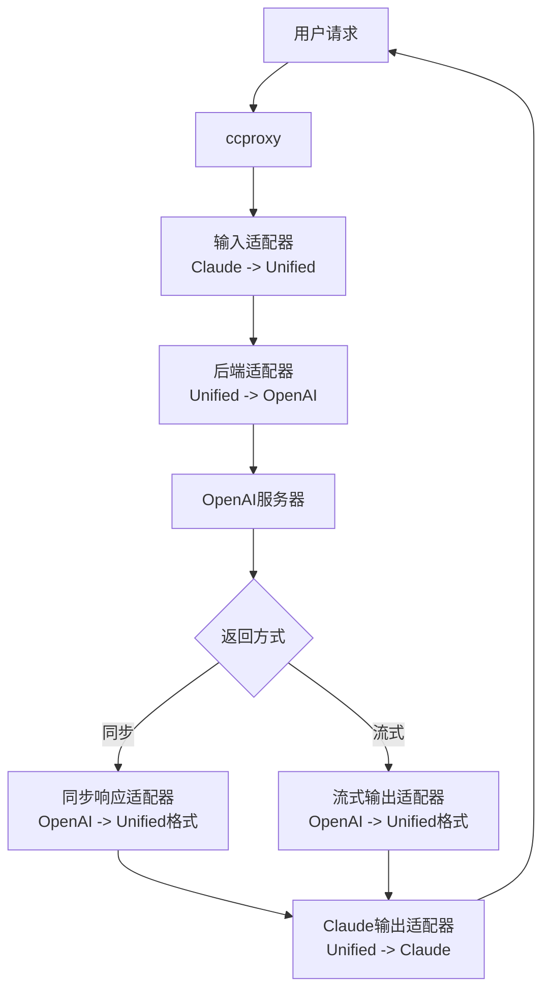

# ccproxy - 通用 AI 模型代理

> ccproxy 是一个协议适配器，它实现了 OpenAI 兼容协议、Claude、Gemini、Ollama 等主流 AI 协议之间的任意转换，并提供了 MCP 代理功能。

## 🎯 什么是 ccproxy？

ccproxy 是 Chatspeed 的核心模块，提供**通用 AI 模型代理能力**。它充当不同 AI 模型协议之间的桥梁，让您可以在任何开发环境中使用一种协议访问采用其他协议的 AI 模型。

## 🔄 协议转换

ccproxy 支持主流 AI 对话协议之间的无缝转换：

- **OpenAI 兼容格式**
- **Claude API**
- **Gemini API**
- **Ollama 本地模型**

## ⚙️ 工作原理

ccproxy 使用适配器模式实现不同 AI 模型协议间的无缝转换。当用户发起请求时，系统会自动将请求从一种协议格式转换为目标服务器所需的协议格式，并将最终输出转换回请求方所用的协议格式。

以下是以 Claude 协议输入，代理到兼容 OpenAI 协议的服务器的数据流向示例：



工作流程说明：

1.  用户发出 Claude 协议请求，路由器将其分发到相应的处理器。
2.  输入适配器将 Claude 格式数据转换为内部统一格式。
3.  后端适配器将统一格式转换为目标服务器（兼容 OpenAI 协议）所需的格式。
4.  转换后的数据被发送到兼容 OpenAI 协议的服务器。
5.  根据数据返回方式选择相应的处理方式：
    -   同步返回：通过响应适配器将 OpenAI 格式转换为统一格式。
    -   流式返回：通过流式适配器将 OpenAI 格式数据块逐块转换为统一格式块。
6.  输出适配器将统一格式转换回用户请求的 Claude 协议格式，并返回给客户端。

## 💡 使用场景

### 💰 成本优化

-   通过整合各模型平台的免费模型，以低成本甚至免费的方式替代昂贵的 Claude Code。
-   为不同使用场景定义独立的代理分组。
-   利用高性价比模型，**可将开发成本降低 80% 以上**。

### 🚀 开发效率

-   根据不同任务快速切换模型。
-   在所有 IDE 中使用统一接口。
-   无需反复重新配置工具。

### 🔬 学习研究

-   ccproxy 允许通过开关将各模型的输入输出信息记录到日志，方便研究各 IDE 的提示词系统。

### 🛡️ 隐私与控制

-   使用 Ollama 将敏感代码保留在本地处理。
-   利用 ccproxy 隔离真实模型配置信息（如密钥），提高安全性。
-   无供应商锁定，轻松切换模型服务。

## 🔧 ccproxy 配置

在开始本章节之前，请根据[安装指南](../guide/installation.md)安装好 **Chatspeed**。

### 🧩 代理分组

代理分组可以让用户根据使用场景，隔离不同的模型访问能力，也可以用于根据场景快速切换 Claude Code。

#### 分组管理

1.  按数字标注的顺序依次点击 Chatspeed 主窗口右上角的下拉菜单，选择“代理”。

    

2.  进入代理设置页面后，按数字标注顺序点击“代理分组”切换到代理分组管理，然后点击“+”添加分组。

    

3.  本例以`qwen`分组为例，按图中填写并保存。

    

    **其中**：

    -   **提示词注入**：选择**增强**。
    -   **提示词文本**：可以输入您需要的提示词增强（下文会提供示例）。
    -   **工具过滤**：输入`WebFetch`和`WebSearch`，一行一个。由于我们使用的是外部模型，Claude Code 的内部工具 `WebFetch`和`WebSearch`无法使用，因此需要过滤掉。这两个工具可以通过安装搜索相关的 MCP 工具来替代。
    -   **温度比例**：请根据不同模型的最佳温度来设置。Claude 生成代码时使用的温度是`1.0`，而根据 `qwen3-code`的官方文档，其最佳温度是`0.7`，所以比例应设为`0.7`。

**Claude Code**提示词增强：

```md
# Task Execution and Tool Usage

You are a world-class programming expert, responsible for executing code modifications, bug fixes, and writing code based on the user's requirements. Unless you need to confirm details with the user or the task has been completed, you should continue using the appropriate tools in each interaction to gradually push the task forward.

# Error Handling and Troubleshooting

When you need to use a tool, follow the user's provided tool and use standard output, aiming to avoid invalid tool calls. If an error occurs while executing a tool, first check the error message and attempt different solutions. If the same tool encounters errors more than 3 times in a row, consider the following steps:

1. Check if the tool configuration or usage is correct.
2. Consider switching to another tool or alternative solution to ensure the task continues progressing.
3. If the issue cannot be resolved, inform the user promptly and propose feasible alternative solutions.

# Maintaining Task Continuity

Throughout the task execution process, always monitor progress and strive to minimize interruptions. Ensure that each operation step is clear, and that every tool used is appropriate, so as to avoid wasting unnecessary resources and time. If multiple tool calls are required within a task, arrange them logically and execute them sequentially to ensure each step receives effective feedback.

# Language Consistency

You should always maintain the user's question in the language they are using, unless the user explicitly requests otherwise.
```

#### 分组切换

您可以依据上面的步骤依次添加 kimi 代理组、gemini 组等。不同分组的模型访问通过`/{group_name}/` 前缀即可，具体的访问规则请参考[API文档](../api/)。

### 🔀 代理管理

完成分组管理后，我们现在可以根据需要将不同的代理添加到相应分组中。本例以`Claude Code`使用场景为例，演示如何添加代理模型。

> 在开始本章节之前，您必须先添加一些模型。具体可以参考[快速开始](../guide/quickStart.md)的**添加模型**章节。

#### 代理设置

1.  按数字标注的顺序依次点击 Chatspeed 主窗口右上角的下拉菜单，选择“代理”。

    

2.  在代理管理页面依次按数字标注点击**代理服务**、**+**。

    

3.  按下图标注分别填写并保存，其中：

    -   **分组**：本例以配置 qwen3-code 作为 `Claude Code` 的备用模型，所以选择 qwen。
    -   **代理别名**：`Claude Code`目前使用`claude-sonnet-4-20250514`作为编程的主模型，因此这里填写`claude-sonnet-4-20250514`。
    -   **模型**：搜索 qwen，然后将所有 qwen3-coder 或相关的模型选中。

        > 注：图中`Nvidia`的`qwen3-235b-a22b`实际上并非代码模型，此处仅作示例。

    

4.  请按步骤 3 再次添加一个`claude-3-5-haiku-20241022`代理，这个是目前`Claude Code`用于生成会话标题的模型。

    

5.  至此，我们已经具备了`Claude Code`代理的基本条件。

    

### 🔑 密钥管理

代理密钥用于访问代理模型，它独立于 AI 供应商提供的密钥，可以有效保护您的数据安全。您可以配置多个密钥以用于不同的场景。

#### 密钥管理

1.  按数字标注的顺序依次点击 Chatspeed 主窗口右上角的下拉菜单，选择“代理”。

    

2.  按数字标注，切换到密钥管理，然后点击“+”，在**密钥名称**中输入`ClaudeCode`，然后点击保存。密钥的名称可以是您喜欢的任意字符串。

    

3.  您可以根据自己的使用场景添加多个密钥。例如，可以为`Claude Code`、`Cline`、`Roo Code`、`Zed`和开发测试（`dev`）分别添加密钥。文档中的一些示例密钥（如`dev`）通常可以安全地用于测试环境。

    

### ✍️ 提示词工程

目前 `Qwen Code` 每天有 2000 次免费调用额度，`Gemini CLI` 也有充足的免费额度（经测试`gemini-2.5-pro`每天约有 50 次免费额度，用完后会自动切换为`gemini-2.5-flash`）。因此，在预算有限的情况下，使用它们基本能满足大部分编程场景。当您希望体验`Claude Code`且预算有限时，使用各渠道的免费模型组成一个代理池，会是一个非常不错的选择。

但是，免费模型也存在一些限制，包括调用次数限制、频率限制、适配度问题等。调用次数和频率可以通过多账户、多密钥的方式解决。本文主要介绍适配问题。

可以确定的是，`Claude Code`中使用的`Claude`模型是经过专门适配的，其表现非常优秀，特别是工具调用出错的概率很低，工作流运行也十分流畅。

而要将外部未经特别训练的模型用于`Claude Code`，该模型至少**需具备**良好的工具调用能力和指令遵循能力。在此基础上，我们可以通过提示词增强来优化其在 `Claude Code` 中的表现。

下面的提示词增强是在`Claude Code`系统提示词的基础上追加的，它试图通过用法示例和引导来让模型更好地执行任务。由于提示词内容较多，您可以从这里参考[提示词增强](../../prompt.md)。

### 🎛️ 参数调优

从 `Claude Code` 发送的请求来看，目前主要通过温度参数进行调优，而`top_k`、`top_p`等参数则未作设置。各模型的最佳温度建议参考其官方文档。据了解，`qwen3-coder`的最佳温度是 0.7，而 `kimi-k2`的最佳温度是 0.6。其他模型请参考您所使用的模型的官方文档。

## 💻 使用示例

### 🤖 Claude Code

如果您已跟随上面的**ccproxy 配置**章节完成了所有设置，那么现在就可以在 Claude Code 中使用代理了。

为了方便切换代理分组，我们提供了两个脚本，分别用于 `zsh` 和 `bash` 环境。利用它们，您可以快速切换不同的代理分组。根据您使用的 Shell 环境，可以直接将相应脚本拷贝到`~/.zshrc`或`~/.bashrc`中。

> **重要**：务必将脚本中的`$DEV_KEY`修改为您在**代理密钥**中设置的密钥，并将`$KIMI_KEY`修改为您的实际密钥。另外，脚本中的`prod`环境使用了 Kimi 官方的 k2 接口，如果您使用的是`Claude Code`的官方模型，请将其改为相应的`URL`。


#### 代理分组切换辅助

1.  `zsh` 环境下的代理分组切换脚本

```zsh
# Format: [environment_name]="BASE_URL AUTH_TOKEN"
declare -A CLAUDE_ENV_MAP=(
  [dev]="http://127.0.0.1:11434 $DEV_KEY"
  [prod]="https://api.moonshot.cn/anthropic $KIMI_KEY"
)

# Function to set Claude Code environment variables
# Usage examples:
# source ~/.zshrc
# set_claude_env qwen      # Uses qwen configuration, URL becomes http://127.0.0.1:11434/qwen
# set_claude_env prod     # Uses prod configuration
set_claude_env() {
  local group_name="$1"     # Original environment name provided by the user
  local lookup_key="$1"   # Key used to look up configuration in the map
  local local_compat_mode="$2"

  # Check if argument is empty
  if [[ -z "$group_name" ]]; then
    echo "❌ Error: Missing argument. Usage: set_claude_env <environment_name>"
    # `${(k)VAR}` is Zsh syntax to get all keys of an associative array
    echo "Supported environment names: ${(k)CLAUDE_ENV_MAP}"
    return 1
  fi

  # If the input environment is not 'prod', force the 'dev' configuration
  if [[ "$lookup_key" != "prod" ]]; then
    lookup_key="dev"
  fi

  # Check if 'lookup_key' exists in the configuration map to prevent errors
  if [[ -z "${CLAUDE_ENV_MAP[$lookup_key]}" ]]; then
      echo "❌ Error: Configuration for environment '$lookup_key' not found."
      return 1
  fi

  # Get the corresponding values and set environment variables
  # `${(z)VAR}` is Zsh syntax to split a string into an array by whitespace
  local env_values=("${(z)CLAUDE_ENV_MAP[$lookup_key]}")
  export ANTHROPIC_BASE_URL="${env_values[1]}"
  export ANTHROPIC_AUTH_TOKEN="${env_values[2]}"

  # If 'dev' configuration is ultimately used, append '/<group_name>' to the URL
  if [[ "$lookup_key" == "dev" ]]; then
    if [[ "$local_compat_mode" == "compat" ]]; then
      export ANTHROPIC_BASE_URL="$ANTHROPIC_BASE_URL/$group_name/compat_mode"
    else
      export ANTHROPIC_BASE_URL="$ANTHROPIC_BASE_URL/$group_name"
    fi
  fi

  # Success message, explicitly stating the configuration used
  echo "✅ Successfully switched to environment: $group_name (using '$lookup_key' configuration)"
  echo "   ANTHROPIC_BASE_URL = $ANTHROPIC_BASE_URL"
  echo "   ANTHROPIC_AUTH_TOKEN = $ANTHROPIC_AUTH_TOKEN"
}
```

2.  `bash`环境下的代理分组切换脚本

```sh
# Format: [environment_name]="BASE_URL AUTH_TOKEN"
declare -A CLAUDE_ENV_MAP=(
  [dev]="http://127.0.0.1:11434 $DEV_KEY"
  [prod]="https://api.moonshot.cn/anthropic $KIMI_KEY"
)

# Function to set Claude Code environment variables
# Usage examples:
# source ~/.bashrc
# set_claude_env qwen      # Uses qwen configuration, URL becomes http://127.0.0.1:11434/qwen
# set_claude_env prod     # Uses prod configuration
set_claude_env() {
  local group_name="$1"     # Original environment name provided by the user
  local lookup_key="$1"   # Key used to look up configuration in the map
  local local_compat_mode="$2"

  # Check if argument is empty
  if [[ -z "$group_name" ]]; then
    echo "❌ Error: Missing argument. Usage: set_claude_env <environment_name>"
    # ${!VAR[@]} is Bash syntax to get all keys of an associative array
    echo "Supported environment names: ${!CLAUDE_ENV_MAP[@]}"
    return 1
  fi

  # If the input environment is not 'prod', force the 'dev' configuration
  if [[ "$lookup_key" != "prod" ]]; then
    lookup_key="dev"
  fi

  # Check if 'lookup_key' exists in the configuration map to prevent errors
  if [[ -z "${CLAUDE_ENV_MAP[$lookup_key]}" ]]; then
      echo "❌ Error: Configuration for environment '$lookup_key' not found."
      return 1
  fi

  # Get the corresponding values and set environment variables
  # Using read -ra to split the string into an array by whitespace
  local -a env_values # Declare as indexed array
  read -r -a env_values <<< "${CLAUDE_ENV_MAP[$lookup_key]}"

  # Bash array indexing starts at 0
  export ANTHROPIC_BASE_URL="${env_values[0]}"
  export ANTHROPIC_AUTH_TOKEN="${env_values[1]}"

  # If 'dev' configuration is ultimately used, append '/<group_name>' to the URL
  if [[ "$lookup_key" == "dev" ]]; then
    if [[ "$local_compat_mode" == "compat" ]]; then
      export ANTHROPIC_BASE_URL="$ANTHROPIC_BASE_URL/$group_name/compat_mode"
    else
      export ANTHROPIC_BASE_URL="$ANTHROPIC_BASE_URL/$group_name"
    fi
  fi

  # Success message, explicitly stating the configuration used
  echo "✅ Successfully switched to environment: $group_name (using '$lookup_key' configuration)"
  echo "   ANTHROPIC_BASE_URL = $ANTHROPIC_BASE_URL"
  echo "   ANTHROPIC_AUTH_TOKEN = $ANTHROPIC_AUTH_TOKEN"
}
```

#### 代理分组切换

以 `zsh` 为例，将上述脚本拷贝到您的 `~/.zshrc`中，然后执行 `source ~/.zshrc` 使其生效。

接下来我们就可以开始使用 `Claude Code` 了：

1.  执行 `source ~/.zshrc`
2.  执行 `set_claude_env qwen`
3.  执行 `claude` 进入 `Claude Code`

下面是我的输出示例：

```zsh
> claude
╭───────────────────────────────────────────────────╮
│ ✻ Welcome to Claude Code!                         │
│                                                   │
│   /help for help, /status for your current setup  │
│                                                   │
│   cwd: /Volumes/dev/personal/dev/ai/chatspeed     │
│                                                   │
│   ─────────────────────────────────────────────── │
│                                                   │
│   Overrides (via env):                            │
│                                                   │
│   • API Base URL: http://127.0.0.1:11434/qwen     │
╰───────────────────────────────────────────────────╯

> Could you analyze @src-tauri/src/ccproxy/ for me?
  ⎿  Listed directory src-tauri/src/ccproxy/

⏺ I'll analyze the src-tauri/src/ccproxy/ directory structure for you.

  This appears to be a Rust-based proxy implementation with support for multiple AI backends. Here's what I can see:

  The main components are:
  1. Adapter module - Contains backend implementations for different AI providers:
    - Claude, Gemini, Ollama, OpenAI backends
    - Input/output handling for each provider
    - Traits for standardizing adapter behavior
  2. Handler module - Manages different types of requests:
    - Chat handling
    - Direct requests
    - Model listing
    - Ollama-specific extra handlers
  3. Helper module - Utility functions:
    - Proxy rotation
    - SSE (Server-Sent Events) handling
    - Stream processing
  4. Types module - Data structures for each provider's API formats
  5. Core files:
    - auth.rs - Authentication handling
    - errors.rs - Error definitions
    - router.rs - Request routing

  This structure suggests a proxy service that can route requests to different AI backends while providing a unified interface. Each backend has its own adapter with
  specific input/output handling.

  Would you like me to examine any specific part of this implementation in more detail?
```

现在，您可以愉快地使用免费的 `Claude Code` 了！

### 💎 Gemini CLI

[待添加]

### 🛠️ Zed

Zed 是一款为高性能人机协作而设计的下一代代码编辑器。它在资源占用方面有优势，提供了不错的 AI 支持，并且调试功能也日趋成熟。

本节主要讲解如何将 ccproxy 配置的模型应用到 Zed 中。

1.  从菜单 `Zed` -> `Settings` -> `Open Settings`（macOS 快捷键: `Command + ,`）打开设置。
2.  将下面的配置添加到文件中：

```json
{
  "language_models": {
    "openai_compatible": {
      "Chatspeed": {
        "api_url": "http://localhost:11434/v1",
        "available_models": [
          {
            "name": "gemini2.5-pro",
            "display_name": "gemini2.5-pro",
            "max_tokens": 200000,
            "max_output_tokens": 32000,
            "max_completion_tokens": 200000
          },
          {
            "name": "gemini2.5-flash",
            "display_name": null,
            "max_tokens": 200000,
            "max_output_tokens": 32000,
            "max_completion_tokens": 200000
          },
          {
            "name": "gemini2.0-flash",
            "display_name": null,
            "max_tokens": 200000,
            "max_output_tokens": 32000,
            "max_completion_tokens": 200000
          },
          {
            "name": "deepseek-v3",
            "display_name": null,
            "max_tokens": 200000,
            "max_output_tokens": 32000,
            "max_completion_tokens": 200000
          },
          {
            "name": "qwen3-coder",
            "display_name": null,
            "max_tokens": 200000,
            "max_output_tokens": 32000,
            "max_completion_tokens": 200000
          },
          {
            "name": "k2",
            "display_name": "kimi-k2",
            "max_tokens": 200000,
            "max_output_tokens": 32000,
            "max_completion_tokens": 200000
          }
        ]
      }
    }
  }
}
```

> **注意**：所有模型都需预先在 Chatspeed 中添加。配置中的模型名称应从下图指示的位置拷贝。


2.  按下图数字标注的顺序拷贝代理密钥。

    

3.  按下图数字标注的顺序打开 Zed 的设置，并将**代理密钥**粘贴到**Chatspeed**的 API Key 字段中。

    

    

4.  完成以上步骤后，您就可以在 Zed 编辑器中使用代理模型了。

    

### 🛠️ Roo Code

[Roo Code](https://github.com/RooCodeInc/Roo-Code) 是 [Cline](https://github.com/cline/cline) 的一个分支，是一款优秀的 `vscode` **AI 插件**。它能高效处理繁琐任务，例如为 Chatspeed 补充缺失的 i18n 语言项，或通过安装必要的 MCP 工具进行信息校对。

下面主要讲解如何在 `Roo Code` 中配置 `ccproxy`的代理模型，下文以添加 `gemini2.5-pro`为例。

1.  按下图数字标注的顺序打开 Roo Code 的模型设置，输入`gemini2.5-pro`然后点击`Create Profile`保存。

    

2.  按下图数字标注的顺序点开，输入相关信息，然后点击**数字 6** 标注的`Save`按钮保存信息，其中：

    -   **API Provider**：选择 `OpenAI Compatible`。
    -   **Base URL**：输入`http://127.0.0.1:11434/v1`。
    -   **API Key**：从 ccproxy 设置界面拷贝代理密钥并粘贴。
    -   **Model**：选择 `gemini2.5-pro`。
    -   `gemini2.5-pro` 支持图片输入和工具调用，可以将对应的选项打勾，也可以忽略。

    

3.  Roo Code 支持创建多个模型，您只需重复第一步和第二步即可添加其他模型。最后返回 `Roo Code` 插件主界面，就可以开始使用了。

    

### 🛠️ Cline

[Cline](https://github.com/cline/cline) 是一款优秀的 vscode 插件，它的 `计划 -> 执行` 模式与`Roo Code`有所不同，是另一款流行的 AI 编程插件。本文主要讲解如何在 `Cline` 中配置 `ccproxy`的代理模型。

1.  按下图数字标注的顺序打开 Cline 的模型设置，首先设置`Cline`的**执行模型**，其中：

    -   **API Provider**：选择 `OpenAI Compatible`。
    -   **Base URL**：输入`http://127.0.0.1:11434/v1`。
    -   **API Key**：从 ccproxy 设置界面拷贝代理密钥并粘贴。
    -   **Model ID**：输入 `gemini2.5-flash`。
    -   `gemini2.5-flash` 支持图片输入和工具调用，可以将对应的选项打勾，也可以忽略。

    

2.  切换到`Plan Mode`，按下图数字标注的顺序修改相关信息，然后点击**数字 3** 标注的`Done`按钮保存信息，其中：

    -   **Model ID**：选择 `deepseek-r1-0528`。
    -   `deepseek-r1-0528` 是推理模型，因此如图中**数字 2** 所示，取消勾选`Supports Images`和`Supports browser use`。

    

3.  回到 `Cline` 插件的主界面，您就可以开始使用了。

    

## 📚 下一步

-   [MCP 代理集成](../mcp/)
-   [API 参考](../api/)
