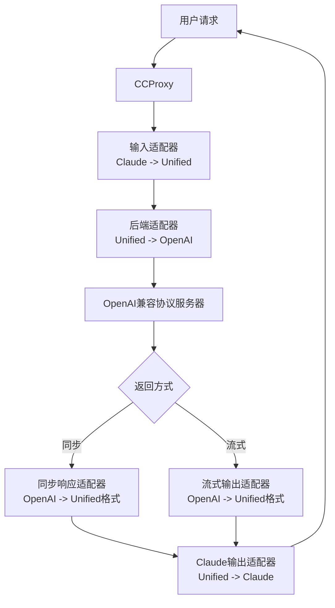

# CCProxy 简介

> CCProxy (Chat Completion Proxy) 是一个协议适配器，它实现了 OpenAI 兼容协议、Claude、Gemini、Ollama 协议之间的任意转换。

## 🎯 什么是 CCProxy？

CCProxy 是 Chatspeed 的核心模块，提供**通用 AI 模型代理能力**。它作为不同 AI 模型协议之间的适配桥梁，让您能够将市面上绝大多数 AI 模型接入到各种流行的 AI IDE 或插件中。例如，您可以将 Gemini、本地部署的 Ollama 模型，或其他支持 OpenAI 兼容协议格式的模型接入到 Claude Code 等平台。

CCProxy 还具备 AI 模型增强功能，其**工具兼容模式**可以让不支持原生工具调用（function calling）的模型获得工具调用能力。例如，许多通过 Ollama 部署的模型原本不支持工具调用，但通过 CCProxy 即可“获得”此能力，并能够接入 Claude Code 或 Gemini CLI 等平台。

## 🔄 CCProxy 支持哪些协议转换

CCProxy 支持主流 AI 对话协议之间的无缝转换：

- **OpenAI 兼容格式**
- **Claude API**
- **Gemini API**
- **Ollama 本地模型**

## ⚙️ CCProxy 的工作原理

CCProxy 使用适配器模式实现不同 AI 模型协议间的无缝转换。当用户发起请求时，系统会自动将请求从一种协议格式转换为目标服务器所需的协议格式，并将最终输出转换回请求方所用的协议格式。

以下是以 `Claude` 协议输入，代理到 `OpenAI 兼容协议`的服务器的数据流向示例：

工作流程说明：

1. 用户发出 Claude 协议请求，路由器将其分发到相应的处理器。
2. 输入适配器将 Claude 格式数据转换为内部统一格式。
3. 后端适配器将统一格式转换为目标服务器（兼容 OpenAI 协议）所需的格式。
4. 转换后的数据被发送到 AI (OpenAI 兼容协议) 服务器。
5. 根据数据返回方式选择相应的处理方式：
    - 同步返回：通过响应适配器将 OpenAI 格式转换为统一格式。
    - 流式返回：通过流式适配器将 OpenAI 格式数据块逐块转换为统一格式块。
6. 输出适配器将统一格式转换回用户请求的 Claude 协议格式，并返回给客户端。

## 🚀 CCProxy 的核心价值

### 🔄 全局密钥轮换

CCProxy 提供多重负载均衡能力：

- 支持为每个供应商添加多个访问密钥
- 每个代理模型可以路由到多个相同或不同的供应商模型
- 客户端请求时会自动在所有供应商和密钥之间进行轮询
- 可将多个免费渠道组合成代理池，提高调用限额和频率

### 💰 成本优化

- 通过整合各模型平台的免费模型，以低成本甚至免费的方式替代昂贵的 Claude Code。
- 为不同使用场景定义独立的代理分组。
- 利用高性价比模型，**可将开发成本降低 80% 以上**。

### 🚀 开发效率

- 根据不同任务快速切换模型。
- 在所有 IDE 中使用统一接口。
- 无需反复重新配置工具。

### 🔬 学习研究

- CCProxy 允许通过开关将各模型的输入输出信息记录到日志，方便研究各**工作流**的提示词系统。

### 🛡️ 隐私与控制

- 利用 CCProxy 隔离真实模型配置信息（如密钥），提高安全性。
- 无供应商锁定，轻松切换模型服务。

## 📚 详细文档

- [配置指南](./configuration.md)
- [Claude Code 使用](./claude-code.md)
- [Gemini CLI 使用](./gemini-cli.md)
- [Zed 配置](./zed.md)
- [Roo Code 配置](./roo-code.md)
- [Cline 配置](./cline.md)

## 📚 下一步

- [MCP 代理集成](../mcp/)
- [API 参考](../api/)
