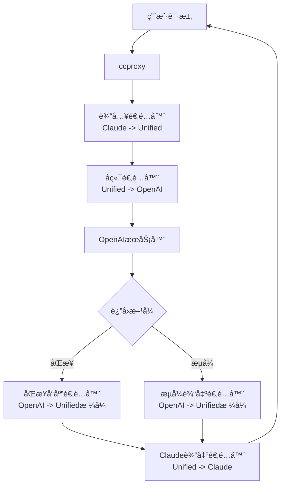

# ccproxy - 通用 AI 模å‹ä»£ç†

> ccproxy 是一个å议适é…器，它å®ç°äº† OpenAI 兼容åè®®ã€Claudeã€Geminiã€Ollama ç­‰ä¸»æµ AI å议之间的任æ„转æ¢ï¼Œå¹¶æ供了 MCP 代ç†åŠŸèƒ½ã€‚

## 🯠什么是 ccproxy？

ccproxy 是 Chatspeed 的核心模å—，æä¾›**通用 AI 模å‹ä»£ç†èƒ½åŠ›**。它充当ä¸åŒ AI 模å‹å议之间的桥æ¢ï¼Œè®©æ‚¨å¯ä»¥åœ¨ä»»ä½•å¼€å‘ç¯å¢ƒä¸­ä½¿ç”¨ä¸€ç§å议访问采用其他å议的 AI 模å‹ã€‚

## 🔄 å议转æ¢

ccproxy 支æŒä¸»æµ AI 对è¯å议之间的无ç¼è½¬æ¢ï¼š

- **OpenAI 兼容格å¼**
- **Claude API**
- **Gemini API**
- **Ollama 本地模å‹**

## âš™ï¸ å·¥ä½œåŸç†

ccproxy 使用适é…器模å¼å®ç°ä¸åŒ AI 模å‹å议间的无ç¼è½¬æ¢ã€‚当用户å‘起请求时，系统会自动将请求ä»ä¸€ç§å议格å¼è½¬æ¢ä¸ºç›®æ ‡æœåŠ¡å™¨æ‰€éœ€çš„å议格å¼ï¼Œå¹¶å°†æœ€ç»ˆè¾“出转æ¢å›è¯·æ±‚方所用的å议格å¼ã€‚

以下是以 Claude å议输入，代ç†åˆ°å…¼å®¹ OpenAI å议的æœåŠ¡å™¨çš„æ•°æ®æµå‘示例：



工作æµç¨‹è¯´æ˜ï¼š

1.  用户å‘出 Claude å议请求，路由器将其分å‘到相应的处ç†å™¨ã€‚
2.  输入适é…器将 Claude æ ¼å¼æ•°æ®è½¬æ¢ä¸ºå†…部统一格å¼ã€‚
3.  å端适é…器将统一格å¼è½¬æ¢ä¸ºç›®æ ‡æœåŠ¡å™¨ï¼ˆå…¼å®¹ OpenAI å议）所需的格å¼ã€‚
4.  转æ¢åçš„æ•°æ®è¢«å‘é€åˆ°å…¼å®¹ OpenAI å议的æœåŠ¡å™¨ã€‚
5.  æ ¹æ®æ•°æ®è¿”å›æ–¹å¼é€‰æ‹©ç›¸åº”的处ç†æ–¹å¼ï¼š
    -   åŒæ­¥è¿”å›ï¼šé€šè¿‡å“应适é…器将 OpenAI æ ¼å¼è½¬æ¢ä¸ºç»Ÿä¸€æ ¼å¼ã€‚
    -   æµå¼è¿”å›ï¼šé€šè¿‡æµå¼é€‚é…器将 OpenAI æ ¼å¼æ•°æ®å—é€å—转æ¢ä¸ºç»Ÿä¸€æ ¼å¼å—。
6.  输出适é…器将统一格å¼è½¬æ¢å›ç”¨æˆ·è¯·æ±‚çš„ Claude å议格å¼ï¼Œå¹¶è¿”å›ç»™å®¢æˆ·ç«¯ã€‚

## 💡 使用场景

### 💰 æˆæœ¬ä¼˜åŒ–

-   通过整åˆå„模å‹å¹³å°çš„å…费模å‹ï¼Œä»¥ä½æˆæœ¬ç”šè‡³å…费的方å¼æ›¿ä»£æ˜‚贵的 Claude Code。
-   为ä¸åŒä½¿ç”¨åœºæ™¯å®šä¹‰ç‹¬ç«‹çš„代ç†åˆ†ç»„。
-   利用高性价比模å‹ï¼Œ**å¯å°†å¼€å‘æˆæœ¬é™ä½ 80% 以上**。

### 🚀 å¼€å‘效ç‡

-   æ ¹æ®ä¸åŒä»»åŠ¡å¿«é€Ÿåˆ‡æ¢æ¨¡å‹ã€‚
-   在所有 IDE 中使用统一æ¥å£ã€‚
-   无需åå¤é‡æ–°é…置工具。

### 🔬 学习研究

-   ccproxy å…许通过开关将å„模å‹çš„输入输出信æ¯è®°å½•åˆ°æ—¥å¿—ï¼Œæ–¹ä¾¿ç ”ç©¶å„ IDE çš„æ示è¯ç³»ç»Ÿã€‚

### ğŸ›¡ï¸ éšç§ä¸æ§åˆ¶

-   使用 Ollama å°†æ•æ„Ÿä»£ç ä¿ç•™åœ¨æœ¬åœ°å¤„ç†ã€‚
-   利用 ccproxy 隔离真å®æ¨¡å‹é…置信æ¯ï¼ˆå¦‚密钥），æ高安全性。
-   无供应商é”定，轻æ¾åˆ‡æ¢æ¨¡å‹æœåŠ¡ã€‚

## 🔧 ccproxy é…ç½®

在开始本章节之å‰ï¼Œè¯·æ ¹æ®[安装指å—](../guide/installation.md)安装好 **Chatspeed**。

### 🧩 代ç†åˆ†ç»„

代ç†åˆ†ç»„å¯ä»¥è®©ç”¨æˆ·æ ¹æ®ä½¿ç”¨åœºæ™¯ï¼Œéš”离ä¸åŒçš„模å‹è®¿é—®èƒ½åŠ›ï¼Œä¹Ÿå¯ä»¥ç”¨äºæ ¹æ®åœºæ™¯å¿«é€Ÿåˆ‡æ¢ Claude Code。

#### 分组管ç†

1.  按数字标注的顺åºä¾æ¬¡ç‚¹å‡» Chatspeed 主窗å£å³ä¸Šè§’的下拉èœå•ï¼Œé€‰æ‹©â€œä»£ç†â€ã€‚

    

2.  进入代ç†è®¾ç½®é¡µé¢å，按数字标注顺åºç‚¹å‡»â€œä»£ç†åˆ†ç»„â€åˆ‡æ¢åˆ°ä»£ç†åˆ†ç»„管ç†ï¼Œç„¶å点击“+â€æ·»åŠ åˆ†ç»„。

    

3.  本例以`qwen`分组为例，按图中填写并ä¿å­˜ã€‚

    

    **其中**：

    -   **æ示è¯æ³¨å…¥**：选择**å¢å¼º**。
    -   **æ示è¯æ–‡æœ¬**：å¯ä»¥è¾“入您需è¦çš„æ示è¯å¢å¼ºï¼ˆä¸‹æ–‡ä¼šæ供示例）。
    -   **工具过滤**：输入`WebFetch`å’Œ`WebSearch`，一行一个。由äºæˆ‘们使用的是外部模å‹ï¼ŒClaude Code 的内部工具 `WebFetch`å’Œ`WebSearch`无法使用，因此需è¦è¿‡æ»¤æ‰ã€‚这两个工具å¯ä»¥é€šè¿‡å®‰è£…æœç´¢ç›¸å…³çš„ MCP 工具æ¥æ›¿ä»£ã€‚
    -   **温度比例**：请根æ®ä¸åŒæ¨¡å‹çš„最佳温度æ¥è®¾ç½®ã€‚Claude 生æˆä»£ç æ—¶ä½¿ç”¨çš„温度是`1.0`ï¼Œè€Œæ ¹æ® `qwen3-code`的官方文档，其最佳温度是`0.7`，所以比例应设为`0.7`。

**Claude Code**æ示è¯å¢å¼ºï¼š

```md
# Task Execution and Tool Usage

You are a world-class programming expert, responsible for executing code modifications, bug fixes, and writing code based on the user's requirements. Unless you need to confirm details with the user or the task has been completed, you should continue using the appropriate tools in each interaction to gradually push the task forward.

# Error Handling and Troubleshooting

When you need to use a tool, follow the user's provided tool and use standard output, aiming to avoid invalid tool calls. If an error occurs while executing a tool, first check the error message and attempt different solutions. If the same tool encounters errors more than 3 times in a row, consider the following steps:

1. Check if the tool configuration or usage is correct.
2. Consider switching to another tool or alternative solution to ensure the task continues progressing.
3. If the issue cannot be resolved, inform the user promptly and propose feasible alternative solutions.

# Maintaining Task Continuity

Throughout the task execution process, always monitor progress and strive to minimize interruptions. Ensure that each operation step is clear, and that every tool used is appropriate, so as to avoid wasting unnecessary resources and time. If multiple tool calls are required within a task, arrange them logically and execute them sequentially to ensure each step receives effective feedback.

# Language Consistency

You should always maintain the user's question in the language they are using, unless the user explicitly requests otherwise.
```

#### 分组切æ¢

您å¯ä»¥ä¾æ®ä¸Šé¢çš„步骤ä¾æ¬¡æ·»åŠ  kimi 代ç†ç»„ã€gemini 组等。ä¸åŒåˆ†ç»„的模å‹è®¿é—®é€šè¿‡`/{group_name}/` å‰ç¼€å³å¯ï¼Œå…·ä½“的访问规则请å‚考[API文档](../api/)。

### 🔀 代ç†ç®¡ç†

完æˆåˆ†ç»„管ç†å，我们ç°åœ¨å¯ä»¥æ ¹æ®éœ€è¦å°†ä¸åŒçš„代ç†æ·»åŠ åˆ°ç›¸åº”分组中。本例以`Claude Code`使用场景为例，演示如何添加代ç†æ¨¡å‹ã€‚

> 在开始本章节之å‰ï¼Œæ‚¨å¿…须先添加一些模å‹ã€‚具体å¯ä»¥å‚考[快速开始](../guide/quickStart.md)çš„**添加模å‹**章节。

#### 代ç†è®¾ç½®

1.  按数字标注的顺åºä¾æ¬¡ç‚¹å‡» Chatspeed 主窗å£å³ä¸Šè§’的下拉èœå•ï¼Œé€‰æ‹©â€œä»£ç†â€ã€‚

    

2.  在代ç†ç®¡ç†é¡µé¢ä¾æ¬¡æŒ‰æ•°å­—标注点击**代ç†æœåŠ¡**ã€**+**。

    

3.  按下图标注分别填写并ä¿å­˜ï¼Œå…¶ä¸­ï¼š

    -   **分组**：本例以é…ç½® qwen3-code 作为 `Claude Code` 的备用模å‹ï¼Œæ‰€ä»¥é€‰æ‹© qwen。
    -   **代ç†åˆ«å**：`Claude Code`ç›®å‰ä½¿ç”¨`claude-sonnet-4-20250514`作为编程的主模å‹ï¼Œå› æ­¤è¿™é‡Œå¡«å†™`claude-sonnet-4-20250514`。
    -   **模å‹**：æœç´¢ qwen，然å将所有 qwen3-coder 或相关的模å‹é€‰ä¸­ã€‚

        > 注：图中`Nvidia`çš„`qwen3-235b-a22b`å®é™…上并é代ç æ¨¡å‹ï¼Œæ­¤å¤„仅作示例。

    

4.  请按步骤 3 å†æ¬¡æ·»åŠ ä¸€ä¸ª`claude-3-5-haiku-20241022`代ç†ï¼Œè¿™ä¸ªæ˜¯ç›®å‰`Claude Code`用äºç”Ÿæˆä¼šè¯æ ‡é¢˜çš„模å‹ã€‚

    

5.  至此，我们已ç»å…·å¤‡äº†`Claude Code`代ç†çš„基本æ¡ä»¶ã€‚

    

### 🔑 密钥管ç†

代ç†å¯†é’¥ç”¨äºè®¿é—®ä»£ç†æ¨¡å‹ï¼Œå®ƒç‹¬ç«‹äº AI 供应商æ供的密钥，å¯ä»¥æœ‰æ•ˆä¿æŠ¤æ‚¨çš„æ•°æ®å®‰å…¨ã€‚您å¯ä»¥é…置多个密钥以用äºä¸åŒçš„场景。

#### 密钥管ç†

1.  按数字标注的顺åºä¾æ¬¡ç‚¹å‡» Chatspeed 主窗å£å³ä¸Šè§’的下拉èœå•ï¼Œé€‰æ‹©â€œä»£ç†â€ã€‚

    

2.  按数字标注，切æ¢åˆ°å¯†é’¥ç®¡ç†ï¼Œç„¶å点击“+â€ï¼Œåœ¨**密钥å称**中输入`ClaudeCode`，然å点击ä¿å­˜ã€‚密钥的å称å¯ä»¥æ˜¯æ‚¨å–œæ¬¢çš„ä»»æ„字符串。

    

3.  您å¯ä»¥æ ¹æ®è‡ªå·±çš„使用场景添加多个密钥。例如，å¯ä»¥ä¸º`Claude Code`ã€`Cline`ã€`Roo Code`ã€`Zed`和开å‘测试（`dev`）分别添加密钥。文档中的一些示例密钥（如`dev`）通常å¯ä»¥å®‰å…¨åœ°ç”¨äºæµ‹è¯•ç¯å¢ƒã€‚

    

### âœï¸ æ示è¯å·¥ç¨‹

ç›®å‰ `Qwen Code` æ¯å¤©æœ‰ 2000 次å…费调用é¢åº¦ï¼Œ`Gemini CLI` 也有充足的å…è´¹é¢åº¦ï¼ˆç»æµ‹è¯•`gemini-2.5-pro`æ¯å¤©çº¦æœ‰ 50 次å…è´¹é¢åº¦ï¼Œç”¨å®Œå会自动切æ¢ä¸º`gemini-2.5-flash`）。因此，在预算有é™çš„情况下，使用它们基本能满足大部分编程场景。当您希望体验`Claude Code`且预算有é™æ—¶ï¼Œä½¿ç”¨å„渠é“çš„å…费模å‹ç»„æˆä¸€ä¸ªä»£ç†æ± ï¼Œä¼šæ˜¯ä¸€ä¸ªé常ä¸é”™çš„选择。

但是，å…费模å‹ä¹Ÿå­˜åœ¨ä¸€äº›é™åˆ¶ï¼ŒåŒ…括调用次数é™åˆ¶ã€é¢‘ç‡é™åˆ¶ã€é€‚é…度问题等。调用次数和频ç‡å¯ä»¥é€šè¿‡å¤šè´¦æˆ·ã€å¤šå¯†é’¥çš„æ–¹å¼è§£å†³ã€‚本文主è¦ä»‹ç»é€‚é…问题。

å¯ä»¥ç¡®å®šçš„是，`Claude Code`中使用的`Claude`模å‹æ˜¯ç»è¿‡ä¸“门适é…的，其表ç°é常优秀，特别是工具调用出错的概ç‡å¾ˆä½ï¼Œå·¥ä½œæµè¿è¡Œä¹Ÿå分æµç•…。

而è¦å°†å¤–部未ç»ç‰¹åˆ«è®­ç»ƒçš„模å‹ç”¨äº`Claude Code`，该模å‹è‡³å°‘**需具备**良好的工具调用能力和指令éµå¾ªèƒ½åŠ›ã€‚在此基础上，我们å¯ä»¥é€šè¿‡æ示è¯å¢å¼ºæ¥ä¼˜åŒ–其在 `Claude Code` 中的表ç°ã€‚

下é¢çš„æ示è¯å¢å¼ºæ˜¯åœ¨`Claude Code`系统æ示è¯çš„基础上追加的，它试图通过用法示例和引导æ¥è®©æ¨¡å‹æ›´å¥½åœ°æ‰§è¡Œä»»åŠ¡ã€‚ç”±äºæ示è¯å†…容较多，您å¯ä»¥ä»è¿™é‡Œå‚考[æ示è¯å¢å¼º](../../prompt.md)。

### ğŸ›ï¸ å‚数调优

ä» `Claude Code` å‘é€çš„请求æ¥çœ‹ï¼Œç›®å‰ä¸»è¦é€šè¿‡æ¸©åº¦å‚数进行调优，而`top_k`ã€`top_p`ç­‰å‚数则未作设置。å„模å‹çš„最佳温度建议å‚考其官方文档。æ®äº†è§£ï¼Œ`qwen3-coder`的最佳温度是 0.7，而 `kimi-k2`的最佳温度是 0.6。其他模å‹è¯·å‚考您所使用的模å‹çš„官方文档。

## 💻 使用示例

### 🤖 Claude Code

如æœæ‚¨å·²è·Ÿéšä¸Šé¢çš„**ccproxy é…ç½®**章节完æˆäº†æ‰€æœ‰è®¾ç½®ï¼Œé‚£ä¹ˆç°åœ¨å°±å¯ä»¥åœ¨ Claude Code 中使用代ç†äº†ã€‚

为了方便切æ¢ä»£ç†åˆ†ç»„，我们æä¾›äº†ä¸¤ä¸ªè„šæœ¬ï¼Œåˆ†åˆ«ç”¨äº `zsh` å’Œ `bash` ç¯å¢ƒã€‚利用它们，您å¯ä»¥å¿«é€Ÿåˆ‡æ¢ä¸åŒçš„代ç†åˆ†ç»„。根æ®æ‚¨ä½¿ç”¨çš„ Shell ç¯å¢ƒï¼Œå¯ä»¥ç›´æ¥å°†ç›¸åº”脚本拷è´åˆ°`~/.zshrc`或`~/.bashrc`中。

> **é‡è¦**：务必将脚本中的`$DEV_KEY`修改为您在**代ç†å¯†é’¥**中设置的密钥，并将`$KIMI_KEY`修改为您的å®é™…密钥。å¦å¤–，脚本中的`prod`ç¯å¢ƒä½¿ç”¨äº† Kimi 官方的 k2 æ¥å£ï¼Œå¦‚æœæ‚¨ä½¿ç”¨çš„是`Claude Code`的官方模å‹ï¼Œè¯·å°†å…¶æ”¹ä¸ºç›¸åº”çš„`URL`。


#### 代ç†åˆ†ç»„切æ¢è¾…助

1.  `zsh` ç¯å¢ƒä¸‹çš„代ç†åˆ†ç»„切æ¢è„šæœ¬

```zsh
# Format: [environment_name]="BASE_URL AUTH_TOKEN"
declare -A CLAUDE_ENV_MAP=(
  [dev]="http://127.0.0.1:11434 $DEV_KEY"
  [prod]="https://api.moonshot.cn/anthropic $KIMI_KEY"
)

# Function to set Claude Code environment variables
# Usage examples:
# source ~/.zshrc
# set_claude_env qwen      # Uses qwen configuration, URL becomes http://127.0.0.1:11434/qwen
# set_claude_env prod     # Uses prod configuration
set_claude_env() {
  local group_name="$1"     # Original environment name provided by the user
  local lookup_key="$1"   # Key used to look up configuration in the map
  local local_compat_mode="$2"

  # Check if argument is empty
  if [[ -z "$group_name" ]]; then
    echo "⌠Error: Missing argument. Usage: set_claude_env <environment_name>"
    # `${(k)VAR}` is Zsh syntax to get all keys of an associative array
    echo "Supported environment names: ${(k)CLAUDE_ENV_MAP}"
    return 1
  fi

  # If the input environment is not 'prod', force the 'dev' configuration
  if [[ "$lookup_key" != "prod" ]]; then
    lookup_key="dev"
  fi

  # Check if 'lookup_key' exists in the configuration map to prevent errors
  if [[ -z "${CLAUDE_ENV_MAP[$lookup_key]}" ]]; then
      echo "⌠Error: Configuration for environment '$lookup_key' not found."
      return 1
  fi

  # Get the corresponding values and set environment variables
  # `${(z)VAR}` is Zsh syntax to split a string into an array by whitespace
  local env_values=("${(z)CLAUDE_ENV_MAP[$lookup_key]}")
  export ANTHROPIC_BASE_URL="${env_values[1]}"
  export ANTHROPIC_AUTH_TOKEN="${env_values[2]}"

  # If 'dev' configuration is ultimately used, append '/<group_name>' to the URL
  if [[ "$lookup_key" == "dev" ]]; then
    if [[ "$local_compat_mode" == "compat" ]]; then
      export ANTHROPIC_BASE_URL="$ANTHROPIC_BASE_URL/$group_name/compat_mode"
    else
      export ANTHROPIC_BASE_URL="$ANTHROPIC_BASE_URL/$group_name"
    fi
  fi

  # Success message, explicitly stating the configuration used
  echo "✅ Successfully switched to environment: $group_name (using '$lookup_key' configuration)"
  echo "   ANTHROPIC_BASE_URL = $ANTHROPIC_BASE_URL"
  echo "   ANTHROPIC_AUTH_TOKEN = $ANTHROPIC_AUTH_TOKEN"
}
```

2.  `bash`ç¯å¢ƒä¸‹çš„代ç†åˆ†ç»„切æ¢è„šæœ¬

```sh
# Format: [environment_name]="BASE_URL AUTH_TOKEN"
declare -A CLAUDE_ENV_MAP=(
  [dev]="http://127.0.0.1:11434 $DEV_KEY"
  [prod]="https://api.moonshot.cn/anthropic $KIMI_KEY"
)

# Function to set Claude Code environment variables
# Usage examples:
# source ~/.bashrc
# set_claude_env qwen      # Uses qwen configuration, URL becomes http://127.0.0.1:11434/qwen
# set_claude_env prod     # Uses prod configuration
set_claude_env() {
  local group_name="$1"     # Original environment name provided by the user
  local lookup_key="$1"   # Key used to look up configuration in the map
  local local_compat_mode="$2"

  # Check if argument is empty
  if [[ -z "$group_name" ]]; then
    echo "⌠Error: Missing argument. Usage: set_claude_env <environment_name>"
    # ${!VAR[@]} is Bash syntax to get all keys of an associative array
    echo "Supported environment names: ${!CLAUDE_ENV_MAP[@]}"
    return 1
  fi

  # If the input environment is not 'prod', force the 'dev' configuration
  if [[ "$lookup_key" != "prod" ]]; then
    lookup_key="dev"
  fi

  # Check if 'lookup_key' exists in the configuration map to prevent errors
  if [[ -z "${CLAUDE_ENV_MAP[$lookup_key]}" ]]; then
      echo "⌠Error: Configuration for environment '$lookup_key' not found."
      return 1
  fi

  # Get the corresponding values and set environment variables
  # Using read -ra to split the string into an array by whitespace
  local -a env_values # Declare as indexed array
  read -r -a env_values <<< "${CLAUDE_ENV_MAP[$lookup_key]}"

  # Bash array indexing starts at 0
  export ANTHROPIC_BASE_URL="${env_values[0]}"
  export ANTHROPIC_AUTH_TOKEN="${env_values[1]}"

  # If 'dev' configuration is ultimately used, append '/<group_name>' to the URL
  if [[ "$lookup_key" == "dev" ]]; then
    if [[ "$local_compat_mode" == "compat" ]]; then
      export ANTHROPIC_BASE_URL="$ANTHROPIC_BASE_URL/$group_name/compat_mode"
    else
      export ANTHROPIC_BASE_URL="$ANTHROPIC_BASE_URL/$group_name"
    fi
  fi

  # Success message, explicitly stating the configuration used
  echo "✅ Successfully switched to environment: $group_name (using '$lookup_key' configuration)"
  echo "   ANTHROPIC_BASE_URL = $ANTHROPIC_BASE_URL"
  echo "   ANTHROPIC_AUTH_TOKEN = $ANTHROPIC_AUTH_TOKEN"
}
```

#### 代ç†åˆ†ç»„切æ¢

以 `zsh` 为例，将上述脚本拷è´åˆ°æ‚¨çš„ `~/.zshrc`中，然å执行 `source ~/.zshrc` 使其生效。

æ¥ä¸‹æ¥æˆ‘们就å¯ä»¥å¼€å§‹ä½¿ç”¨ `Claude Code` 了：

1.  执行 `source ~/.zshrc`
2.  执行 `set_claude_env qwen`
3.  执行 `claude` 进入 `Claude Code`

下é¢æ˜¯æˆ‘的输出示例：

```zsh
> claude
╭───────────────────────────────────────────────────╮
│ ✻ Welcome to Claude Code!                         │
│                                                   │
│   /help for help, /status for your current setup  │
│                                                   │
│   cwd: /Volumes/dev/personal/dev/ai/chatspeed     │
│                                                   │
│   ─────────────────────────────────────────────── │
│                                                   │
│   Overrides (via env):                            │
│                                                   │
│   • API Base URL: http://127.0.0.1:11434/qwen     │
╰───────────────────────────────────────────────────╯

> Could you analyze @src-tauri/src/ccproxy/ for me?
  ⿠ Listed directory src-tauri/src/ccproxy/

⺠I'll analyze the src-tauri/src/ccproxy/ directory structure for you.

  This appears to be a Rust-based proxy implementation with support for multiple AI backends. Here's what I can see:

  The main components are:
  1. Adapter module - Contains backend implementations for different AI providers:
    - Claude, Gemini, Ollama, OpenAI backends
    - Input/output handling for each provider
    - Traits for standardizing adapter behavior
  2. Handler module - Manages different types of requests:
    - Chat handling
    - Direct requests
    - Model listing
    - Ollama-specific extra handlers
  3. Helper module - Utility functions:
    - Proxy rotation
    - SSE (Server-Sent Events) handling
    - Stream processing
  4. Types module - Data structures for each provider's API formats
  5. Core files:
    - auth.rs - Authentication handling
    - errors.rs - Error definitions
    - router.rs - Request routing

  This structure suggests a proxy service that can route requests to different AI backends while providing a unified interface. Each backend has its own adapter with
  specific input/output handling.

  Would you like me to examine any specific part of this implementation in more detail?
```

ç°åœ¨ï¼Œæ‚¨å¯ä»¥æ„‰å¿«åœ°ä½¿ç”¨å…费的 `Claude Code` 了ï¼

### 💠Gemini CLI

[待添加]

### ğŸ› ï¸ Zed

Zed 是一款为高性能人机å作而设计的下一代代ç ç¼–辑器。它在资æºå ç”¨æ–¹é¢æœ‰ä¼˜åŠ¿ï¼Œæ供了ä¸é”™çš„ AI 支æŒï¼Œå¹¶ä¸”调试功能也日趋æˆç†Ÿã€‚

本节主è¦è®²è§£å¦‚何将 ccproxy é…置的模å‹åº”用到 Zed 中。

1.  ä»èœå• `Zed` -> `Settings` -> `Open Settings`（macOS å¿«æ·é”®: `Command + ,`）打开设置。
2.  将下é¢çš„é…置添加到文件中：

```json
{
  "language_models": {
    "openai_compatible": {
      "Chatspeed": {
        "api_url": "http://localhost:11434/v1",
        "available_models": [
          {
            "name": "gemini2.5-pro",
            "display_name": "gemini2.5-pro",
            "max_tokens": 200000,
            "max_output_tokens": 32000,
            "max_completion_tokens": 200000
          },
          {
            "name": "gemini2.5-flash",
            "display_name": null,
            "max_tokens": 200000,
            "max_output_tokens": 32000,
            "max_completion_tokens": 200000
          },
          {
            "name": "gemini2.0-flash",
            "display_name": null,
            "max_tokens": 200000,
            "max_output_tokens": 32000,
            "max_completion_tokens": 200000
          },
          {
            "name": "deepseek-v3",
            "display_name": null,
            "max_tokens": 200000,
            "max_output_tokens": 32000,
            "max_completion_tokens": 200000
          },
          {
            "name": "qwen3-coder",
            "display_name": null,
            "max_tokens": 200000,
            "max_output_tokens": 32000,
            "max_completion_tokens": 200000
          },
          {
            "name": "k2",
            "display_name": "kimi-k2",
            "max_tokens": 200000,
            "max_output_tokens": 32000,
            "max_completion_tokens": 200000
          }
        ]
      }
    }
  }
}
```

> **注æ„**：所有模å‹éƒ½éœ€é¢„先在 Chatspeed 中添加。é…置中的模å‹å称应ä»ä¸‹å›¾æŒ‡ç¤ºçš„ä½ç½®æ‹·è´ã€‚


2.  按下图数字标注的顺åºæ‹·è´ä»£ç†å¯†é’¥ã€‚

    

3.  按下图数字标注的顺åºæ‰“å¼€ Zed 的设置，并将**代ç†å¯†é’¥**粘贴到**Chatspeed**çš„ API Key 字段中。

    

    

4.  完æˆä»¥ä¸Šæ­¥éª¤å，您就å¯ä»¥åœ¨ Zed 编辑器中使用代ç†æ¨¡å‹äº†ã€‚

    

### ğŸ› ï¸ Roo Code

[Roo Code](https://github.com/RooCodeInc/Roo-Code) 是 [Cline](https://github.com/cline/cline) 的一个分支，是一款优秀的 `vscode` **AI æ’件**。它能高效处ç†ç¹ç任务，例如为 Chatspeed 补充缺失的 i18n 语言项，或通过安装必è¦çš„ MCP 工具进行信æ¯æ ¡å¯¹ã€‚

下é¢ä¸»è¦è®²è§£å¦‚何在 `Roo Code` 中é…ç½® `ccproxy`的代ç†æ¨¡å‹ï¼Œä¸‹æ–‡ä»¥æ·»åŠ  `gemini2.5-pro`为例。

1.  按下图数字标注的顺åºæ‰“å¼€ Roo Code 的模å‹è®¾ç½®ï¼Œè¾“å…¥`gemini2.5-pro`然å点击`Create Profile`ä¿å­˜ã€‚

    

2.  按下图数字标注的顺åºç‚¹å¼€ï¼Œè¾“入相关信æ¯ï¼Œç„¶å点击**æ•°å­— 6** 标注的`Save`按钮ä¿å­˜ä¿¡æ¯ï¼Œå…¶ä¸­ï¼š

    -   **API Provider**：选择 `OpenAI Compatible`。
    -   **Base URL**：输入`http://127.0.0.1:11434/v1`。
    -   **API Key**ï¼šä» ccproxy 设置界é¢æ‹·è´ä»£ç†å¯†é’¥å¹¶ç²˜è´´ã€‚
    -   **Model**：选择 `gemini2.5-pro`。
    -   `gemini2.5-pro` 支æŒå›¾ç‰‡è¾“入和工具调用，å¯ä»¥å°†å¯¹åº”的选项打勾，也å¯ä»¥å¿½ç•¥ã€‚

    

3.  Roo Code 支æŒåˆ›å»ºå¤šä¸ªæ¨¡å‹ï¼Œæ‚¨åªéœ€é‡å¤ç¬¬ä¸€æ­¥å’Œç¬¬äºŒæ­¥å³å¯æ·»åŠ å…¶ä»–模å‹ã€‚最åè¿”å› `Roo Code` æ’件主界é¢ï¼Œå°±å¯ä»¥å¼€å§‹ä½¿ç”¨äº†ã€‚

    

### ğŸ› ï¸ Cline

[Cline](https://github.com/cline/cline) 是一款优秀的 vscode æ’件，它的 `计划 -> 执行` 模å¼ä¸`Roo Code`有所ä¸åŒï¼Œæ˜¯å¦ä¸€æ¬¾æµè¡Œçš„ AI 编程æ’件。本文主è¦è®²è§£å¦‚何在 `Cline` 中é…ç½® `ccproxy`的代ç†æ¨¡å‹ã€‚

1.  按下图数字标注的顺åºæ‰“å¼€ Cline 的模å‹è®¾ç½®ï¼Œé¦–先设置`Cline`çš„**执行模å‹**，其中：

    -   **API Provider**：选择 `OpenAI Compatible`。
    -   **Base URL**：输入`http://127.0.0.1:11434/v1`。
    -   **API Key**ï¼šä» ccproxy 设置界é¢æ‹·è´ä»£ç†å¯†é’¥å¹¶ç²˜è´´ã€‚
    -   **Model ID**：输入 `gemini2.5-flash`。
    -   `gemini2.5-flash` 支æŒå›¾ç‰‡è¾“入和工具调用，å¯ä»¥å°†å¯¹åº”的选项打勾，也å¯ä»¥å¿½ç•¥ã€‚

    

2.  切æ¢åˆ°`Plan Mode`，按下图数字标注的顺åºä¿®æ”¹ç›¸å…³ä¿¡æ¯ï¼Œç„¶å点击**æ•°å­— 3** 标注的`Done`按钮ä¿å­˜ä¿¡æ¯ï¼Œå…¶ä¸­ï¼š

    -   **Model ID**：选择 `deepseek-r1-0528`。
    -   `deepseek-r1-0528` 是æ¨ç†æ¨¡å‹ï¼Œå› æ­¤å¦‚图中**æ•°å­— 2** 所示，å–消勾选`Supports Images`å’Œ`Supports browser use`。

    

3.  å›åˆ° `Cline` æ’件的主界é¢ï¼Œæ‚¨å°±å¯ä»¥å¼€å§‹ä½¿ç”¨äº†ã€‚

    

## 📚 下一步

-   [MCP 代ç†é›†æˆ](../mcp/)
-   [API å‚考](../api/)
