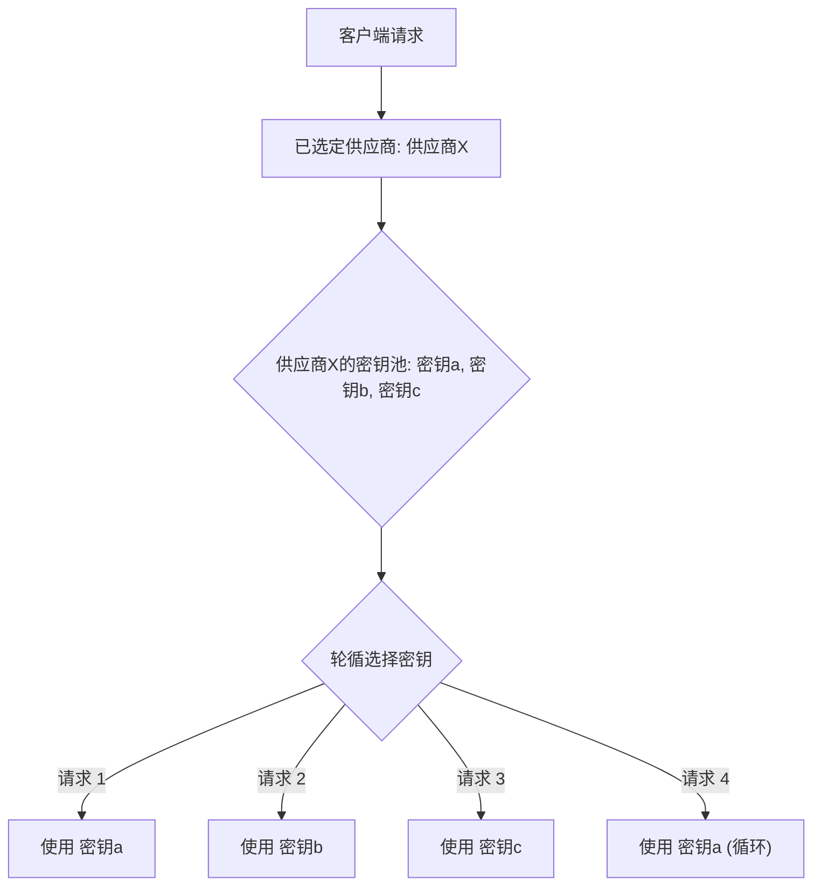
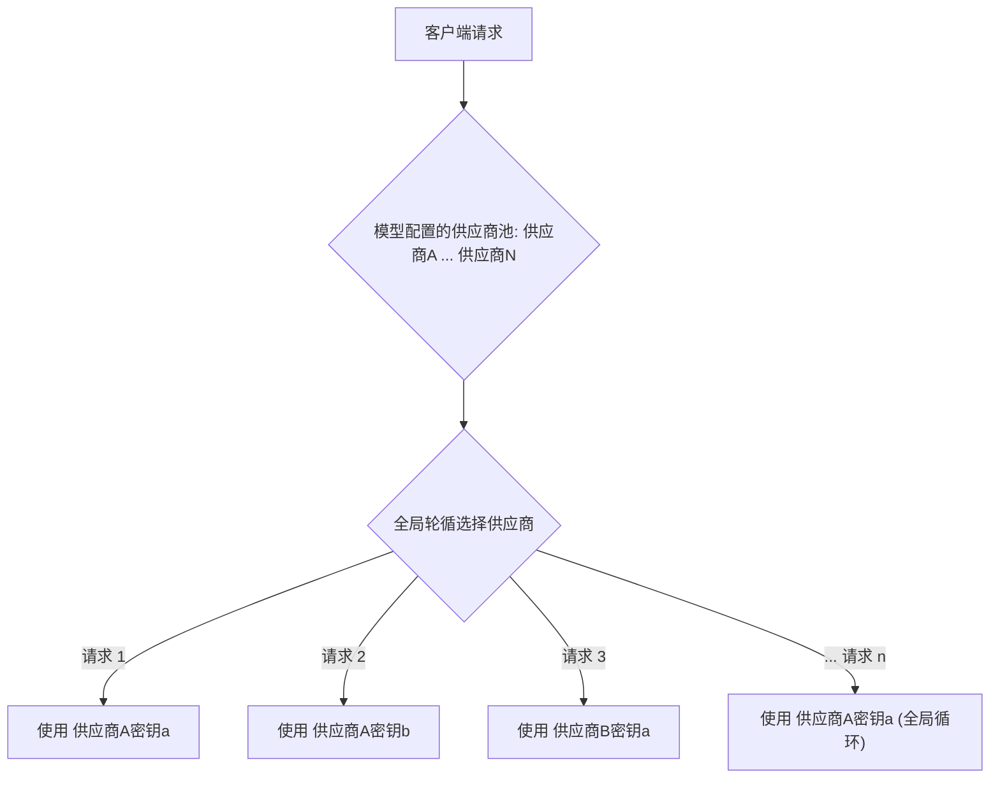

# 功能概览

Chatspeed 是一个功能丰富的 AI 助手应用，帮助您更好地与 AI 进行交互。除了基本的聊天功能外，Chatspeed 还集成了强大的 CCProxy 模块，提供 AI 代理能力和 MCP 代理功能，让您能够灵活地将各种 AI 模型接入 Claude Code 或者 Gemini CLI，集中管理各种 MCP 工具。

## 🤖 核心功能

### 1. AI 助手

Chatspeed 作为您的 AI 助手，提供以下核心功能：

- **多模型聊天**：支持多种 AI 模型的对话交互
- **智能翻译**：自动识别输入语言并进行翻译
- **富文本支持**：支持代码块、思维导图、流程图、表格、公式等格式
- **技能管理**：可视化创建和管理自定义技能
- **智记**：保存和管理重要的 AI 对话内容

### 2. AI 代理管理

Chatspeed 提供统一平台来管理各种 AI 聊天代理和多模态内容代理：

- **集中式管理**：统一管理分散的 AI 服务
- **协议转换**：可以在 Claude、Gemini、OpenAI兼容格式、Ollama 之间任意转换
- **分组支持**：可以根据需要配置代理分组，方便快速切换 Claude Code 或者 Gemini CLI

### 3. 多模型支持

支持接入主流 AI 平台，通过 OpenAI 兼容协议可使用多种大模型：

- **广泛兼容**：支持 OpenAI、Gemini、Ollama 和 Claude
- **密钥管理**：支持单个模型配置多个 API 密钥，对话时自动轮换使用
- **流式输出**：支持流式响应，提供实时输出体验
- **推理展示**：支持 Deepseek 的思考链输出展示与 OpenAI 的推理输出
- **参数配置**：完整支持温度、top_p、max_tokens 等参数配置
- **代理支持**：支持 HTTP 网络代理设置

## 🌐 CCProxy - 核心代理模块

CCProxy 是 Chatspeed 的核心模块，提供强大的 AI 模型代理能力。

### 协议转换能力

CCProxy 支持主流对话协议之间的转换：

- **OpenAI 兼容格式**
- **Claude API**
- **Gemini API**
- **Ollama 本地模型**

通过协议转换，CCProxy 实现了"Any Claude Code"——将任何 AI 模型接入 Claude Code 环境，以及"Any Gemini CLI"——将任何 AI 模型接入 Gemini CLI 环境。

### 分组管理

为不同场景创建不同的代理分组。您可以将常用的模型比如用于 Cline、Roo Code、Zed 等 IDE 或插件的模型放到默认分组，同时为 Claude Code 创建不同的模型代理分组，方便快速切换。

### 负载均衡

Chatspeed 支持在同一个供应商中设置多个密钥，在每次调用时自动轮换使用。而 CCProxy 模块的代理，同一个模型支持配置多个不同的供应商，其轮换规则是全局轮换。

**Chatspeed 密钥轮换 (同一供应商)**

 

---

**ccproxy密钥全局轮换（同一模型）**

## 🔧 MCP 代理统一管理

将 Chatspeed 系统中所有可用的 MCP（模型上下文协议）工具聚合为统一代理入口，解决在不同 IDE 间重复配置工具的问题。

### 为什么需要 MCP 代理？

在相同的使用场景中通常会安装相同的 MCP 工具，比如编程场景下，在不同的 IDE 或插件中，通常会安装 context7、搜索 MCP 等。使用的 IDE 越多，管理或升级越麻烦。

### 使用 MCP 代理的优势

- **统一配置**：只需将所有必要的 MCP 工具安装到 Chatspeed 上
- **统一访问**：CCProxy 模块通过 `http://localhost:11435/sse` 提供聚合后的所有 MCP 工具
- **简化配置**：所有 IDE 或插件配置 MCP 都变得简单
- **集中管理**：工具的增删改查都可以在 Chatspeed 客户端中统一完成

## 💬 高级聊天界面

提供良好的聊天体验：

- **简洁界面**：支持明/暗主题模式
- **多语言支持**：界面支持多语言
- **便捷操作**：支持消息引用与重新发送
- **富文本解析**：支持代码块、思维导图、流程图、表格、公式等

## 🤖 智能助手

增强的 AI 助手功能：

- **即时响应**：快速问答响应
- **智能翻译**：自动识别输入语言并转换
- **推理能力**：通过技能通用模型能力，实现类 Deepseek R1 的推理能力
- **可视化生成**：AI 辅助生成思维导图与流程图
- **自定义技能**：支持创建自定义技能

## 🛠️ 技能管理

可视化技能创建和管理：

- **可视化构建**：提供直观的技能创建界面
- **快捷访问**：支持快捷键绑定的快速技能唤出
- **图标支持**：支持内置图标库和自定义上传

## 📝 智记功能

AI 知识管理：

- **智能保存**：可将对话中的精彩回答保存至知识库
- **标签管理**：支持按标签分类归档
- **富媒体展示**：支持推理过程、代码块、思维导图、流程图、表格、公式等格式解析

## 🔐 数据安全

保护您的数据安全：

- **本地加密存储**：所有数据本地加密存储
- **历史归档**：对话历史归档管理
- **备份恢复**：数据库备份与恢复功能

## 💡 使用场景

### 成本优化

- 在 Claude Code 中，使用免费模型或者高性价比的模型替代昂贵的 Claude
- 聚合不同提供商的免费模型，利用其免费额度降低开发成本

### 开发效率

- 快速切换不同任务的模型
- 统一的 IDE 接口
- 减少工具重新配置

### 隐私与控制

- 使用 Ollama 保持敏感代码本地化
- 完全控制模型选择
- 避免供应商锁定

## 下一步

了解了 Chatspeed 的功能概览后，您可以：

1. **[快速开始](../../guide/quickStart.md)** - 学习如何快速上手使用 Chatspeed
2. **[CCProxy 模块](../../ccproxy/)** - 探索核心代理功能
3. **[MCP 代理](../../mcp/)** - 了解 MCP 代理集成
