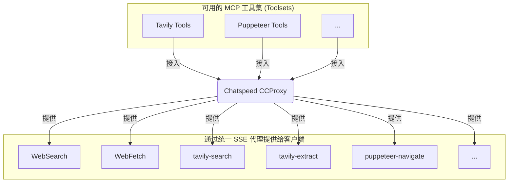

# MCP 代理

> 将 `Chatspeed` 系统中所有可用的 MCP（大模型上下文协议）工具聚合为统一代理入口，彻底解决在不同 IDE 间重复配置工具的痛点。

[Chatspeed](https://chatspeed.aidyou.ai) 的 [CCProxy](../ccproxy/) 模块提供的 **MCP 代理** 是 `Chatspeed` 针对上述碎片化 MCP 管理提供的解决方案。它将所有安装在 `Chatspeed` 上的 MCP 工具整合为一个扁平化结构，并通过多种协议提供统一的访问入口。也就是说，您只需在 `Chatspeed` 中安装好 MCP 工具，并禁用不需要的工具后，就可以通过以下任一协议来访问您所有的 MCP 工具：

- Streamable HTTP 协议: `http://localhost:11435/mcp/http` (推荐)
- SSE 协议: `http://localhost:11435/mcp/sse`

> 请注意，本章节 MCP URL 中使用的端口 `11435` 是 [CCProxy](../ccproxy/) 模块的默认端口。若您修改了默认端口，请同步更新配置文件中的端口配置。

## 🔧 为何需要 MCP 代理

每个开发者通常会使用多个 AI IDE 或 AI 插件，而每个 AI IDE 或 AI 插件通常都会安装一些常用的 MCP 来扩展 AI 的能力。一些常用的 MCP 无论在哪个 IDE 中都会被安装，比如 context7、tavily-mcp 等。每次更换 IDE 都需要重新安装相同的 MCP 工具，这会非常繁琐。

### 在使用 CCProxy 模块的 MCP 代理之前

- 在 `VS Code` 中单独安装 MCP 工具 ❌
- 在 `Cursor` 中重复配置相同的工具 ❌
- 为 `Claude Code` 重复设置 ❌
- 为 `Gemini CLI` 重复设置 ❌
- 为 `Trae`、`Cline`、`Roo Code` 等重复安装相同的 MCP 工具 ❌

### 在使用 `CCProxy` 模块的 MCP 代理之后

- 只需将所有必要的 MCP 工具安装在 `Chatspeed` 上 ✅
- `CCProxy` 模块通过 SSE 协议提供聚合后的所有 MCP 工具 (`http://localhost:11435/mcp/sse`) ✅ 或 `Streamable HTTP` 协议 (`http://localhost:11435/mcp/http`) ✅
- 所有 IDE 或插件配置 MCP 都变得非常简单，只需选择合适的协议，并配置为对应的 URL 即可 ✅
- 工具的增删改查都可以在 `Chatspeed` 客户端中统一完成 ✅

## 🌐 Chatspeed 的 MCP 代理架构



## 🛠️ 服务端安装与配置

### 安装

请从 [Chatspeed 官网](https://github.com/aidyou/chatspeed/releases) 下载并安装最新版 Chatspeed，详情可以参考[用户指南](../guide/installation.md)。

### MCP 代理配置

1. 请从 Chatspeed 主界面右上角的菜单栏中点击“MCP”打开 MCP 配置选项，按下图标注的数字顺序点击：


2. 在 MCP 配置界面添加必要的 MCP 工具，如 context7、tavily-mcp 等，对于不需要的工具，您可以将其禁用（如下图中数字 2 标注）。


配置完成后，您将拥有如下 MCP 工具：


## ⚙️ MCP客户端配置

### 通用配置

通常不同的 MCP 客户端的配置格式略有不同，不过大致如下：

**Streamable HTTP 协议配置 (推荐):**

```json
{
  "mcpServers": {
    "ccproxy": {
      "type": "http",
      "url": "http://localhost:11435/mcp/http"
    }
  }
}
```

**SSE 协议配置:**

```json
{
  "mcpServers": {
    "ccproxy": {
      "type": "sse",
      "url": "http://localhost:11435/mcp/sse"
    }
  }
}
```

> **说明:** `Chatspeed` 的 MCP 代理实现的 `Streamable HTTP` 协议提供了更好的连接稳定性，可以在网络断线、电脑休眠（挂起）后仍然可用，推荐在支持的客户端中优先使用。

### Claude Code

1. 下面将安装到用户范围内，也就是所有项目都可用

```bash
claude mcp add -t http -s user ccproxy http://localhost:11435/mcp/http
```

2. 如果您只想为当前项目安装，进入项目目录，然后使用以下命令安装

```bash
claude mcp add -t http ccproxy http://localhost:11435/mcp/http
```

3. 安装后通过 `claude mcp get ccproxy` 进行验证，如果输出如下表示安装成功。

```bash
> claude mcp get ccproxy
ccproxy:
  Scope: User config (available in all your projects)
  Status: ✓ Connected
  Type: http
  URL: http://localhost:11435/mcp/http
```

### Gemini CLI

`Gemini CLI` 的 MCP 配置与 `Claude Code` 命令完全相同，只要将 `claude` 改为 `gemini` 即可。

1. 全局安装

```bash
gemini mcp add -t http -s user ccproxy http://localhost:11435/mcp/http
```

2. 项目安装，请先进入项目目录然后执行下面命令

```bash
gemini mcp add -t http ccproxy http://localhost:11435/mcp/http
```

3. 配置完成后，通过 `gemini mcp list` 进行验证，输出类似下面信息说明安装成功。

```bash
> gemini mcp list
Configured MCP servers:

✓ ccproxy: http://localhost:11435/mcp/http (http) - Connected
```

更多配置信息，请参考这个[指引](https://github.com/google-gemini/gemini-cli/blob/main/docs/tools/mcp-server.md#configure-the-mcp-server-in-settingsjson)。

### Qwen Code

`Qwen Code` 是 `Gemini CLI` 的一个分支，所以安装命令与 `Gemini CLI` 完全相同。

1. 全局安装

```bash
qwen mcp add -t http -s user ccproxy http://localhost:11435/mcp/http
```

2. 项目安装，请先进入项目目录然后执行下面命令

```bash
qwen mcp add -t http ccproxy http://localhost:11435/mcp/http
```

3. 配置完成后，通过 `qwen mcp list` 进行验证，输出类似下面信息说明安装成功。

```bash
> qwen mcp list
Configured MCP servers:

✓ ccproxy: http://localhost:11435/mcp/http (http) - Connected
```

### VS Code

您可以按照 MCP [安装指南](https://code.visualstudio.com/docs/copilot/chat/mcp-servers#_add-an-mcp-server)操作，使用上述标准配置。也可以使用 `VS Code CLI` 安装 CCProxy MCP 工具：

#### 通过界面安装的步骤

1. 点击下图的配置按钮


2. 点击下图的MCP配置按钮


3. 选择“HTTP(HTTP or Server-Sent Events) Connect to a remote HTTP server that implements the MCP protocol”


4. 输入 `http://localhost:11435/mcp/http` 并回车


5. 输入 MCP 服务器名称`ccproxy`并回车


6. 选择全局或者当前工作区，建议配置为全局


#### 命令行安装

```sh
code --add-mcp '{"name":"ccproxy","type":"http","url":"http://localhost:11435/mcp/http"}'
```

### Cursor

进入 `Cursor Settings` -> Tools & Integrations -> MCP Tools -> Add new MCP Server。将以下信息添加到配置文件中：

```json
{
  "mcpServers": {
    "ccproxy": {
      "url": "http://localhost:11435/mcp/http"
    }
  }
}
```

### Trae CN

进入 `Trae CN` 的 AI 功能管理 -> MCP -> 添加 -> 手动添加。将以下信息添加到配置文件中并保存即可：

```json
{
  "mcpServers": {
    "ccproxy": {
      "url": "http://localhost:11435/mcp/http"
    }
  }
}
```

### Windsurf

`Windsurf` 的 MCP 服务器配置文件位于 `~/.codeium/windsurf/mcp_config.json`，该文件是一个 JSON 文件，其中包含 `Cascade` 可以连接的服务器列表。JSON 应遵循与 `Claude Desktop` 配置文件相同的模式。

您可以打开 `~/.codeium/windsurf/mcp_config.json`，然后添加以下内容：

```json
{
  "mcpServers": {
    "ccproxy": {
      "serverUrl": "http://localhost:11435/mcp/http"
    }
  }
}
```

> 注意，如果您有多个 MCP 工具，只要添加 `ccproxy` 部分即可，如：

```json
    "ccproxy":{
      "serverUrl": "http://localhost:11435/mcp/http"
    }
```

### Cline

1. 请点击 **数字1** 标注的按钮进入 MCP 设置界面，然后点击 **数字2** 标注的按钮切换到“已安装”界面，最后点击 **数字3** 标注的按钮进入 MCP 的代码配置界面，将下面代码复制到代码编辑器中并保存：

```json
{
  "mcpServers": {
    "ccproxy": {
      "type": "streamableHttp",
      "url": "http://127.0.0.1:11435/mcp/http"
    }
  }
}
```


2. 保存代码后就可以看到 `Cline` 的 MCP 服务器列表已经有 `ccproxy` 的 MCP 工具了。


### Roo Code

1. 点击**数字1**标注的按钮


2. 从下拉菜单选择“MCP Servers”


3. 您可以点击**数字1**标注的按钮添加全局 MCP 或者点击**数字2**标注的按钮添加项目 MCP


4. 在打开的代码编辑器中添加以下内容并保存：

```json
{
  "mcpServers": {
    "ccproxy": {
      "type": "streamable-http",
      "url": "http://localhost:11435/mcp/http"
    }
  }
}
```

5. 现在您可以在 `Roo Code` 的 MCP 服务器列表中看到 `ccproxy` 的 MCP 工具了。


### Crush

`Crush` 的配置文件名称可以是 `.crush.json` 或者 `crush.json`。在 linux/macOS 上的配置文件地址为`$HOME/.config/crush/crush.json`，在 windows 上的配置文件地址为 `%USERPROFILE%\AppData\Local\crush\crush.json`。

本文以`macos`为例，请编辑 `$HOME/.config/crush/crush.json`，如果文件不存在则创建一个，将下面代码放入 mcp 配置块：

```json
{
  "ccproxy": {
    "type": "http",
    "url": "http://localhost:11435/mcp/http"
  }
}
```

完整配置示例如下：

```json
{
  "$schema": "https://charm.land/crush.json",
  "mcp": {
    "ccproxy": {
      "type": "http",
      "url": "http://localhost:11435/mcp/http"
    }
  },
  "providers": {
    "Chatspeed": {
      "name": "Chatspeed",
      "base_url": "http://localhost:11435/compat_mode/v1",
      "type": "openai",
      "api_key": "your_api_key",
      "models": [
        {
          "name": "gemini2.5-pro",
          "id": "gemini2.5-pro",
          "context_window": 1000000,
          "default_max_tokens": 8192
        }
      ]
    }
  }
}
```
