# MCP 代理

> 将 Chatspeed 系统中所有可用的 MCP（大模型上下文协议）工具聚合为统一代理入口，彻底解决在不同 IDE 间重复配置工具的痛点。

Chatspeed 的 ccproxy 模块提供的 **MCP 代理** 是 Chatspeed 针对上述碎片化 MCP 管理提供的解决方案。它将所有安装在 Chatspeed 上的 MCP 工具整合为一个扁平化结构，并通过 SSE 协议提供统一的访问入口。也就是说，您只需在 Chatspeed 中安装好 MCP 工具，并禁用不需要的工具后，就可以通过 `http://localhost:11434/sse` 来访问你所有的 MCP 工具。

## 🔧 为何需要 MCP 代理

每个开发者通常会使用多个 AI IDE 或 AI 插件，而每个 AI IDE 或 AI 插件通常都会安装一些常用的 MCP 来扩展 AI 的能力。一些常用的 MCP 无论在哪个 IDE 中都会被安装，比如 context7、搜索 MCP 等。每次更换 IDE 都需要重新安装相同的 MCP 工具，这会非常繁琐。

### 在使用 ccproxy 模块的 MCP 代理之前

- 在 VS Code 中单独安装 MCP 工具 ❌
- 在 Cursor 中重复配置相同的工具 ❌
- 为 Claude Code 重复设置 ❌
- 为 Gemini CLI 重复设置 ❌
- 为 Trae、Cline、Roo Code 等重复安装相同的 MCP 工具 ❌

### 在使用 ccproxy 模块的 MCP 代理之后

- 只需将所有必要的 MCP 工具安装在 Chatspeed 上 ✅
- ccproxy 模块通过 `http://localhost:11434/sse` 提供聚合后的所有 MCP 工具 ✅
- 所有 IDE 或插件配置 MCP 都变得非常简单，只需选择 SSE 协议，并配置为 `http://localhost:11434/sse` 即可 ✅
- 工具的增删改查都可以在 Chatspeed 客户端中统一完成 ✅

## 🌐 Chatspeed 的 MCP 代理架构

```mermaid
graph TD
    subgraph "可用的 MCP 工具集 (Toolsets)"
        A[Tavily Tools]
        B[Puppeteer Tools]
        C[...]
    end

    P(Chatspeed ccproxy)

    subgraph "通过统一 SSE 代理提供给客户端"
        D[tavily-search]
        E[tavily-extract]
        F[puppeteer-navigate]
        G[...]
    end

    A -- "接入" --> P
    B -- "接入" --> P
    C -- "接入" --> P

    P -- "提供" --> D
    P -- "提供" --> E
    P -- "提供" --> F
    P -- "提供" --> G
```



## 🛠️ 服务端安装与配置

### 安装

请从 [Chatspeed 官网](https://github.com/aidyou/chatspeed/releases) 下载并安装最新版 Chatspeed。

### MCP 代理配置

1. 请从 Chatspeed 主界面右上角的菜单栏中点击“MCP”打开 MCP 配置选项，按下图标注的数字顺序点击：


2. 在 MCP 配置界面添加必要的 MCP 工具，如 context7、tavily-mcp 等，对于不需要的工具，你可以将其禁用（如下图中数字 2 标注）。


配置完成后，你将拥有如下 MCP 工具：


## ⚙️ MCP客户端配置

### 通用配置

通常不同的 MCP 客户端的配置格式略有不同，不过大致如下：

```json
{
  "mcpServers": {
    "ccproxy": {
      "type": "sse",
      "url": "http://localhost:11434/sse"
    }
  }
}
```

> 请注意，本章节 MCP URL 中使用的端口是 `ccproxy` 的默认端口。若您修改了默认端口，请同步更新配置文件中的端口配置。

### Claude Code

下面将安装到用户范围内，也就是所有项目都可用

```bash
claude mcp add -t sse -s user ccproxy http://localhost:11434/sse
```

安装后你可以看到如下配置信息：

```bash
> claude mcp get ccproxy
ccproxy:
  Scope: User config (available in all your projects)
  Status: ✓ Connected
  Type: sse
  URL: http://localhost:11434/sse
```

如果你只想为当前项目安装，可以使用以下命令：

```bash
claude mcp add -t sse ccproxy http://localhost:11434/sse
```

### Gemini CLI

`Gemini CLI` 使用 `settings.json` 文件中的 `mcpServers` 配置项来定位和连接到 MCP 服务器。此配置支持具有不同传输机制的多个服务器。

您可以在全局级别的 `~/.gemini/settings.json` 文件中或在项目的根目录下配置 MCP 服务器，创建或打开 `.gemini/settings.json` 文件。在该文件中，添加 `mcpServers` 配置块。

```json
{
  "mcpServers": {
    "ccproxy": {
      "url": "http://localhost:11434/sse"
    }
  }
}
```

配置完成后，进入 `Gemini CLI`，然后执行 `/mcp list` 就可以看到可用的工具列表，比如我的示例：

```bash
╭───────────────╮
│  > /mcp list  │
╰───────────────╯


ℹ Configured MCP servers:

  🟢 ccproxy - Ready (5 tools)
    Tools:
    - get_current_time
    - get-library-docs
    - resolve-library-id
    - tavily-extract
    - tavily-search
```

更多配置信息，请参考这个[指引](https://github.com/google-gemini/gemini-cli/blob/main/docs/tools/mcp-server.md#configure-the-mcp-server-in-settingsjson)。

### VS Code

您可以按照 MCP 安装[指南](https://code.visualstudio.com/docs/copilot/chat/mcp-servers#_add-an-mcp-server)操作，使用上述标准配置。也可以使用 VS Code CLI 安装 ccproxy MCP 工具：

```sh
code --add-mcp '{"name":"ccproxy","url":"http://localhost:11434/sse"}'
```

### Cursor

进入 `Cursor Settings` -> Tools & Integrations -> MCP Tools -> Add new MCP Server。将以下信息添加到配置文件中：

```json
{
  "mcpServers": {
    "ccproxy": {
      "url": "http://localhost:11434/sse"
    }
  }
}
```

### Trae CN

进入 `Trae CN` 的 AI 功能管理 -> MCP -> 添加 -> 手动添加。将以下信息添加到配置文件中并保存即可：

```json
{
  "mcpServers": {
    "ccproxy": {
      "url": "http://localhost:11434/sse"
    }
  }
}
```

### Windsurf

`Windsurf` 的 MCP 服务器配置文件位于 `~/.codeium/windsurf/mcp_config.json`，该文件是一个 JSON 文件，其中包含 `Cascade` 可以连接的服务器列表。JSON 应遵循与 `Claude Desktop` 配置文件相同的模式。

您可以打开 `~/.codeium/windsurf/mcp_config.json`，然后添加以下内容：

```json
{
  "mcpServers": {
    "ccproxy": {
      "serverUrl": "http://localhost:11434/sse"
    }
  }
}
```

> 注意，如果你有多个 MCP 工具，只要添加 `ccproxy` 部分即可，如：

```json
    "ccproxy":{
      "url": "http://localhost:11434/sse"
    }
```

### Cline

1. 请点击**数字1**标注的按钮进入 MCP 设置界面，然后点击**数字2**标注的按钮切换到“已安装”界面，最后点击**数字3**标注的按钮进入 MCP 的代码配置界面，将下面代码复制到代码编辑器中并保存：

```json
{
  "mcpServers": {
    "ccproxy": {
      "serverUrl": "http://localhost:11434/sse"
    }
  }
}
```


2. 保存代码后就可以看到 `Cline` 的 MCP 服务器列表已经有 `ccproxy` 的 MCP 工具了


### Roo Code

1. 点击**数字1**标注的按钮


2. 从下拉菜单选择“MCP Servers”


3. 您可以点击**数字1**标注的按钮添加全局 MCP 或者点击**数字2**标注的按钮添加项目 MCP


4. 在打开的代码编辑器中添加以下内容并保存：

```json
{
  "mcpServers": {
    "ccproxy": {
      "serverUrl": "http://localhost:11434/sse"
    }
  }
}
```

5. 现在你可以在 `Roo Code` 的 MCP 服务器列表中看到 `ccproxy` 的 MCP 工具了


