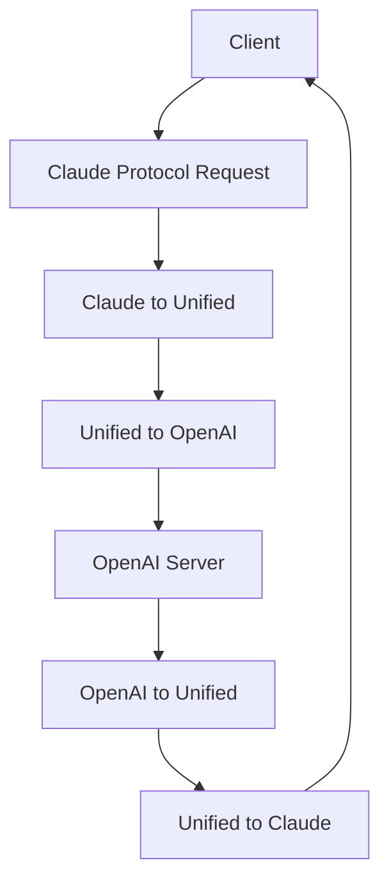

# CCProxy 工具兼容模式：让任何AI模型都具备工具调用能力

在AI开发过程中，我们经常遇到这样的问题：不同的AI服务商提供的模型在工具调用支持上参差不齐，有些模型原生支持工具调用，有些则完全不支持。更复杂的是，即使支持工具调用的模型，在参数格式上也存在差异。

更令人困惑的是，即便是同一个具有原生工具调用能力的模型，在不同平台提供的接口中，其工具调用能力也可能存在显著差异。例如，DeepSeek V3.1模型本身具备原生工具调用能力，但在魔塔社区提供的调用接口中却不支持原生工具调用，而在NVIDIA提供的接口中则完全支持。这种平台间的差异进一步增加了开发的复杂性。

为了解决这些问题，我们开发了ccproxy的工具兼容模式。

## 工作原理

ccproxy是一个AI聊天代理模块，可以在OpenAI兼容协议、Gemini、Claude、Ollama等不同协议之间进行转换。其核心工作流程如下：

### 标准协议转换流程

以Claude协议输入，请求到OpenAI兼容协议服务器为例：



整个数据流可以表示为：
```
client -> claude protocol -> unified format -> openai format -> server -> unified format -> claude format -> client
```

### 工具兼容模式原理

对于不支持原生工具调用的模型，ccproxy采用了创新的工具兼容模式：

1. **工具描述转换**：将工具调用解析成XML格式的说明文件，作为prompt的一部分传递给AI
2. **格式要求**：要求AI在需要调用工具时返回特定的XML格式
3. **响应解析**：解析AI返回的XML格式数据，将其中的工具调用信息转换为标准的工具调用格式

## 核心优势

### 1. 解决协议间参数兼容性问题

不同AI服务商对工具参数的要求存在差异，这种差异会导致工具调用失败。让我们通过一个具体例子来说明这个问题：

**问题场景**：Claude Code定义的Grep工具包含`-A`、`-B`、`-C`等参数，但Gemini不允许参数名以`-`开头。

以下是Claude Code中Grep工具的部分定义：

```json
{
  "name": "Grep",
  "description": "A powerful search tool built on ripgrep\n\n  Usage:\n  - ALWAYS use Grep for search tasks. NEVER invoke `grep` or `rg` as a Bash command. The Grep tool has been optimized for correct permissions and access.\n  - Supports full regex syntax (e.g., \"log.*Error\", \"function\\s+\\w+\")\n  - Filter files with glob parameter (e.g., \"*.js\", \"**/*.tsx\") or type parameter (e.g., \"js\", \"py\", \"rust\")\n  - Output modes: \"content\" shows matching lines, \"files_with_matches\" shows only file paths (default), \"count\" shows match counts\n  - Use Task tool for open-ended searches requiring multiple rounds\n  - Pattern syntax: Uses ripgrep (not grep) - literal braces need escaping (use `interface\\{\\}` to find `interface{}` in Go code)\n  - Multiline matching: By default patterns match within single lines only. For cross-line patterns like `struct \\{[\\s\\S]*?field`, use `multiline: true`\n",
  "input_schema": {
    "type": "object",
    "properties": {
      "pattern": {
        "type": "string",
        "description": "The regular expression pattern to search for in file contents"
      },
      "path": {
        "type": "string",
        "description": "File or directory to search in (rg PATH). Defaults to current working directory."
      },
      "glob": {
        "type": "string",
        "description": "Glob pattern to filter files (e.g. \"*.js\", \"*.{ts,tsx}\") - maps to rg --glob"
      },
      "output_mode": {
        "type": "string",
        "enum": ["content", "files_with_matches", "count"],
        "description": "Output mode: \"content\" shows matching lines (supports -A/-B/-C context, -n line numbers, head_limit), \"files_with_matches\" shows file paths (supports head_limit), \"count\" shows match counts (supports head_limit). Defaults to \"files_with_matches\"."
      },
      "-B": {
        "type": "number",
        "description": "Number of lines to show before each match (rg -B). Requires output_mode: \"content\", ignored otherwise."
      },
      "-A": {
        "type": "number",
        "description": "Number of lines to show after each match (rg -A). Requires output_mode: \"content\", ignored otherwise."
      },
      "-C": {
        "type": "number",
        "description": "Number of lines to show before and after each match (rg -C). Requires output_mode: \"content\", ignored otherwise."
      },
      "-n": {
        "type": "boolean",
        "description": "Show line numbers in output (rg -n). Requires output_mode: \"content\", ignored otherwise."
      },
      "-i": {
        "type": "boolean",
        "description": "Case insensitive search (rg -i)"
      },
      "type": {
        "type": "string",
        "description": "File type to search (rg --type). Common types: js, py, rust, go, java, etc. More efficient than include for standard file types."
      },
      "head_limit": {
        "type": "number",
        "description": "Limit output to first N lines/entries, equivalent to \"| head -N\". Works across all output modes: content (limits output lines), files_with_matches (limits file paths), count (limits count entries). When unspecified, shows all results from ripgrep."
      },
      "multiline": {
        "type": "boolean",
        "description": "Enable multiline mode where . matches newlines and patterns can span lines (rg -U --multiline-dotall). Default: false."
      }
    },
    "required": ["pattern"],
    "additionalProperties": false,
    "$schema": "http://json-schema.org/draft-07/schema#"
  }
}
```

**兼容性问题**：当直接将此工具定义传递给Gemini时，会因为`-A`、`-B`、`-C`、`-i`等参数名不符合Gemini的命名规范而导致调用失败，如下错误示例：

```json
{
  "candidates": [
    {
      "finishReason": "MALFORMED_FUNCTION_CALL",
      "index": 0
    }
  ],
  "usageMetadata": {
    "promptTokenCount": 47265,
    "totalTokenCount": 47265,
    "promptTokensDetails": [
      {
        "modality": "TEXT",
        "tokenCount": 47265
      }
    ]
  },
  "modelVersion": "gemini-2.5-flash",
  "responseId": "tWHGaMzaJLi5mtkPiPGkiA8"
}

```

ccproxy的工具兼容模式不仅不需要模型本身支持原生工具调用，还能完美绕开参数格式问题。

### 2. 让任何模型具备工具调用能力

这是ccproxy最基础的功能之一。即使AI供应商提供的模型本身不支持原生工具调用，通过工具兼容模式，我们也能让它们具备工具调用能力。这大大扩展了可用模型的范围，特别是对于一些免费或开源模型。

### 3. 降低用户认知负担

对于普通用户来说，了解每个模型是否支持工具调用是一个很大的认知负担。ccproxy让用户无需关心底层模型的技术细节，所有模型在用户看来都具备相同的工具调用能力。这种透明化的处理方式极大提升了用户体验。

### 4. 赋能复杂的AI工作流

工具兼容模式通过将工具定义转化为模型易于理解的文本（XML），并结合 CCProxy 的提示词增强系统，可以引导模型更可靠地执行多步骤的复杂任务。AI 能够：
- 在对话中更准确地判断何时需要使用工具。
- 按照预设的 XML 格式，稳定地输出工具调用指令。
- 将多个工具串联起来，完成更复杂的工作流。

这种方式将模型的语言理解能力与工具的确定性功能相结合，让 AI 助手真正成为能够解决实际问题的得力工具。

## 实际案例：Gemini接入Claude Code

让我们通过一个具体案例来看ccproxy的实际效果。在开始之前请参考这篇博客先配置好代理模型：[免费使用 Claude Code：集成魔塔 qwen3-code](../claude-code-free/post-1.md)

### 挑战

将 Gemini 模型接入 `Claude Code` 的工具集时，我们遇到了一个核心的兼容性障碍。虽然 CCProxy 的标准代理模式已经能处理大部分参数**类型**不匹配的问题（例如，将 `uint` 转为 `integer`），但一个更棘手的问题是参数**命名**规范：

**Gemini API 不允许工具的参数名以 `-` (中划线) 开头。**

而 `Claude Code` 的 `Grep` 工具中，恰好定义了 `-A`, `-B`, `-C` 等参数。如果直接通过标准模式将这些工具定义发给 Gemini，API 会立即返回 `MALFORMED_FUNCTION_CALL` 错误，导致工具调用完全失败。这正是工具兼容模式要解决的完美场景。

### 解决方案
通过ccproxy的工具兼容模式将`Gemini`模型接入`Claude Code`，就能完美避开**参数类型限制**。要启用工具兼容模式很简单，只要在 URL 地址中增加`/compat_mode`即可，完整的代理地址类似`http://localhost:11434/gemini/compat_mode`,其中`gemini`是分组名称，这个你可以自己任意修改,`compat_mode`表示启用工具兼容模式

下面这张图是我将`gemini-flash-2.5`在工具兼容模式下接入`Claude Code`，用来修复Chatspeed AI 模块bug 的截图：


## 总结

ccproxy的工具兼容模式不仅仅是一个技术解决方案，更是对AI生态系统标准化的重要贡献。它让开发者能够：

- 使用任何喜欢的AI模型，无需担心工具调用支持问题
- 专注于业务逻辑开发，而不是协议适配
- 为用户提供一致的体验，无论底层使用什么模型

随着AI技术的快速发展，模型间的差异化将会越来越大。ccproxy这样的中间层解决方案，为构建更加开放、兼容的AI生态系统提供了重要的基础设施支持。
